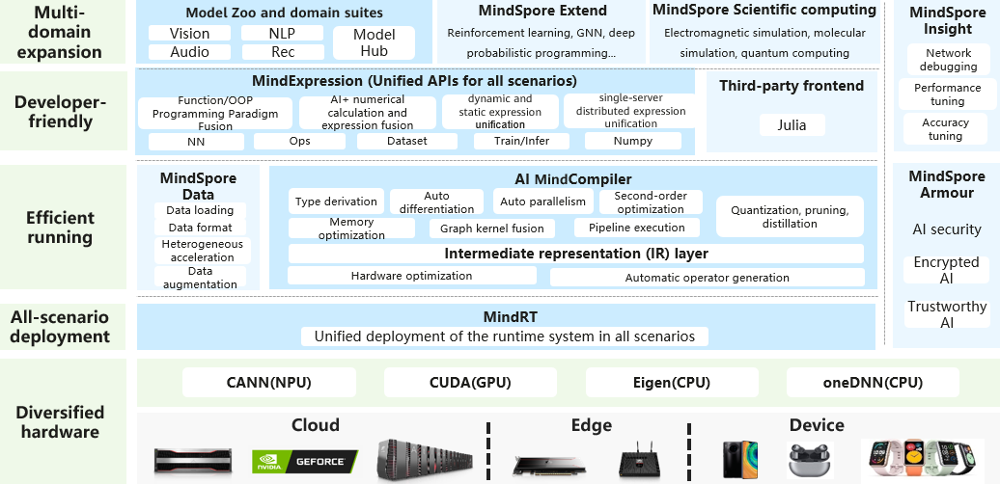
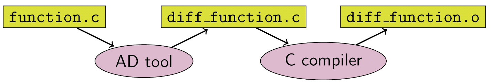
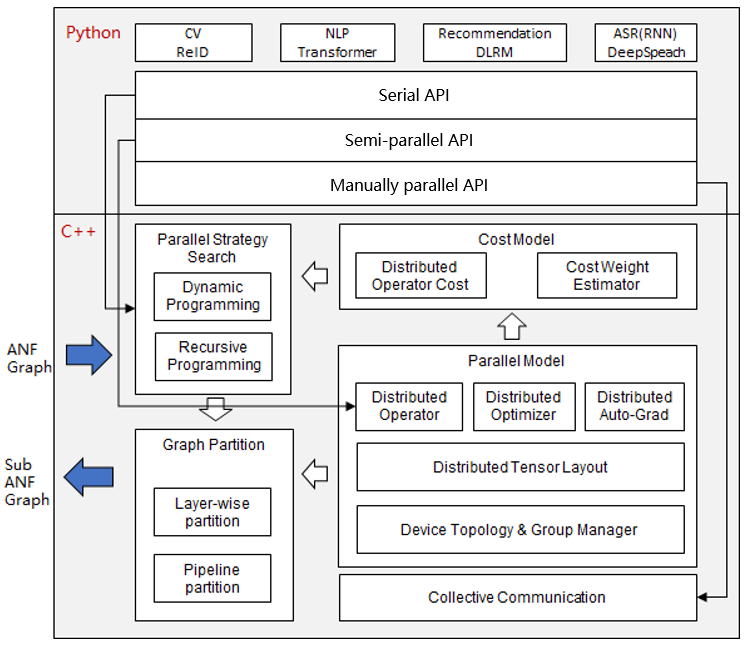

============================================================

- [What Is MindSpore?](#what-is-mindspore)
    - [Automatic Differentiation](#automatic-differentiation)
    - [Automatic Parallel](#automatic-parallel)
- [Installation](#installation)
    - [Binaries](#binaries)
    - [From Source](#from-source)
    - [Docker Image](#docker-image)
- [Quickstart](#quickstart)
- [Docs](#docs)
- [Community](#community)
    - [Governance](#governance)
    - [Communication](#communication)
- [Contributing](#contributing)
- [Release Notes](#release-notes)
- [License](#license)

## What Is MindSpore

MindSpore is a new open source deep learning training/inference framework that
could be used for mobile, edge and cloud scenarios. MindSpore is designed to
provide development experience with friendly design and efficient execution for
the data scientists and algorithmic engineers, native support for Ascend AI
processor, and software hardware co-optimization. At the meantime MindSpore as
a global AI open source community, aims to further advance the development and
enrichment of the AI software/hardware application ecosystem.



For more details please check out our [Architecture Guide](https://www.mindspore.cn/docs/en/0.2.0-alpha/architecture.html).

### Automatic Differentiation

There are currently three automatic differentiation techniques in mainstream deep learning frameworks:

- **Conversion based on static compute graph**: Convert the network into a static data flow graph at compile time, then turn the chain rule into a data flow graph to implement automatic differentiation.
- **Conversion based on dynamic compute graph**: Record the operation trajectory of the network during forward execution in an operator overloaded manner, then apply the chain rule to the dynamically generated data flow graph to implement automatic differentiation.
- **Conversion based on source code**: This technology is evolving from the functional programming framework and performs automatic differential transformation on the intermediate expression (the expression form of the program during the compilation process) in the form of just-in-time compilation (JIT), supporting complex control flow scenarios, higher-order functions and closures.

TensorFlow adopted static calculation diagrams in the early days, whereas PyTorch used dynamic calculation diagrams. Static maps can utilize static compilation technology to optimize network performance, however, building a network or debugging it is very complicated. The use of dynamic graphics is very convenient, but it is difficult to achieve extreme optimization in performance.

But MindSpore finds another way, automatic differentiation based on source code conversion. On the one hand, it supports automatic differentiation of automatic control flow, so it is quite convenient to build models like PyTorch. On the other hand, MindSpore can perform static compilation optimization on neural networks to achieve great performance.



The implementation of MindSpore automatic differentiation can be understood as the symbolic differentiation of the program itself. Because MindSpore IR is a functional intermediate expression, it has an intuitive correspondence with the composite function in basic algebra. The derivation formula of the composite function composed of arbitrary basic functions can be derived. Each primitive operation in MindSpore IR can correspond to the basic functions in basic algebra, which can build more complex flow control.

### Automatic Parallel

The goal of MindSpore automatic parallel is to build a training method that combines data parallelism, model parallelism, and hybrid parallelism. It can automatically select a least cost model splitting strategy to achieve automatic distributed parallel training.



At present, MindSpore uses a fine-grained parallel strategy of splitting operators, that is, each operator in the figure is splitted into a cluster to complete parallel operations. The splitting strategy during this period may be very complicated, but as a developer advocating Pythonic, you don't need to care about the underlying implementation, as long as the top-level API compute is efficient.

## Installation

### Binaries

MindSpore offers build options across multiple backends:

| Hardware Platform | Operating System | Status |
| :---------------- | :--------------- | :----- |
| Ascend910 | Ubuntu-x86 | ✔️ |
|  | EulerOS-x86 | ✔️ |
|  | EulerOS-aarch64 | ✔️ |
| GPU CUDA 9.2 | Ubuntu-x86 | ✔️ |
| GPU CUDA 10.1 | Ubuntu-x86 | ✔️ |
| CPU | Ubuntu-x86 | ✔️ |
|  | Windows-x86 | ✔️ |

For installation using `pip`, take `CPU` and `Ubuntu-x86` build version as an example:

1. Download whl from [MindSpore download page](https://www.mindspore.cn/versions/en), and install the package.

    ```
    pip install https://ms-release.obs.cn-north-4.myhuaweicloud.com/0.2.0-alpha/MindSpore/cpu/x86_ubuntu/mindspore-0.2.0-cp37-cp37m-linux_x86_64.whl
    ```

2. Run the following command to verify the install.

    ```python
    import numpy as np
    import mindspore.context as context
    import mindspore.nn as nn
    from mindspore import Tensor
    from mindspore.ops import operations as P

    context.set_context(mode=context.GRAPH_MODE, device_target="CPU")

    class Mul(nn.Cell):
        def __init__(self):
            super(Mul, self).__init__()
            self.mul = P.Mul()

        def construct(self, x, y):
            return self.mul(x, y)

    x = Tensor(np.array([1.0, 2.0, 3.0]).astype(np.float32))
    y = Tensor(np.array([4.0, 5.0, 6.0]).astype(np.float32))

    mul = Mul()
    print(mul(x, y))
    ```
    ```
    [ 4. 10. 18.]
    ```

### From Source

[Install MindSpore](https://www.mindspore.cn/install/en).

### Docker Image

MindSpore docker image is hosted on [Docker Hub](https://hub.docker.com/r/mindspore),
currently the containerized build options are supported as follows:

| Hardware Platform | Docker Image Repository | Tag | Description |
| :---------------- | :---------------------- | :-- | :---------- |
| CPU | `mindspore/mindspore-cpu` | `x.y.z` | Production environment with pre-installed MindSpore `x.y.z` CPU release. |
|  |  | `devel` | Development environment provided to build MindSpore (with `CPU` backend) from the source, refer to https://www.mindspore.cn/install/en for installation details. |
|  |  | `runtime` | Runtime environment provided to install MindSpore binary package with `CPU` backend. |
| GPU | `mindspore/mindspore-gpu` | `x.y.z` | Production environment with pre-installed MindSpore `x.y.z` GPU release. |
|  |  | `devel` | Development environment provided to build MindSpore (with `GPU CUDA10.1` backend) from the source, refer to https://www.mindspore.cn/install/en for installation details. |
|  |  | `runtime` | Runtime environment provided to install MindSpore binary package with `GPU CUDA10.1` backend. |
| Ascend | <center>&mdash;</center> | <center>&mdash;</center> | Coming soon. |

> **NOTICE:** For GPU `devel` docker image, it's NOT suggested to directly install the whl package after building from the source, instead we strongly RECOMMEND you transfer and install the whl package inside GPU `runtime` docker image.

* CPU

    For `CPU` backend, you can directly pull and run the latest stable image using the below command:
    ```
    docker pull mindspore/mindspore-cpu:0.2.0-alpha
    docker run -it mindspore/mindspore-cpu:0.2.0-alpha /bin/bash
    ```

* GPU

    For `GPU` backend, please make sure the `nvidia-container-toolkit` has been installed in advance, here are some install guidelines for `Ubuntu` users:
    ```
    DISTRIBUTION=$(. /etc/os-release; echo $ID$VERSION_ID)
    curl -s -L https://nvidia.github.io/nvidia-docker/gpgkey | apt-key add -
    curl -s -L https://nvidia.github.io/nvidia-docker/$DISTRIBUTION/nvidia-docker.list | tee /etc/apt/sources.list.d/nvidia-docker.list

    sudo apt-get update && sudo apt-get install -y nvidia-container-toolkit nvidia-docker2
    sudo systemctl restart docker
    ```

    Then you can pull and run the latest stable image using the below command:
    ```
    docker pull mindspore/mindspore-gpu:0.2.0-alpha
    docker run -it --runtime=nvidia --privileged=true mindspore/mindspore-gpu:0.2.0-alpha /bin/bash
    ```

    To test if the docker image works, please execute the python code below and check the output:
    ```python
    import numpy as np
    import mindspore.context as context
    from mindspore import Tensor
    from mindspore.ops import functional as F

    context.set_context(device_target="GPU")

    x = Tensor(np.ones([1,3,3,4]).astype(np.float32))
    y = Tensor(np.ones([1,3,3,4]).astype(np.float32))
    print(F.tensor_add(x, y))
    ```
    ```
    [[[ 2.  2.  2.  2.],
    [ 2.  2.  2.  2.],
    [ 2.  2.  2.  2.]],

    [[ 2.  2.  2.  2.],
    [ 2.  2.  2.  2.],
    [ 2.  2.  2.  2.]],

    [[ 2.  2.  2.  2.],
    [ 2.  2.  2.  2.],
    [ 2.  2.  2.  2.]]]
    ```

If you want to learn more about the building process of MindSpore docker images,
please check out [docker](docker/README.md) repo for the details.

## Quickstart

See the [Quick Start](https://www.mindspore.cn/tutorial/en/0.2.0-alpha/quick_start/quick_start.html)
to implement the image classification.

## Docs

More details about installation guide, tutorials and APIs, please see the
[User Documentation](https://gitee.com/mindspore/docs).

## Community

### Governance

Check out how MindSpore Open Governance [works](https://gitee.com/mindspore/community/blob/master/governance.md).

### Communication

- [MindSpore Slack](https://join.slack.com/t/mindspore/shared_invite/enQtOTcwMTIxMDI3NjM0LTNkMWM2MzI5NjIyZWU5ZWQ5M2EwMTQ5MWNiYzMxOGM4OWFhZjI4M2E5OGI2YTg3ODU1ODE2Njg1MThiNWI3YmQ) - Communication platform for developers.
- IRC channel at `#mindspore` (only for meeting minutes logging purpose)
- Video Conferencing: https://meet.jit.si
- Mailing-list: https://mailweb.mindspore.cn/postorius/lists

## Contributing

Welcome contributions. See our [Contributor Wiki](CONTRIBUTING.md) for
more details.

## Release Notes

The release notes, see our [RELEASE](RELEASE.md).

## License

[Apache License 2.0](LICENSE)
