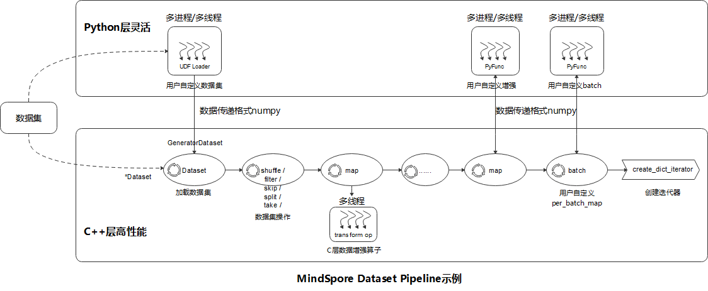

mindspore.dataset
=================

该模块提供了加载和处理各种通用数据集的API，如MNIST、CIFAR-10、CIFAR-100、VOC、COCO、ImageNet、CelebA、CLUE等，
也支持加载业界标准格式的数据集，包括MindRecord、TFRecord、Manifest等。此外，用户还可以使用此模块定义和加载自己的数据集。

该模块还提供了在加载时进行数据采样的API，如SequentialSample、RandomSampler、DistributedSampler等。

大多数数据集可以通过指定参数 `cache` 启用缓存服务，以提升整体数据处理效率。
请注意Windows平台上还不支持缓存服务，因此在Windows上加载和处理数据时，请勿使用。更多介绍和限制，
请参考 `Single-Node Tensor Cache <https://www.mindspore.cn/tutorials/experts/zh-CN/master/dataset/cache.html>`_。

在API示例中，常用的模块导入方法如下：

.. code-block::

    import mindspore.dataset as ds
    from mindspore.dataset.transforms import c_transforms

常用数据集术语说明如下：

- Dataset，所有数据集的基类，提供了数据处理方法来帮助预处理数据。
- SourceDataset，一个抽象类，表示数据集管道的来源，从文件和数据库等数据源生成数据。
- MappableDataset，一个抽象类，表示支持随机访问的源数据集。
- Iterator，用于枚举元素的数据集迭代器的基类。

数据处理Pipeline介绍
--------------------

如上图所示，MindSpore Dataset模块使得用户很简便地定义数据预处理Pipeline，并以最高效（多进程/多线程）的方式处理
数据集中样本，具体的步骤参考如下：

- 加载数据集（Dataset）：用户可以方便地使用 `*Dataset` 类来加载已支持的数据集，或者通过 `UDF Loader` +
  `GeneratorDataset` 实现Python层自定义数据集的加载，同时加载类方法可以使用多种Sampler、数据分片、数据shuffle等功能；
- 数据集操作（filter/ skip）：用户通过数据集对象方法 `.shuffle` / `.filter` / `.skip` / `.split` /
  `.take` / … 来实现数据集的进一步混洗、过滤、跳过、最多获取条数等操作；
- 数据集样本增强操作（map）：用户可以将数据增强算子
  （`vision类 <https://www.mindspore.cn/docs/zh-CN/master/api_python/mindspore.dataset.vision.html>`_，
  `nlp类 <https://www.mindspore.cn/docs/zh-CN/master/api_python/mindspore.dataset.text.html>`_，
  `audio类 <https://www.mindspore.cn/docs/zh-CN/master/api_python/mindspore.dataset.audio.html>`_）
  添加到map操作来执行，数据预处理过程中可以定义多个map操作，用于执行不同增强操作，数据增强算子也可以是
  用户自定义增强的 `PyFunc`；
- 批（batch）：用户在样本完成增强后，使用 `.batch` 操作将多个样本组织成batch，也可以通过batch的参数 `per_batch_map`
  来自定义batch逻辑；
- 迭代器（create_dict_iterator）：最后用户通过数据集对象方法 `create_dict_iterator` 来创建迭代器，
  可以将预处理完成的数据循环输出。

数据处理Pipeline示例如下，完整示例请参考
`datasets_example.py <https://gitee.com/mindspore/mindspore/tree/master/docs/api/api_python/datasets_example.py>`_：

.. code-block:: python

    import numpy as np
    import mindspore as ms
    import mindspore.dataset as ds
    import mindspore.dataset.vision as vision
    import mindspore.dataset.transforms as transforms

    # 构造图像和标签
    data1 = np.array(np.random.sample(size=(300, 300, 3)) * 255, dtype=np.uint8)
    data2 = np.array(np.random.sample(size=(300, 300, 3)) * 255, dtype=np.uint8)
    data3 = np.array(np.random.sample(size=(300, 300, 3)) * 255, dtype=np.uint8)
    data4 = np.array(np.random.sample(size=(300, 300, 3)) * 255, dtype=np.uint8)

    label = [1, 2, 3, 4]

    # 加载数据集
    dataset = ds.NumpySlicesDataset(([data1, data2, data3, data4], label), ["data", "label"])

    # 对data数据增强
    dataset = dataset.map(operations=vision.RandomCrop(size=(250, 250)), input_columns="data")
    dataset = dataset.map(operations=vision.Resize(size=(224, 224)), input_columns="data")
    dataset = dataset.map(operations=vision.Normalize(mean=[0.485 * 255, 0.456 * 255, 0.406 * 255],
                                                      std=[0.229 * 255, 0.224 * 255, 0.225 * 255]),
                          input_columns="data")
    dataset = dataset.map(operations=vision.HWC2CHW(), input_columns="data")

    # 对label变换类型
    dataset = dataset.map(operations=transforms.TypeCast(ms.int32), input_columns="label")

    # batch操作
    dataset = dataset.batch(batch_size=2)

    # 创建迭代器
    epochs = 2
    ds_iter = dataset.create_dict_iterator(output_numpy=True, num_epochs=epochs)
    for _ in range(epochs):
        for item in ds_iter:
            print("item: {}".format(item), flush=True)

视觉
-----

.. mscnautosummary::
    :toctree: dataset
    :nosignatures:
    :template: classtemplate_inherited.rst

    mindspore.dataset.Caltech101Dataset
    mindspore.dataset.Caltech256Dataset
    mindspore.dataset.CelebADataset
    mindspore.dataset.Cifar10Dataset
    mindspore.dataset.Cifar100Dataset
    mindspore.dataset.CityscapesDataset
    mindspore.dataset.CocoDataset
    mindspore.dataset.DIV2KDataset
    mindspore.dataset.EMnistDataset
    mindspore.dataset.FakeImageDataset
    mindspore.dataset.FashionMnistDataset
    mindspore.dataset.FlickrDataset
    mindspore.dataset.Flowers102Dataset
    mindspore.dataset.ImageFolderDataset
    mindspore.dataset.KMnistDataset
    mindspore.dataset.ManifestDataset
    mindspore.dataset.MnistDataset
    mindspore.dataset.PhotoTourDataset
    mindspore.dataset.Places365Dataset
    mindspore.dataset.QMnistDataset
    mindspore.dataset.SBDataset
    mindspore.dataset.SBUDataset
    mindspore.dataset.SemeionDataset
    mindspore.dataset.STL10Dataset
    mindspore.dataset.SVHNDataset
    mindspore.dataset.USPSDataset
    mindspore.dataset.VOCDataset
    mindspore.dataset.WIDERFaceDataset

文本
----

.. mscnautosummary::
    :toctree: dataset
    :nosignatures:
    :template: classtemplate_inherited.rst

    mindspore.dataset.AGNewsDataset
    mindspore.dataset.AmazonReviewDataset
    mindspore.dataset.CLUEDataset
    mindspore.dataset.CoNLL2000Dataset
    mindspore.dataset.DBpediaDataset
    mindspore.dataset.EnWik9Dataset
    mindspore.dataset.IMDBDataset
    mindspore.dataset.IWSLT2016Dataset
    mindspore.dataset.IWSLT2017Dataset
    mindspore.dataset.PennTreebankDataset
    mindspore.dataset.SogouNewsDataset
    mindspore.dataset.TextFileDataset
    mindspore.dataset.UDPOSDataset
    mindspore.dataset.WikiTextDataset
    mindspore.dataset.YahooAnswersDataset
    mindspore.dataset.YelpReviewDataset

音频
------

.. mscnautosummary::
    :toctree: dataset
    :nosignatures:
    :template: classtemplate_inherited.rst

    mindspore.dataset.LJSpeechDataset
    mindspore.dataset.SpeechCommandsDataset
    mindspore.dataset.TedliumDataset
    mindspore.dataset.YesNoDataset

标准格式
--------

.. mscnautosummary::
    :toctree: dataset
    :nosignatures:
    :template: classtemplate_inherited.rst

    mindspore.dataset.CSVDataset
    mindspore.dataset.MindDataset
    mindspore.dataset.OBSMindDataset
    mindspore.dataset.TFRecordDataset

用户自定义
----------

.. mscnautosummary::
    :toctree: dataset
    :nosignatures:
    :template: classtemplate_inherited.rst

    mindspore.dataset.GeneratorDataset
    mindspore.dataset.NumpySlicesDataset
    mindspore.dataset.PaddedDataset
    mindspore.dataset.RandomDataset

图
---

.. mscnautosummary::
    :toctree: dataset

    mindspore.dataset.ArgoverseDataset
    mindspore.dataset.Graph
    mindspore.dataset.GraphData
    mindspore.dataset.InMemoryGraphDataset

采样器
-------

.. mscnautosummary::
    :toctree: dataset

    mindspore.dataset.DistributedSampler
    mindspore.dataset.PKSampler
    mindspore.dataset.RandomSampler
    mindspore.dataset.SequentialSampler
    mindspore.dataset.SubsetRandomSampler
    mindspore.dataset.SubsetSampler
    mindspore.dataset.WeightedRandomSampler

其他
-----

.. mscnautosummary::
    :toctree: dataset
    :nosignatures:
    :template: classtemplate_inherited.rst

    mindspore.dataset.BatchInfo
    mindspore.dataset.DatasetCache
    mindspore.dataset.DSCallback
    mindspore.dataset.SamplingStrategy
    mindspore.dataset.Schema
    mindspore.dataset.Shuffle
    mindspore.dataset.WaitedDSCallback
    mindspore.dataset.OutputFormat
    mindspore.dataset.compare
    mindspore.dataset.deserialize
    mindspore.dataset.serialize
    mindspore.dataset.show
    mindspore.dataset.sync_wait_for_dataset
    mindspore.dataset.utils.imshow_det_bbox
    mindspore.dataset.zip
