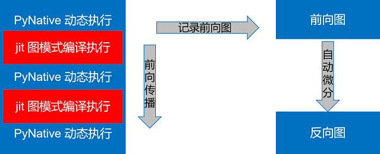

# 函数式算子切分

<a href="https://gitee.com/mindspore/mindspore/blob/master/docs/api/api_python/samples/mindspore/pynative_shard_function_parallel.md" target="_blank"></a>

## 概述

动态图支持语法更丰富，使用更为灵活，但是目前MindSpore的动态图模式不支持自动并行的各种特性。借鉴Jax的pmap的设计理念，我们设计了shard函数，支持在动态图模式下，指定某一部分以图模式执行，并且执行各种并行操作。

## 基本原理

MindSpore的动态图模式下，可以通过`@jit`的装饰符，指定某一段以图模式编译执行，在前向执行的同时，会将执行的算子、子图记录下来，前向执行完毕后，会对得到的整图进行自动微分得到反向图，具体流程如下图所示：



*图1：@jit装饰器的执行示意图*

Shard function沿用此模式，不同的是可以在图模式编译执行的环节进行算子级别的模型并行。

## 操作实践

### 样例代码说明

>你可以在这里下载完整的样例代码：
>
><https://gitee.com/mindspore/docs/tree/master/docs/sample_code/pynative_shard_function_parallel>。

目录结构如下：

```text
└─sample_code
    ├─shard_function_parallel
        ├── rank_table_8pcs.json
        ├── run_shard_function_example.sh
        └── shard_function_example.py
```

其中每个文件的作用如下：

- shard_function_example.py：shard function的示例代码，介绍了如何使用shard function指定部分代码并行执行。
- rank_table_8pcs.json：RANK_TABLE_FILE的8卡配置文件。
- run_shard_function_example.sh：shard function example的启动脚本。

### 接口介绍

```python
def shard(fn, in_strategy, out_strategy=None, parameter_plan=None, device="Ascend", level=0):
    return shard_fn(fn, in_strategy, out_strategy, device, level)
```

`in_strategy(tuple)`：指定输入`Tensor`的切分策略，每个元素为元组，表示对应输入`Tensor`的切分策略，每个元组的长度要与对应`Tensor`的维度相等，表示每个维度如何切分，可以传入`None`，对应的切分策略将自动推导生成。

`out_strategy(None, tuple)`：指定输出`Tensor`的切分策略，用法和`in_strategy`相同，默认值为None，目前尚未使能，后续会开放。在深度学习模型中，输出策略会根据full_batch的值，被替换为数据并行(False)和重复计算(True)。

`parameter_plan(None, dict)`：指定各参数的切分策略，传入字典时，键是str类型的参数名，值是一维整数tuple表示相应的切分策略，如果参数名错误或对应参数已经设置了切分策略，该参数的设置会被跳过。默认值：None，表示不设置。

`device(string)`：指定执行的设备，可选范围`Ascend`、`GPU`和`CPU`，默认为`Ascend`，目前尚未使能，后续会开放。

`level(int)`：指定全部算子搜索策略，输入输出`Tensor`的切分策略由用户指定，其余算子的切分策略会由框架搜索得到，此参数指定搜索时的目标函数，可选范围为0、1、2，分别代表最大化计算通信比、内存消耗最小、最大化运行速度，默认为0，目前尚未使能，后续会开放。

### 导入相关包并设定执行模式

如前所述，shard function会将动态图模式下某一部分以图模式执行算子级模型并行，因此使用shard function时需要设置模式为PyNative：

```python
import mindspore as ms
from mindspore.communication import init


ms.set_context(mode=ms.PYNATIVE_MODE)
init()
ms.set_auto_parallel_context(parallel_mode=ms.ParallelMode.AUTO_PARALLEL,
                             search_mode="sharding_propagation", device_num=8)
```

> 当前函数式算子切分仅支持在并行模式为"auto_parallel"且策略搜索算法为"sharding_propagation"下使用。

### 指定输出排布

当前支持指定输出排布为数据并行和重复计算，可通过auto_parallel_context里的`dataset_strategy`或`full_batch`属性控制，具体设置方法如下：

```python
# 通过dataset_strategy设置，推荐此方式
ms.set_auto_parallel_context(dataset_strategy="full_batch")  # 数据集不切分，且shard的输出张量也不切分；(默认配置)
ms.set_auto_parallel_context(dataset_strategy="data_parallel")  # 数据集按数据并行的方式切分，且shard的输出张量也按数据并行方式切分

# 通过full_batch设置，该属性即将弃用
ms.set_auto_parallel_context(full_batch=True)   # 数据集不切分，且shard的输出张量也不切分；(默认配置)
ms.set_auto_parallel_context(full_batch=False)  # 数据集按数据并行的方式切分，且shard的输出张量也按数据并行方式切分
```

### Cell使用函数式切分

shard function目前有两种使用方法，以下面的网络为例介绍shard function的使用方法。

```python
import mindspore.nn as nn
class BasicBlock(nn.Cell):
    def __init__(self):
        super(BasicBlock, self).__init__()
        self.dense1 = nn.Dense(32, 32)
        self.gelu = nn.GELU()
        self.dense2 = nn.Dense(32, 32)

    def construct(self, x):
        # two dimensional input x
        x = self.dense1(x)
        x = self.gelu(x)
        x = self.dense2(x)
        return x

class Net(nn.Cell):
    def __init__(self):
        super(Net, self).__init__()
        self.block1 = BasicBlock()
        self.block2 = BasicBlock()
        self.block3 = BasicBlock()

    def construct(self, x):
        # All three blocks are executed as PyNative mode.
        x = self.block1(x)
        x = self.block2(x)
        x = self.block3(x)
        return x
```

- 通过Cell成员方法`shard`进行自调用

    ```python
    class Net1(Net):
        def __init__(self):
            super(Net1, self).__init__()
            # slice input along the second axis and make output as data-parallel layout
            self.block1.shard(in_strategy=((1, 8),),
                              parameter_plan={'self.block1.dense2.weight': (8, 1)})

        def construct(self, x):
            # block1 is executed as GRAPH.
            x = self.block1(x)
            # block2 and block3 are executed as PyNative mode.
            x = self.block2(x)
            x = self.block3(x)
            return x
    ```

- 使用函数式接口`mindspore.shard`，由于`shard`函数的返回值为函数，使用函数式接口的时候，不能将已经实例过的类赋值为`shard`的返回值，因为MindSpore不支持将类实例赋值为其它类型

    ```python
    class NetError(Net):
        def __init__(self):
            self.block1 = ms.shard(self.block1, in_strategy=((8, 1),),
                                    parameter_plan={'self.block1.dense2.weight': (8, 1)})

        def construct(self, x):
            x = self.block1(x)
            x = self.block2(x)
            x = self.block3(x)
            return x
    ```

    如此执行会遇到报错：

    ```text
    TypeError: For 'Cell', the type of block1 should be cell, but got function.
    ```

    正确使用方式如下：

    ```python
    class Net2(Net):
        def __init__(self):
            # set the return function of shard a different name with the Cell instance
            self.block1_graph = ms.shard(self.block1, in_strategy=((8, 1),),
                                          parameter_plan={'self.block1.dense2.weight': (8, 1)})
            self.block2.shard(in_strategy=((1, 8),))

        def construct(self, x):
            # block1 is executed as GRAPH with input sliced along the first dimension
            x = self.block1_graph(x)
            # block2 is executed as GRAPH as well.
            x = self.block2(x)
            # block3 is executed as PyNative mode.
            x = self.block3(x)
            return x
    ```

### function使用函数式切分

- function可以使用`mindspore.shard`进行函数式切分，以matmul+bias_add+relu函数为例，使用方法如下：

    ```python
    import numpy as np

    import mindspore as ms
    import mindspore.ops as ops
    from mindspore import Tensor

    ms.set_auto_parallel_context(dataset_strategy="full_batch") # 此处例子为数据集不切分且shard的输出张量不切分

    def dense_relu(x, weight, bias):
        x = ops.matmul(x, weight)
        x = ops.bias_add(x, bias)
        x = ops.relu(x)
        return x

    x = Tensor(np.random.uniform(0, 1, (32, 128)), ms.float32)
    weight = Tensor(np.random.uniform(0, 1, (128, 10)), ms.float32)
    bias = Tensor(np.random.uniform(0, 1, (10,)), ms.float32)

    # 通过in_strategy指定x的切分策略为(4, 2)、weight和bias切分策略设为None，表示自动推导生成。
    result = ms.shard(dense_relu, in_strategy=((4, 2), None, None))(x, weight, bias)
    print('result.shape:', result.shape)
    ```

    > 注意，参数的初始化依赖于Cell的参数管理，当传入shard的fn类型为function时，其定义不应该含有参数（如Conv2D、Dense等运算）。

### 运行代码

当前MindSpore可以通过分进程启动和mpirun两种方式拉起分布式并行任务。

#### 通过多进程启动

在Ascend上执行，且不存在子Group通信时，可以通过多进程的方式启动分布式并行。

> 当某个对象存在维度未切满或对至少切分了两个维度时，模型并行会产生子Group通信。
>
> 即通过该方式启动时，`shard`内部的模型并行产生的通信只能发生在`world group`内部，所以指定的切分策略目前只能支持切一个维度。

上述代码需要在配置分布式变量后才可以运行。Ascend环境需要配置RANK_TABLE_FILE、RANK_ID和DEVICE_ID。配置的过程请参考[此处](https://www.mindspore.cn/tutorials/experts/zh-CN/master/parallel/train_ascend.html#配置分布式环境变量)。

Ascend分布式相关的环境变量有：

- RANK_TABLE_FILE：组网信息文件的路径。rank_table_file文件可以使用models代码仓中的hccl_tools.py生成，可以从[此处](https://gitee.com/mindspore/models/tree/master/utils/hccl_tools)获取。
- DEVICE_ID：当前卡在机器上的实际序号。
- RANK_ID：当前卡的逻辑序号。

```bash
#!/bin/bash
set -e
echo "=============================================================================================================="
echo "Please run the script as: "
echo "bash run_shard_function_example.sh RANK_SIZE RANK_TABLE_FILE"
echo "For example: bash run_fusion_example.sh 8"
echo "It is better to use the absolute path."
echo "This example is expected to run on the Ascend environment."
echo "=============================================================================================================="
if [$# != 2]
then
    echo "Usage: bash run_shard_function_example.sh RANK_SIZE RANK_TABLE_FILE"
exit 1
fi
RANK_SIZE=$1
RANK_TABLE_FILE=$2
test_dist_8pcs()
{
    export RANK_TABLE_FILE=${RANK_TABLE_FILE}
    export RANK_SIZE=8
}
test_dist_${RANK_SIZE}pcs

for((i=0;i<${RANK_SIZE};i++))
do
    rm -rf device$i
    mkdir device$i
    cp ./shard_function_example.py ./device$i
    cd ./device$i
    export DEVICE_ID=$i
    export RANK_ID=$i
    echo "start training for device $i"
    env > env$i.log
    python ./shard_function_example.py > train.log$i 2>&1 &
    cd ../
done
echo "The program launch succeed, the log is under device0/train.log0."
```

在当前目录下配置完RANK_TABLE_FILE之后，下述的命令要求用户拥有8张Ascend 910设备。运行命令如下：

```bash
bash run_shard_function_example.sh 8 rank_table_8pcs.json
```

执行过程中，框架会自动为`shard`的输入函数进行算子级别的模型并行，每个算子的并行策略由框架搜索得到，整个过程用户无感知。可以按如下操作存图

```python
ms.set_context(save_graphs=2)
```

在`step_parallel_end.ir`中可以看到具体每一个算子的并行策略。

#### 通过mpirun启动

在Ascend和GPU上，可以通过mpirun的方式启动分布式并行，**该启动方式支持创建子Group通信**。运行命令如下：

```bash
mpirun -n ${DEVICE_NUM} --allow-run-as-root python ${PYTHON_SCRIPT_PATH}
```

以示例代码为例，启动8卡，对应的命令为：

```bash
mpirun -n 8 --allow-run-as-root python shard_function_example.py
```

> 注意，在Ascend上通过mpirun启动且子Group数量较多时，可能会碰到创建通信域失败的错误，具体报错信息如："Ascend collective Error: "HcclCommInitRootInfo failed. | Error Number 2"。可以减少`context`里的`max_device_memory`来给hccl预留足够的内存创建通信域。

## 使用限制

- 执行模式需设置为`PYNATIVE_MODE`，并行配置为`AUTO_PARALLEL`，`search_mode`为`sharding_propagation`。
- 支持嵌套`vmap`使用，使用时必须`shard`在外，`vmap`在内。
- 不支持`shard`嵌套使用。
