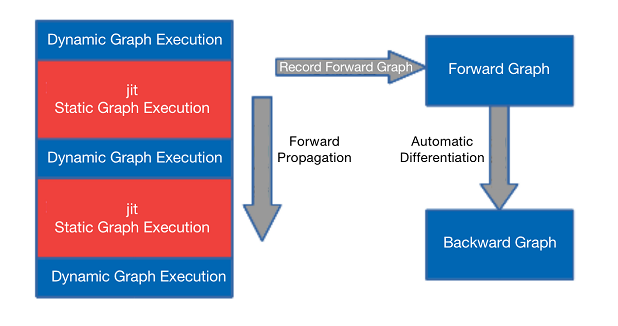

# Functional Operator Sharding

<a href="https://gitee.com/mindspore/mindspore/tree/master/docs/api/api_python_en/samples/mindspore/pynative_shard_function_parallel.md" target="_blank"></a>

## Overview

Dynamic diagram supports richer syntax and are more flexible to use, but currently MindSpore's dynamic diagram mode does not support the various features of automatic parallelism. Drawing on the design concept of Jax's pmap, we design the shard function to support specifying a certain part to be executed in graph mode and performing various parallel operations in dynamic graph mode.

## Basic Principle

In MindSpore dynamic graph mode, you can specify a segment to be compiled and executed in the graph mode by using the `@jit` decorator. During forward execution, the executed operators and subgraphs will be recorded, and after the forward execution, the whole graph obtained will be automatically differentiated to obtain the reverse graph, as shown in the following diagram:



*Figure 1: Schematic diagram of the @jit decorator implementation*

The Shard function follows this pattern, except that it can perform operator-level model parallelism in the session where the graph pattern is compiled and executed.

## Operation Practices

### Sample Code Description

> You can download the full sample code here:
>
> <https://gitee.com/mindspore/docs/tree/master/docs/sample_code/pynative_shard_function_parallel>.

The directory structure is as follows:

```text
└─sample_code
    ├─shard_function_parallel
        ├── rank_table_8pcs.json
        ├── run_shard_function_example.sh
        └── shard_function_example.py
```

The role of each of these files is as follows:

- shard_function_example.py: The shard function sample code describes how to use the shard function to specify the part of the code to perform parallel execution.
- rank_table_8pcs.json: 8-card configuration file for RANK_TABLE_FILE.
- run_shard_function_example.sh: Start script for shard function example.

### Interface Introduction

```python
def shard(fn, in_strategy, out_strategy=None, parameter_plan=None, device="Ascend", level=0):
    return shard_fn(fn, in_strategy, out_strategy, device, level)
```

`in_strategy(tuple)`: Specify the shard strategy of the input `Tensor`. Each element is a tuple indicating the shard strategy corresponding to the input `Tensor`. The length of each tuple should be equal to the dimension of the corresponding `Tensor`, indicating how each dimension is sliced, and `None` can be passed in. The corresponding shard strategy will be automatically derived and generated.

`out_strategy(None, tuple)`: Specify the shard strategy for output `Tensor`. The usage is the same as `in_strategy`, and the default value is None. This shard strategy is not enabled yet, will open later. In the deep learning model, the output strategy is replaced with data parallelism (False) and repeated computation (True), according to the value of full_batch.

`parameter_plan(None, dict)`: Specify the shard strategy for each parameter. When passed into the dictionary, the key is the parameter name of str type, and the value is a 1-dimensional integer tuple indicating the corresponding shard strategy. The setting of this parameter will be skipped if the parameter name is wrong or the corresponding parameter has already set the shard strategy. Default: None, which means no setting.

`device(string)`: Specify the device to execute on. The optional range is `Ascend`, `GPU` and `CPU`. Default: `Ascend`, currently not enabled, will open later.

`level(int)`: Specify the search strategy for all operators. The shard strategy for the input and output `Tensor` is specified by the user, and the shard strategy for the rest of the operators will be obtained by the framework search. This parameter specifies the objective function when searching, and the optional range is 0, 1, 2, which represents maximizing the computational communication ratio, minimizing memory consumption, and maximizing operation speed, respectively. Default: 0, currently not enabled, will open later.

### Importing Relevant Packages and Setting Execution Mode

As mentioned earlier, the shard function executes a part of the dynamic graph schema in parallel with the operator-level model in graph mode, so during using the shard function you need to set the mode to PyNative.

```python
import mindspore as ms
from mindspore.communication import init


ms.set_context(mode=ms.PYNATIVE_MODE)
init()
ms.set_auto_parallel_context(parallel_mode=ms.ParallelMode.AUTO_PARALLEL,
                             search_mode="sharding_propagation", device_num=8)
```

> The current functional operator slicing is only supported when the parallel mode is "auto_parallel" and the policy search algorithm is "sharding_propagation".

### Specifying Output Scheduling

Support specifying output scheduling as data parallelism and double counting and control through the `dataset_strategy` or `full_batch` attribute in auto_parallel_context, which is set as follows:

```python
# Set output scheduling via dataset_strategy, which is recommended
ms.set_auto_parallel_context(dataset_strategy="full_batch")  # The dataset is not sliced and the output tensor of the shard is not sliced; (default configuration)
ms.set_auto_parallel_context(dataset_strategy="data_parallel")  # The dataset is sliced in data parallelism and the output tensor of the shard is also sliced in data parallelism

# Set output scheduling via full_batch, and this property will be deprecated soon
ms.set_auto_parallel_context(full_batch=True)   # The dataset is not sliced and the output tensor of the shard is not sliced; (default configuration)
ms.set_auto_parallel_context(full_batch=False)  # The dataset is sliced in data parallelism and the output tensor of the shard is also sliced in data parallelism
```

### Cell Uses Shard Function

There are currently two ways to use the shard function. The following network is an example of how to use the shard function.

```python
import mindspore.nn as nn
class BasicBlock(nn.Cell):
    def __init__(self):
        super(BasicBlock, self).__init__()
        self.dense1 = nn.Dense(32, 32)
        self.gelu = nn.GELU()
        self.dense2 = nn.Dense(32, 32)

    def construct(self, x):
        # two dimensional input x
        x = self.dense1(x)
        x = self.gelu(x)
        x = self.dense2(x)
        return x

class Net(nn.Cell):
    def __init__(self):
        super(Net, self).__init__()
        self.block1 = BasicBlock()
        self.block2 = BasicBlock()
        self.block3 = BasicBlock()

    def construct(self, x):
        # All three blocks are executed as PyNative mode.
        x = self.block1(x)
        x = self.block2(x)
        x = self.block3(x)
        return x
```

- Self-call via member method `shard` of Cell

    ```python
    class Net1(Net):
        def __init__(self):
            super(Net1, self).__init__()
            # slice input along the second axis and make output as data-parallel layout
            self.block1.shard(in_strategy=((1, 8),),
                              parameter_plan={'self.block1.dense2.weight': (8, 1)})

        def construct(self, x):
            # block1 is executed as GRAPH.
            x = self.block1(x)
            # block2 and block3 are executed as PyNative mode.
            x = self.block2(x)
            x = self.block3(x)
            return x
    ```

- When using the functional interface `mindspore.shard`, since the return value of the `shard` function is a function, you cannot assign an instantiated class to the return value of `shard` when using the functional interface, because MindSpore does not support assigning class instances to other types

    ```python
    class NetError(Net):
        def __init__(self):
            self.block1 = ms.shard(self.block1, in_strategy=((8, 1),),
                                    parameter_plan={'self.block1.dense2.weight': (8, 1)})

        def construct(self, x):
            x = self.block1(x)
            x = self.block2(x)
            x = self.block3(x)
            return x
    ```

    An error may be reported after execution:

    ```text
    TypeError: For 'Cell', the type of block1 should be cell, but got function.
    ```

    The correct use is as follows:

    ```python
    class Net2(Net):
        def __init__(self):
            # set the return function of shard a different name with the Cell instance
            self.block1_graph = ms.shard(self.block1, in_strategy=((8, 1),),
                                          parameter_plan={'self.block1.dense2.weight': (8, 1)})
            self.block2.shard(in_strategy=((1, 8),))

        def construct(self, x):
            # block1 is executed as GRAPH with input sliced along the first dimension
            x = self.block1_graph(x)
            # block2 is executed as GRAPH as well.
            x = self.block2(x)
            # block3 is executed as PyNative mode.
            x = self.block3(x)
            return x
    ```

### function Uses Shard Function

- function can using `mindspore.shard` for shard function. Taking the matmul+bias_add+relu function as an example, the use is as follows:

    ```python
    import numpy as np

    import mindspore as ms
    import mindspore.ops as ops
    from mindspore import Tensor

    ms.set_auto_parallel_context(dataset_strategy="full_batch") # Here is an example where the dataset is unsliced and the output tensor of the shard is unsliced

    def dense_relu(x, weight, bias):
        x = ops.matmul(x, weight)
        x = ops.bias_add(x, bias)
        x = ops.relu(x)
        return x

    x = Tensor(np.random.uniform(0, 1, (32, 128)), ms.float32)
    weight = Tensor(np.random.uniform(0, 1, (128, 10)), ms.float32)
    bias = Tensor(np.random.uniform(0, 1, (10,)), ms.float32)

    # Specify the shard strategy for x as (4, 2) and shard strategy of weight and bias as None via in_strategy, indicating automatic derivation generation.
    result = ms.shard(dense_relu, in_strategy=((4, 2), None, None))(x, weight, bias)
    print('result.shape:', result.shape)
    ```

     > It is noted that the initialization of parameters depends on the Cell parameter management, and when the fn type passed into the shard is function, its definition should not contain parameters (e.g. Conv2D and Dense).

### Running the Code

Currently MindSpore can pull up distributed parallel tasks by both multi-process start and mpirun.

#### Starting via Multi-process

When executed on Ascend and there is no sub-Group communication, distributed parallelism can be initiated by means of multi-process.

> Model parallelism generates sub-Group communication when the number of parts that an object is cut is smaller than the number of cards or with at least two dimensions cut.
>
> That is, when started by this method, the communication generated by the model parallelism inside `shard` can only occur inside `world group`, so the specified shard strategy can currently only support slicing one dimension.

The above code needs to be configured with distributed variables before it can run. The Ascend environment should configure with RANK_TABLE_FILE, RANK_ID and DEVICE_ID. Please refer to [here](https://www.mindspore.cn/tutorials/experts/en/master/parallel/train_ascend.html#configuring-distributed-environment-variables) for the configuration process.

Environment variables related to Ascend distributed are:

- RANK_TABLE_FILE: The path to the network information file. The rank_table_file file can be generated by using hccl_tools.py in the models code bin, which can be obtained from [here](https://gitee.com/mindspore/models/tree/master/utils/hccl_tools).
- DEVICE_ID: The actual serial number of the current card on the machine.
- RANK_ID: The logical serial number of the current card.

```bash
#!/bin/bash
set -e
echo "=============================================================================================================="
echo "Please run the script as: "
echo "bash run_shard_function_example.sh RANK_SIZE RANK_TABLE_FILE"
echo "For example: bash run_fusion_example.sh 8"
echo "It is better to use the absolute path."
echo "This example is expected to run on the Ascend environment."
echo "=============================================================================================================="
if [$# != 2]
then
    echo "Usage: bash run_shard_function_example.sh RANK_SIZE RANK_TABLE_FILE"
exit 1
fi
RANK_SIZE=$1
RANK_TABLE_FILE=$2
test_dist_8pcs()
{
    export RANK_TABLE_FILE=${RANK_TABLE_FILE}
    export RANK_SIZE=8
}
test_dist_${RANK_SIZE}pcs

for((i=0;i<${RANK_SIZE};i++))
do
    rm -rf device$i
    mkdir device$i
    cp ./shard_function_example.py ./device$i
    cd ./device$i
    export DEVICE_ID=$i
    export RANK_ID=$i
    echo "start training for device $i"
    env > env$i.log
    python ./shard_function_example.py > train.log$i 2>&1 &
    cd ../
done
echo "The program launch succeed, the log is under device0/train.log0."
```

After configuring RANK_TABLE_FILE in the current directory, the following command requires the user to have 8 Ascend 910 devices. Run the command as follows:

```bash
bash run_shard_function_example.sh 8 rank_table_8pcs.json
```

During execution, the framework automatically performs operator-level model parallelism for the input function of `shard`, and the parallel policy of each operator is obtained by the framework search. The whole process is not perceived by the user. The graph can be saved as follows:

```python
ms.set_context(save_graphs=2)
```

In `step_parallel_end.ir`, you can see the specific parallel strategy for each operator.

#### Starting via mpirun

On Ascend and GPU, distributed parallelism can be started by means of mpirun. **This start method supports the creation of sub-Group communication**. Run the command as follows:

```bash
mpirun -n ${DEVICE_NUM} --allow-run-as-root python ${PYTHON_SCRIPT_PATH}
```

Taking the sample code as an example to start 8-card, the corresponding command is:

```bash
mpirun -n 8 --allow-run-as-root python shard_function_example.py
```

> It should be noted that when starting with mpirun on Ascend and a large number of sub-Group, the error of failure to create a communication domain is reported, as shown in the error message "Ascend collective Error: "HcclCommInitRootInfo failed. | Error Number 2". You can reduce the `max_device_memory` in `context` to reserve enough memory for hccl to create communication domains.

## Usage Restrictions

- The execution mode should be set to `PYNATIVE_MODE`, the parallelism configuration to `AUTO_PARALLEL`, and the `search_mode` to `sharding_propagation`.
- Support using nested `vmap`. When using, `shard` must  be outside, `vmap` be inside.
- Not support using nested `shard`.
