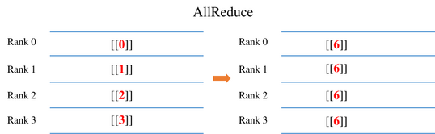
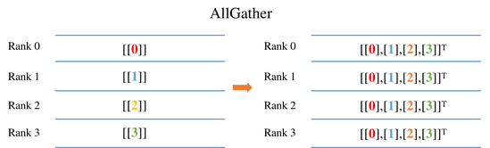
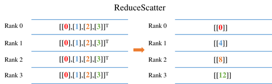
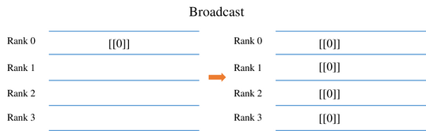
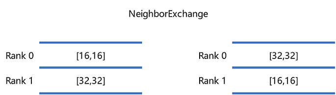
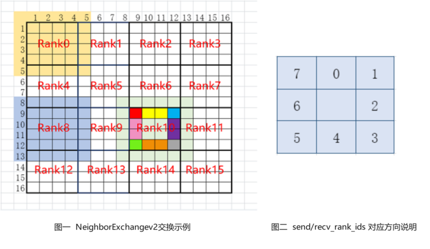
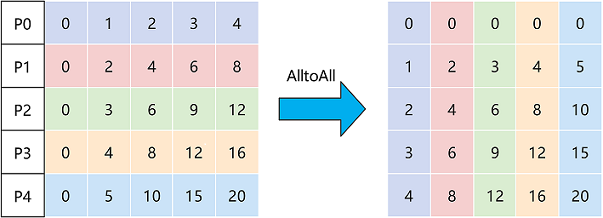

# Distributed Set Communication Primitives

<a href="https://gitee.com/mindspore/mindspore/blob/master/docs/api/api_python_en/samples/ops/communicate_ops.md" target="_blank"></a>

Distributed training involves communication operations such as `AllReduce`, `ReduceScatter`, `AllGather` and `Broadcast` for data transfer, and we will explain their meaning and sample code in the following sections.

Examples of different communication operations by using 4 GPUs are given in each of the following sections. The output in the example comes from the results of the `rank0` program on card 0. The user needs to save each section code below as a separate communication.py. Because it involves a multi-card program, the user needs to go through the `mpirun` command to start communication.py. The `mpirun` commands requires the installation of OpenMPI as well as NCCL, and please refer to [here](https://www.mindspore.cn/tutorials/experts/en/master/parallel/mpirun.html) for the corresponding installation.

```bash
mpirun -output-filename log -merge-stderr-to-stdout -np 4 python communication.py
```

The `-np` in the above code means that 4 process tasks will be started, occupying cards 0, 1, 2 and 3 respectively, and the output logs will be saved under the `log/1/rank.0` directory. The user can view the output of the program here. `python communication.py` indicates starting the script.

## AllReduce



The `AllReduce` operation sums the input Tensor of the `AllReduce` operator in each card. Finally, the output of the `AllReduce` operator in each card is the same value. For example, as shown in the figure above, the input to the AllReduce operator for each card is `0, 1, 2, 3`. After `AllReduce`, the output of each card is the sum of all card inputs as 6(0+1+2+3).

The sample code is as follows: we initialize the value of the `AllReduce` operator input in each process based on the rank number (the communication number to which each card belongs), e.g. for card 0, we request an input of size 1x1 with a value of 0. Then call the `AllReduce` operator to communicate among the cards with communication domain `0-1-2-3` (communication range of all cards i.e. nccl_world_group) and print the output results.

```python
import numpy as np
from mindspore.communication import init, get_rank
import mindspore as ms
import mindspore.nn as nn
import mindspore.ops as ops

init()
class Net(nn.Cell):
    def __init__(self):
        super(Net, self).__init__()
        self.all_reduce_sum = ops.AllReduce(ops.ReduceOp.SUM, group="nccl_world_group")

    def construct(self, x):
        return self.all_reduce_sum(x)

value = get_rank()
input_x = ms.Tensor(np.array([[value]]).astype(np.float32))
net = Net()
output = net(input_x)
print(output)
```

The card 0 runs as follows, and the output log path is `log/1/rank.0`:

```text
[[6.]]
```

## AllGather



The `AllGather` operation will stitch the 0th dimension of the input Tensor on each card, and the final output of each card is the same value. For example, as shown above, the input of each card is a Tensor of size 1x1. After the `AllGather` operation, the output shape of the `AllGather` operator of each card is [4,1]. The element values with index [0,0] are from the input [[0.0]] of card 0 `AllGather`, and the element values with index [1,0] are from the input [[1.0]] of card 1 `AllGather`.

The sample code is as follows: we initialize the value of the `AllGather` operator input in each process based on the rank number (the communication number to which each card belongs), e.g. for card 0, we request an input of size 1x1 with a value of 0. Then call the `AllGather` operator to communicate among the cards with communication domain `0-1-2-3` (communication range of all cards i.e. nccl_world_group) and print the output results.

```python
import numpy as np
import mindspore.ops as ops
import mindspore.nn as nn
from mindspore.communication import init, get_rank
import mindspore as ms

ms.set_context(mode=ms.GRAPH_MODE)
init()
class Net(nn.Cell):
    def __init__(self):
        super(Net, self).__init__()
        self.all_gather = ops.AllGather()

    def construct(self, x):
        return self.all_gather(x)

value = get_rank()
input_x = ms.Tensor(np.array([[value]]).astype(np.float32))
net = Net()
output = net(input_x)
print(output)
```

The result of the run is as follows, with the output log path `log/1/rank.0`:

```text
[[0.],
 [1.],
 [2.],
 [3.]]
```

## ReduceScatter



The `ReduceScatter` operation will first sum the input of each card and then slice the data by number of cards in the 0th dimension and distribute the data to the corresponding card. For example, as shown above, the input of each card is a 4x1 Tensor. `ReduceScatter` first sums the input to get Tensor of [0, 4, 8, 12], and then distributes it to get Tensor of size 1x1 per card. For example, the output result corresponding to card 0 is [[0.0]], and the output result corresponding to card 1 is [[4.0]].

The sample code is as follows: we initialize the value of the `ReduceScatter` operator input in each process based on the rank number (the communication number to which each card belongs), e.g. for card 0, we request an input of size 4x1 with a value of 0. Then call the `ReduceScatter` operator to communicate among the cards with communication domain `0-1-2-3` (communication range of all cards i.e. nccl_world_group) and print the output results.

```python
import mindspore as ms
from mindspore.communication import init, get_rank
import mindspore.nn as nn
import mindspore.ops as ops
import numpy as np

ms.set_context(mode=ms.GRAPH_MODE)
init()
class Net(nn.Cell):
    def __init__(self):
        super(Net, self).__init__()
        self.reduce_scatter = ops.ReduceScatter(ops.ReduceOp.SUM)

    def construct(self, x):
        return self.reduce_scatter(x)

input_x = ms.Tensor(np.array([[0], [1], [2], [3]]).astype(np.float32))
net = Net()
output = net(input_x)
print(output)
```

The running result is as follows, with the output log path `log/1/rank.0`:

```text
[[0.]]
```

## Broadcast



The sample code is as follows: we set the root node of the `Broadcast` operator to card 0, indicating that data will be broadcast from card 0 to other cards. We request an input of size 1x1 with a value of 0. Then call the `Broadcast` operator to communicate among the cards with communication domain `0-1-2-3` (communication range of all cards i.e. nccl_world_group). Finally, the output value of each card is from card 0.

```python
import mindspore as ms
from mindspore.communication import init
import mindspore.nn as nn
import mindspore.ops as ops
import numpy as np

ms.set_context(mode=ms.GRAPH_MODE)
init()
class Net(nn.Cell):
    def __init__(self):
        super(Net, self).__init__()
        self.broadcast = ops.Broadcast(0)

    def construct(self, x):
        return self.broadcast((x,))

input_x = ms.Tensor(np.array([[0]]).astype(np.int32))
net = Net()
output = net(input_x)
print(output)
```

The result of the run is as follows, with the output log path `log/1/rank.0`:

```text
[[0]]
```

## NeighborExchange



The `NeighborExchange` operation will provide a set of data to be sent to each of the other specific cards while receiving data from the specific card. For example, in the above figure, rank 0 sends a Tensor with shape [16,16] to rank 1 and receives a Tensor with shape [32,32] from rank 1. rank 1 sends a Tensor with shape [32,32] to rank 0 and receives a Tensor with shape [16,16] from rank 0. Finally, the rank 0 outputs the received Tensor with shape [32,32], and rank 1 outputs the received Tensor with [16,16].

The example code as follows: we use the `NeighborExchange` operator for data exchange between card 0 and card 1, sending data from card 0 to card 1, and receiving data from card 1. Card 1 sends data to card 0 and receives data from card 0. Finally each card outputs the received data.

```python
import os
import mindspore as ms
from mindspore.communication import init
import mindspore.nn as nn
import mindspore.ops as ops
import numpy as np

class Net0(nn.Cell):
    def __init__(self):
        super(Net0, self).__init__()
        self.neighbor_exchange = ops.NeighborExchange(send_rank_ids=[1], recv_rank_ids=[1], recv_shapes=([2, 2],), send_shapes=([3, 3],), recv_type=ms.float32)

    def construct(self, x):
        out = self.neighbor_exchange((x,))
        return out[0]

class Net1(nn.Cell):
    def __init__(self):
        super(Net1, self).__init__()
        self.neighbor_exchange = ops.NeighborExchange(send_rank_ids=[0], recv_rank_ids=[0], recv_shapes=([3, 3],), send_shapes=([2, 2],), recv_type=ms.float32)

    def construct(self, x):
        out = self.neighbor_exchange((x,))
        return out[0]

ms.set_context(mode=ms.GRAPH_MODE, device_target='Ascend')
init()
rank_id = int(os.getenv("RANK_ID"))
if (rank_id % 2 == 0):
    input_x = ms.Tensor(np.ones([3, 3]), dtype = ms.float32)
    net = Net0()
    output = net(input_x)
    print(output)
else:
    input_x = ms.Tensor(np.ones([2, 2]) * 2, dtype = ms.float32)
    net = Net1()
    output = net(input_x)
    print(output)
```

Use a shell script to start the 2-card script. The `rank_table_file` file below can be generated by hccl_tools.py under [models](https://gitee.com/mindspore/models), which corresponds to the directory file `models/utils/ hccl_tools`. The sample shell script is as follows:

```shell
export MINDSPORE_HCCL_CONFIG_PATH=rank_table_file
export DEVICE_NUM=2
BASE_PATH=$(cd "$(dirname $0)"; pwd)
for((i=0; i<$DEVICE_NUM; i++)); do
    rm -rf ${BASE_PATH}/rank${i}
    mkdir ${BASE_PATH}/rank${i}
    cp -r ${BASE_PATH}/neighborexchange.py ${BASE_PATH}/rank${i}/
    cd ${BASE_PATH}/rank${i}
    export RANK_ID=${i}
    export DEVICE_ID=${i}
    echo "start training for device $i"
    python neighborexchange.py > log.txt 2>&1 &
done
```

The results of rank0 are:

```text
[[2. 2.]
 [2. 2.]]
```

The results of rank1 are:

```text
[[1. 1. 1.]
 [1. 1. 1.]
 [1. 1. 1.]]
```

## NeighborExchangeV2



The `NeighborExchangeV2` operation sends part of the data in the Tensor to the surrounding 8 cards according to the attribute settings, and receives data from the surrounding 8 cards and stitches them into a new Tensor, which is often used in scenarios where a large Tensor is sliced on multiple cards for distributed convolutional operations. Attributes send_rank_ids and recv_rank_ids are 8 numbers, respectively, indicating sending/receiving rank_id in 8 directions, and filling -1 means no send/no receive. As shown above, figure 2 indicates the order corresponding to the 8 directions. The attributes send_lens and recv_lens are four numbers that represent the send/receive lengths in the four directions [top, bottom, left, right], respectively. For example, in Figure 1 above, a 16-card example is shown, taking rank 10 as an example, setting send_rank_ids=[6,7,11,15,14,13,9,5], the data of rank 10 is sliced and sent to rank 5, 6, 7, 11, 15, 14, 13, 9 respectively, for example, red in Figure is sent to rank 5, red, yellow and blue to rank 6, blue to rank 7, etc. Setting recv_rank_ids=[6,7,11,15,14,13,9,5], at the same time rank10 receives some data from each of these cards stitched into the corresponding direction to form a new Tensor output, as shown in the figure with rank10 and the light green part.

The sample code is as follows: we use the `NeighborExchangeV2` operator for data exchange between card 0 and card 1, sending the data below card 0 to card 1 and receiving the data from card 1 stitched below. Card 1 sends the upper part of the data to card 0 and receives the data from card 0 stitched on top. Finally each card outputs the received data.

```python
import os
import mindspore as ms
from mindspore.communication import init
import mindspore.nn as nn
import mindspore.ops as ops
import numpy as np

class Net0(nn.Cell):
    def __init__(self):
        super(Net0, self).__init__()
        self.neighbor_exchangev2 = ops.NeighborExchangeV2(send_rank_ids=[-1, -1, -1, -1, 1, -1, -1, -1], send_lens=[0, 1, 0, 0], recv_rank_ids=[-1, -1, -1, -1, 1, -1, -1, -1], recv_lens=[0, 1, 0, 0], data_format="NCHW")

    def construct(self, x):
        out = self.neighbor_exchangev2(x)
        return out

class Net1(nn.Cell):
    def __init__(self):
        super(Net1, self).__init__()
        self.neighbor_exchangev2 = ops.NeighborExchangeV2(send_rank_ids=[0, -1, -1, -1, -1, -1, -1, -1], send_lens=[1, 0, 0, 0], recv_rank_ids=[0, -1, -1, -1, -1, -1, -1, -1], recv_lens=[1, 0, 0, 0], data_format="NCHW")

    def construct(self, x):
        out = self.neighbor_exchangev2(x)
        return out

ms.set_context(mode=ms.GRAPH_MODE, device_target='Ascend')
init()
rank_id = int(os.getenv("RANK_ID"))
if (rank_id % 2 == 0):
    input_x = ms.Tensor(np.ones([1, 1, 2, 2]), dtype = ms.float32)
    net = Net0()
    output = net(input_x)
    print(output)
else:
    input_x = ms.Tensor(np.ones([1, 1, 2, 2]) * 2, dtype = ms.float32)
    net = Net1()
    output = net(input_x)
    print(output)
```

Use a shell script to start the 2-card script. The `rank_table_file` file below can be generated by hccl_tools.py under [models](https://gitee.com/mindspore/models), which corresponds to the directory file `models/utils/ hccl_tools`. The sample shell script is as follows:

```shell
export MINDSPORE_HCCL_CONFIG_PATH=rank_table_file
export DEVICE_NUM=2
BASE_PATH=$(cd "$(dirname $0)"; pwd)
for((i=0; i<$DEVICE_NUM; i++)); do
    rm -rf ${BASE_PATH}/rank${i}
    mkdir ${BASE_PATH}/rank${i}
    cp -r ${BASE_PATH}/neighborexchangev2.py ${BASE_PATH}/rank${i}/
    cd ${BASE_PATH}/rank${i}
    export RANK_ID=${i}
    export DEVICE_ID=${i}
    echo "start training for device $i"
    python neighborexchangev2.py > log.txt 2>&1 &
done
```

The results of rank0 are:

```text
[[[[1. 1.]
   [1. 1.]
   [2. 2.]]]]
```

The results of rank1 are:

```text
[[[[1. 1.]
   [2. 2.]
   [2. 2.]]]]
```

## AlltoAll



The `AlltoAll` operation will slice the input data into a specific number of chunks in a specific dimension and send them to other ranks in order, while receiving input from other ranks and stitching the data together in a specific dimension in order. For example, in the above figure, the Tensor is sliced into 5 pieces in dimension 0, while receiving data from other ranks and stitching them in dimension 1, and finally outputting the stitched data.

The sample code is as follows: we use `AlltoAll` operator to exchange the data of 8 cards, slice each card in the negative second dimension, and send the slice data to other cards in order, and receive the data from other cards and stitch them in the negative first dimension. Finally, each card outputs the stitched data.

```python
import os
import mindspore as ms
from mindspore.communication import init
import mindspore.nn as nn
import mindspore.ops as ops
import numpy as np

class Net(nn.Cell):
    def __init__(self):
        super(Net, self).__init__()
        self.all_to_all = ops.AlltoAll(split_count = 8, split_dim = -2, concat_dim = -1)

    def construct(self, x):
        out = self.all_to_all(x)
        return out

ms.set_context(mode=ms.GRAPH_MODE, device_target='Ascend')
init()
net = Net()
rank_id = int(os.getenv("RANK_ID"))
input_x = ms.Tensor(np.ones([1, 1, 8, 1]) * rank_id, dtype = ms.float32)
output = net(input_x)
print(output)
```

To start the 8-card script by using a shell script, the `rank_table_file` file below can be generated by hccl_tools.py under [models](https://gitee.com/mindspore/models), which corresponds to the directory file `models/utils/ hccl_tools`. The sample shell script is as follows:

```shell
export MINDSPORE_HCCL_CONFIG_PATH=rank_table_file
export DEVICE_NUM=8
BASE_PATH=$(cd "$(dirname $0)"; pwd)
for((i=0; i<$DEVICE_NUM; i++)); do
    rm -rf ${BASE_PATH}/rank${i}
    mkdir ${BASE_PATH}/rank${i}
    cp -r ${BASE_PATH}/alltoall.py ${BASE_PATH}/rank${i}/
    cd ${BASE_PATH}/rank${i}
    export RANK_ID=${i}
    export DEVICE_ID=${i}
    echo "start training for device $i"
    python alltoall.py > log.txt 2>&1 &
done
```

The results of rank0 to rank7 are:

```text
[[[[0. 1. 2. 3. 4. 5. 6. 7.]]]]
```

## Notes

On the Ascend chip, the three operators, NeighborExchange, NeighborExchangeV2, and AlltoAll, need to be fully-connected for network allocation.

The fully connected network allocation supports communication between any cards with no limit to the number of cards. The fully-connected network allocation method is available in the [HCCN Tool Interface Reference](https://support.huawei.com/enterprise/en/ascend-computing/a300t-9000-pid-250702906?category=developer-documents) for configuration. For fully-connected network allocation, all cards need to have the same VLan ID, IP in the same network segment, static routing table and ARP configured to other cards. **VLan ID needs to be configured on the switch**, and the reference sample of the single 8-card configuration IP changes is as follows:

```shell
# Configure IP to the same network segment
hccn_tool -i 0 -ip -s address 192.98.92.100 netmask 255.255.255.0
hccn_tool -i 1 -ip -s address 192.98.92.101 netmask 255.255.255.0
hccn_tool -i 2 -ip -s address 192.98.92.102 netmask 255.255.255.0
hccn_tool -i 3 -ip -s address 192.98.92.103 netmask 255.255.255.0
hccn_tool -i 4 -ip -s address 192.98.92.104 netmask 255.255.255.0
hccn_tool -i 5 -ip -s address 192.98.92.105 netmask 255.255.255.0
hccn_tool -i 6 -ip -s address 192.98.92.106 netmask 255.255.255.0
hccn_tool -i 7 -ip -s address 192.98.92.107 netmask 255.255.255.0

# Strategy routing
hccn_tool -i 0 -ip_rule -a dir from ip 192.98.92.100 table 100
hccn_tool -i 1 -ip_rule -a dir from ip 192.98.92.101 table 101
hccn_tool -i 2 -ip_rule -a dir from ip 192.98.92.102 table 102
hccn_tool -i 3 -ip_rule -a dir from ip 192.98.92.103 table 103
hccn_tool -i 4 -ip_rule -a dir from ip 192.98.92.104 table 104
hccn_tool -i 5 -ip_rule -a dir from ip 192.98.92.105 table 105
hccn_tool -i 6 -ip_rule -a dir from ip 192.98.92.106 table 106
hccn_tool -i 7 -ip_rule -a dir from ip 192.98.92.107 table 107

hccn_tool -i 0 -ip_route -a ip 192.98.92.0 ip_mask 24 via 192.98.92.100 dev eth0 table 100
hccn_tool -i 1 -ip_route -a ip 192.98.92.0 ip_mask 24 via 192.98.92.101 dev eth1 table 101
hccn_tool -i 2 -ip_route -a ip 192.98.92.0 ip_mask 24 via 192.98.92.102 dev eth2 table 102
hccn_tool -i 3 -ip_route -a ip 192.98.92.0 ip_mask 24 via 192.98.92.103 dev eth3 table 103
hccn_tool -i 4 -ip_route -a ip 192.98.92.0 ip_mask 24 via 192.98.92.104 dev eth4 table 104
hccn_tool -i 5 -ip_route -a ip 192.98.92.0 ip_mask 24 via 192.98.92.105 dev eth5 table 105
hccn_tool -i 6 -ip_route -a ip 192.98.92.0 ip_mask 24 via 192.98.92.106 dev eth6 table 106
hccn_tool -i 7 -ip_route -a ip 192.98.92.0 ip_mask 24 via 192.98.92.107 dev eth7 table 107

# Static ARPs
hccn_tool -i 0 -arp -a dev eth0 ip 192.98.92.101 mac 78:b4:6a:f4:4c:16
hccn_tool -i 0 -arp -a dev eth0 ip 192.98.92.102 mac 78:b4:6a:f4:4c:15
hccn_tool -i 0 -arp -a dev eth0 ip 192.98.92.103 mac 78:b4:6a:f4:4c:14

hccn_tool -i 1 -arp -a dev eth1 ip 192.98.92.100 mac 78:b4:6a:f4:4c:17
hccn_tool -i 1 -arp -a dev eth1 ip 192.98.92.102 mac 78:b4:6a:f4:4c:15
hccn_tool -i 1 -arp -a dev eth1 ip 192.98.92.103 mac 78:b4:6a:f4:4c:14

hccn_tool -i 2 -arp -a dev eth2 ip 192.98.92.100 mac 78:b4:6a:f4:4c:17
hccn_tool -i 2 -arp -a dev eth2 ip 192.98.92.101 mac 78:b4:6a:f4:4c:16
hccn_tool -i 2 -arp -a dev eth2 ip 192.98.92.103 mac 78:b4:6a:f4:4c:14

hccn_tool -i 3 -arp -a dev eth3 ip 192.98.92.100 mac 78:b4:6a:f4:4c:17
hccn_tool -i 3 -arp -a dev eth3 ip 192.98.92.101 mac 78:b4:6a:f4:4c:16
hccn_tool -i 3 -arp -a dev eth3 ip 192.98.92.102 mac 78:b4:6a:f4:4c:15

hccn_tool -i 4 -arp -a dev eth4 ip 192.98.92.105 mac 78:b4:6a:f4:4c:0e
hccn_tool -i 4 -arp -a dev eth4 ip 192.98.92.106 mac 78:b4:6a:f4:4c:0d
hccn_tool -i 4 -arp -a dev eth4 ip 192.98.92.107 mac 78:b4:6a:f4:4c:0c

hccn_tool -i 5 -arp -a dev eth5 ip 192.98.92.104 mac 78:b4:6a:f4:4c:0f
hccn_tool -i 5 -arp -a dev eth5 ip 192.98.92.106 mac 78:b4:6a:f4:4c:0d
hccn_tool -i 5 -arp -a dev eth5 ip 192.98.92.107 mac 78:b4:6a:f4:4c:0c

hccn_tool -i 6 -arp -a dev eth6 ip 192.98.92.104 mac 78:b4:6a:f4:4c:0f
hccn_tool -i 6 -arp -a dev eth6 ip 192.98.92.105 mac 78:b4:6a:f4:4c:0e
hccn_tool -i 6 -arp -a dev eth6 ip 192.98.92.107 mac 78:b4:6a:f4:4c:0c

hccn_tool -i 7 -arp -a dev eth7 ip 192.98.92.104 mac 78:b4:6a:f4:4c:0f
hccn_tool -i 7 -arp -a dev eth7 ip 192.98.92.105 mac 78:b4:6a:f4:4c:0e
hccn_tool -i 7 -arp -a dev eth7 ip 192.98.92.106 mac 78:b4:6a:f4:4c:0d
```
