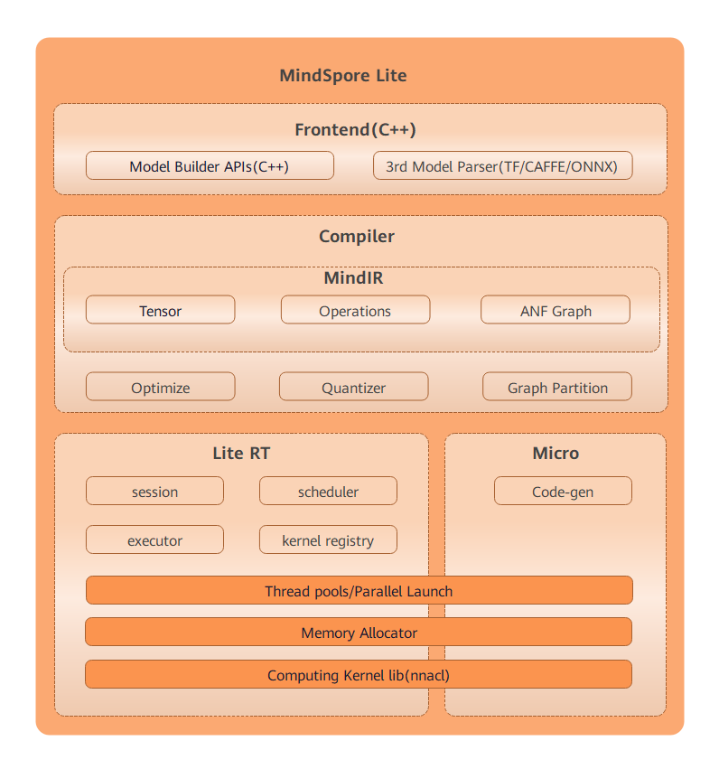


[View English](./README.md)

## MindSpore Lite介绍

MindSpore Lite是MindSpore推出的端云协同的、轻量化、高性能AI推理框架，用于满足越来越多的端测AI应用需求。MindSpore Lite聚焦AI技术在端侧设备上的部署和运行，已经在华为HMS和智能终端的图像分类、目标识别、人脸识别、文字识别等应用中广泛使用，未来MindSpore Lite将与MindSpore AI社区一起，致力于丰富AI软硬件应用生态。

欲了解更多详情，请查看我们的[MindSpore Lite 总体架构](https://www.mindspore.cn/doc/note/zh-CN/master/design/mindspore/architecture_lite.html)。

## MindSpore Lite技术特点

1. 端云协同提供一站式训练和推理

   - 提供模型训练、模型转换优化、部署和推理端到端流程。
   - 统一的IR实现端云AI应用一体化。

2. 超轻量

   - 支持模型量化压缩，模型更小跑得更快。
   - 提供超轻量的推理解决方案MindSpore Micro，满足智能手表、耳机等极限环境下的部署要求。

3. 高性能

   - 自带的高性能内核计算库NNACL，支持Sliding Windows、Im2Col+GEMM、Winograd等多种卷积优化算法。
   - 汇编级优化，支持CPU、GPU、NPU异构调度，最大化发挥硬件算力，最小化推理时延和功耗。

4. 广覆盖

   - 支持iOS、Android等手机操作系统。
   - 支持LiteOS嵌入式操作系统。
   - 支持手机、大屏、平板、IoT等各种智能设备上的AI应用。
   - 支持MindSpore/TensorFlow Lite/Caffe/ONNX模型，方便用户快速部署。

## MindSpore Lite AI部署流程

1. 模型选择和个性化训练

   包括选择新模型或对已有模型，利用标注数据进行增量训练。面向端侧设计模型时，需要考虑模型大小、精度和计算量。

   MindSpore团队提供了一系列预训练模型，用于解决图像分类、目标检测等场景的学习问题。可以在您的应用程序中使用这些预训练模型对应的终端模型。

   MindSpore提供的预训练模型：[图像分类（Image Classification）](https://download.mindspore.cn/model_zoo/official/lite/)。后续MindSpore团队会增加更多的预置模型。

   MindSpore允许您重新训练预训练模型，以执行其他任务。比如：使用预训练的图像分类模型，可以重新训练来识别新的图像类型。

2. 模型转换/优化

   如果您使用MindSpore或第三方训练的模型，需要使用[MindSpore Lite模型转换工具](https://www.mindspore.cn/tutorial/lite/zh-CN/master/use/converter_tool.html)转换成MindSpore Lite模型格式。MindSpore Lite模型转换工具不仅提供了将TensorFlow Lite、Caffe、ONNX等模型格式转换为MindSpore Lite模型格式，还提供了算子融合、量化等功能。

   MindSpore还提供了将IoT设备上运行的模型转换成.C代码的生成工具。

   经过上述两个部署，您已经得到端侧可以部署的模型。

3. 模型部署

   这个阶段主要实现模型部署，包括模型管理、部署和运维监控等。

4. 模型推理

   主要完成模型推理工作，即加载模型，完成模型相关的所有计算。[推理](https://www.mindspore.cn/tutorial/lite/zh-CN/master/use/runtime.html)是通过模型运行输入数据，获取预测的过程。

   MindSpore提供了预训练模型部署在智能终端的[样例](https://www.mindspore.cn/lite/examples)。

## MindSpore Lite性能参考数据

我们在HUAWEI Mate40（Hisilicon Kirin9000）手机上，基于MindSpore r1.2，测试了一组端侧常见网络的性能数据，供您参考：

| 网络                 | 线程数 | 平均推理时间(毫秒) |
| ------------------- |------ |---------------- |
| basic_squeezenet    | 4     | 7.246           |
| inception_v3        | 4     | 36.767          |
| mobilenet_v1_10_224 | 4     | 5.187           |
| mobilenet_v2_10_224 | 4     | 4.153           |
| resnet_v2_50        | 4     | 25.071          |
