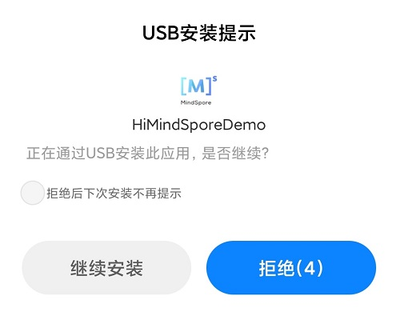

# MindSpore Lite 端侧图像分类demo（Android）

本示例程序演示了如何在端侧利用MindSpore Lite C++ API（Android JNI）以及MindSpore Lite 图像分类模型完成端侧推理，实现对设备摄像头捕获的内容进行分类，并在App图像预览界面中显示出最可能的分类结果。

## 运行依赖

- Android Studio >= 3.2 (推荐4.0以上版本)

## 构建与运行

1. 在Android Studio中加载本示例源码。

    

    启动Android Studio后，点击`File->Settings->System Settings->Android SDK`，勾选相应的`SDK Tools`。如下图所示，勾选后，点击`OK`，Android Studio即可自动安装SDK。

    

    > Android SDK Tools为默认安装项，取消`Hide Obsolete Packages`选框之后可看到。
    >
    > 使用过程中若出现问题，可参考第4项解决。

2. 连接Android设备，运行该应用程序。

    通过USB连接Android手机。待成功识别到设备后，点击`Run 'app'`即可在您的手机上运行本示例项目。

    > 编译过程中Android Studio会自动下载MindSpore Lite、模型文件等相关依赖项，编译过程需做耐心等待。
    >
    > Android Studio连接设备调试操作，可参考<https://developer.android.com/studio/run/device?hl=zh-cn>。
    >
    > 手机需开启“USB调试模式”，Android Studio 才能识别到手机。 华为手机一般在设置->系统和更新->开发人员选项->USB调试中开始“USB调试模型”。

    

3. 在Android设备上，点击“继续安装”，安装完即可查看到设备摄像头捕获的内容和推理结果。

    

    如下图所示，识别出的概率最高的物体是植物。

    

4. Demo部署问题解决方案。

    4.1 NDK、CMake、JDK等工具问题：

    如果Android Studio内安装的工具出现无法识别等问题，可重新从相应官网下载和安装，并配置路径。

    - NDK >= 21.3 [NDK](https://developer.android.google.cn/ndk/downloads?hl=zh-cn)
    - CMake >= 3.10.2   [CMake](https://cmake.org/download)
    - Android SDK >= 26 [SDK](https://developer.microsoft.com/zh-cn/windows/downloads/windows-10-sdk/)
    - JDK >= 1.8 [JDK](https://www.oracle.com/cn/java/technologies/javase/javase-jdk8-downloads.html)

        

    4.2 NDK版本不匹配问题：

    打开`Android SDK`，点击`Show Package Details`，根据报错信息选择安装合适的NDK版本。
    

    4.3 Android Studio版本问题：

    在`工具栏-help-Checkout for Updates`中更新Android Studio版本。

    4.4 Gradle下依赖项安装过慢问题：

   如图所示， 打开Demo根目录下`build.gradle`文件，加入华为镜像源地址：`maven {url 'https://developer.huawei.com/repo/'}`，修改classpath为4.0.0，点击`sync`进行同步。下载完成后，将classpath版本复原，再次进行同步。
    

## 示例程序详细说明  

本端侧图像分类Android示例程序分为JAVA层和JNI层，其中，JAVA层主要通过Android Camera 2 API实现摄像头获取图像帧，以及相应的图像处理等功能；JNI层完成模型推理的过程。

> 此处详细说明示例程序的JNI层实现，JAVA层运用Android Camera 2 API实现开启设备摄像头以及图像帧处理等功能，需读者具备一定的Android开发基础知识。

### 示例程序结构

```text
app
├── src/main
│   ├── assets # 资源文件
|   |   └── mobilenetv2.ms # 存放模型文件
│   |
│   ├── cpp # 模型加载和预测主要逻辑封装类
|   |   ├── ..
|   |   ├── mindspore_lite_x.x.x-runtime-arm64-cpu #MindSpore Lite版本
|   |   ├── MindSporeNetnative.cpp # MindSpore调用相关的JNI方法
│   |   └── MindSporeNetnative.h # 头文件
|   |   └── MsNetWork.cpp # MindSpre接口封装
│   |
│   ├── java # java层应用代码
│   │   └── com.mindspore.classification
│   │       ├── gallery.classify # 图像处理及MindSpore JNI调用相关实现
│   │       │   └── ...
│   │       └── widget # 开启摄像头及绘制相关实现
│   │           └── ...
│   │
│   ├── res # 存放Android相关的资源文件
│   └── AndroidManifest.xml # Android配置文件
│
├── CMakeList.txt # cmake编译入口文件
│
├── build.gradle # 其他Android配置文件
├── download.gradle # 工程依赖文件下载
└── ...
```

### 配置MindSpore Lite依赖项

Android JNI层调用MindSpore C++ API时，需要相关库文件支持。可通过MindSpore Lite[源码编译](https://www.mindspore.cn/tutorial/lite/zh-CN/master/use/build.html)生成`mindspore-lite-{version}-minddata-{os}-{device}.tar.gz`库文件包并解压缩（包含`libmindspore-lite.so`库文件和相关头文件），在本例中需使用生成带图像预处理模块的编译命令。

> version：输出件版本号，与所编译的分支代码对应的版本一致。
>
> device：当前分为cpu（内置CPU算子）和gpu（内置CPU和GPU算子）。
>
> os：输出件应部署的操作系统。

本示例中，build过程由download.gradle文件自动下载MindSpore Lite 版本文件，并放置在`app/src/main/cpp/`目录下。

> 若自动下载失败，请手动下载相关库文件，解压并放在对应位置：

  mindspore-lite-1.1.1-runtime-arm64-cpu.tar.gz [下载链接](https://ms-release.obs.cn-north-4.myhuaweicloud.com/1.1.1/MindSpore/lite/release_0220/android/mindspore-lite-1.1.1-runtime-arm64-cpu.tar.gz)

在app的`build.gradle`文件中配置CMake编译支持，以及`arm64-v8a`的编译支持，如下所示：

```text
android{
    defaultConfig{
        externalNativeBuild{
            cmake{
                arguments "-DANDROID_STL=c++_shared"
                cppFlags "-std=c++17 -fexceptions -frtti"
            }
        }

        ndk{
            abiFilters 'arm64-v8a'
        }
    }
}
```

在`app/CMakeLists.txt`文件中建立`.so`库文件链接，如下所示。

```text
# ============== Set MindSpore Dependencies. =============
include_directories(${CMAKE_SOURCE_DIR}/src/main/cpp)
include_directories(${CMAKE_SOURCE_DIR}/src/main/cpp/${MINDSPORELITE_VERSION})
include_directories(${CMAKE_SOURCE_DIR}/src/main/cpp/${MINDSPORELITE_VERSION}/include)

add_library(mindspore-lite SHARED IMPORTED)
add_library(minddata-lite SHARED IMPORTED)

set_target_properties(mindspore-lite PROPERTIES IMPORTED_LOCATION
        ${CMAKE_SOURCE_DIR}/src/main/cpp/${MINDSPORELITE_VERSION}/lib/libmindspore-lite.so)
set_target_properties(minddata-lite PROPERTIES IMPORTED_LOCATION
        ${CMAKE_SOURCE_DIR}/src/main/cpp/${MINDSPORELITE_VERSION}/minddata/lib/libminddata-lite.so)
# --------------- MindSpore Lite set End. --------------------

# Link target library.
target_link_libraries(
    ...
     # --- mindspore ---
        minddata-lite
        mindspore-lite
    ...
)
```

### 下载及部署模型文件

从MindSpore Model Hub中下载模型文件，本示例程序中使用的终端图像分类模型文件为`mobilenetv2.ms`，同样通过download.gradle脚本在APP构建时自动下载，并放置在`app/src/main/assets`工程目录下。

> 若下载失败请手动下载模型文件，mobilenetv2.ms [下载链接](https://download.mindspore.cn/model_zoo/official/lite/mobilenetv2_openimage_lite/mobilenetv2.ms)。

### 编写端侧推理代码

在JNI层调用MindSpore Lite C++ API实现端测推理。

推理代码流程如下，完整代码请参见`src/cpp/MindSporeNetnative.cpp`。

1. 加载MindSpore Lite模型文件，构建上下文、会话以及用于推理的计算图。  

    - 加载模型文件：创建并配置用于模型推理的上下文

        ```cpp
        // Buffer is the model data passed in by the Java layer
        jlong bufferLen = env->GetDirectBufferCapacity(buffer);
        char *modelBuffer = CreateLocalModelBuffer(env, buffer);  
        ```

    - 创建会话

        ```cpp
        void **labelEnv = new void *;
        MSNetWork *labelNet = new MSNetWork;
        *labelEnv = labelNet;

        // Create context.
        lite::Context *context = new lite::Context;
        context->thread_num_ = numThread;  //Specify the number of threads to run inference

        // Create the mindspore session.
        labelNet->CreateSessionMS(modelBuffer, bufferLen, context);
        delete(context);

        ```

    - 加载模型文件并构建用于推理的计算图

        ```cpp
        void MSNetWork::CreateSessionMS(char* modelBuffer, size_t bufferLen, std::string name, mindspore::lite::Context* ctx)
        {
            CreateSession(modelBuffer, bufferLen, ctx);  
            session = mindspore::session::LiteSession::CreateSession(ctx);
            auto model = mindspore::lite::Model::Import(modelBuffer, bufferLen);
            int ret = session->CompileGraph(model);
        }
        ```

2. 将输入图片转换为传入MindSpore模型的Tensor格式。

    将待检测图片数据转换为输入MindSpore模型的Tensor。

    ```cpp
    if (!BitmapToLiteMat(env, srcBitmap, &lite_mat_bgr)) {
     MS_PRINT("BitmapToLiteMat error");
     return NULL;
    }
    if (!PreProcessImageData(lite_mat_bgr, &lite_norm_mat_cut)) {
     MS_PRINT("PreProcessImageData error");
     return NULL;
    }

    ImgDims inputDims;
    inputDims.channel = lite_norm_mat_cut.channel_;
    inputDims.width = lite_norm_mat_cut.width_;
    inputDims.height = lite_norm_mat_cut.height_;

    // Get the mindsore inference environment which created in loadModel().
    void **labelEnv = reinterpret_cast<void **>(netEnv);
    if (labelEnv == nullptr) {
     MS_PRINT("MindSpore error, labelEnv is a nullptr.");
     return NULL;
    }
    MSNetWork *labelNet = static_cast<MSNetWork *>(*labelEnv);

    auto mSession = labelNet->session();
    if (mSession == nullptr) {
     MS_PRINT("MindSpore error, Session is a nullptr.");
     return NULL;
    }
    MS_PRINT("MindSpore get session.");

    auto msInputs = mSession->GetInputs();
    if (msInputs.size() == 0) {
     MS_PRINT("MindSpore error, msInputs.size() equals 0.");
     return NULL;
    }
    auto inTensor = msInputs.front();

    float *dataHWC = reinterpret_cast<float *>(lite_norm_mat_cut.data_ptr_);
    // Copy dataHWC to the model input tensor.
    memcpy(inTensor->MutableData(), dataHWC,
         inputDims.channel * inputDims.width * inputDims.height * sizeof(float));
    ```

3. 对输入Tensor按照模型进行推理，获取输出Tensor，并进行后处理。

   - 图执行，端测推理。

        ```cpp
        // After the model and image tensor data is loaded, run inference.
        auto status = mSession->RunGraph();
        ```

   - 获取输出数据。

        ```cpp
        auto names = mSession->GetOutputTensorNames();
        std::unordered_map<std::string,mindspore::tensor::MSTensor *> msOutputs;
        for (const auto &name : names) {
            auto temp_dat =mSession->GetOutputByTensorName(name);
            msOutputs.insert(std::pair<std::string, mindspore::tensor::MSTensor *> {name, temp_dat});
          }
         std::string resultStr = ProcessRunnetResult(::RET_CATEGORY_SUM,
                                              ::labels_name_map, msOutputs);
        ```

   - 输出数据的后续处理。

        ```cpp
        std::string ProcessRunnetResult(const int RET_CATEGORY_SUM, const char *const labels_name_map[],
                 std::unordered_map<std::string, mindspore::tensor::MSTensor *> msOutputs) {
         // Get the branch of the model output.
         // Use iterators to get map elements.
         std::unordered_map<std::string, mindspore::tensor::MSTensor *>::iterator iter;
         iter = msOutputs.begin();

         // The mobilenetv2.ms model output just one branch.
         auto outputTensor = iter->second;

         int tensorNum = outputTensor->ElementsNum();
         MS_PRINT("Number of tensor elements:%d", tensorNum);

         // Get a pointer to the first score.
         float *temp_scores = static_cast<float *>(outputTensor->MutableData());
         float scores[RET_CATEGORY_SUM];
         for (int i = 0; i < RET_CATEGORY_SUM; ++i) {
          scores[i] = temp_scores[i];
         }

         float unifiedThre = 0.5;
         float probMax = 1.0;
         for (size_t i = 0; i < RET_CATEGORY_SUM; ++i) {
          float threshold = g_thres_map[i];
          float tmpProb = scores[i];
          if (tmpProb < threshold) {
           tmpProb = tmpProb / threshold * unifiedThre;
          } else {
           tmpProb = (tmpProb - threshold) / (probMax - threshold) * unifiedThre + unifiedThre;
         }
          scores[i] = tmpProb;
        }

         for (int i = 0; i < RET_CATEGORY_SUM; ++i) {
         if (scores[i] > 0.5) {
             MS_PRINT("MindSpore scores[%d] : [%f]", i, scores[i]);
          }
         }

         // Score for each category.
         // Converted to text information that needs to be displayed in the APP.
         std::string categoryScore = "";
         for (int i = 0; i < RET_CATEGORY_SUM; ++i) {
          categoryScore += labels_name_map[i];
          categoryScore += ":";
          std::string score_str = std::to_string(scores[i]);
          categoryScore += score_str;
          categoryScore += ";";
         }
           return categoryScore;
        }

        ```
