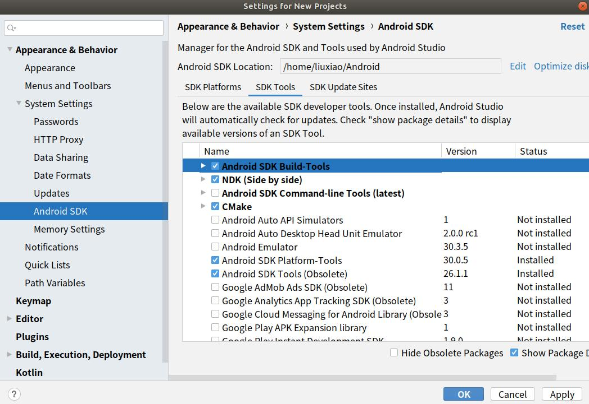
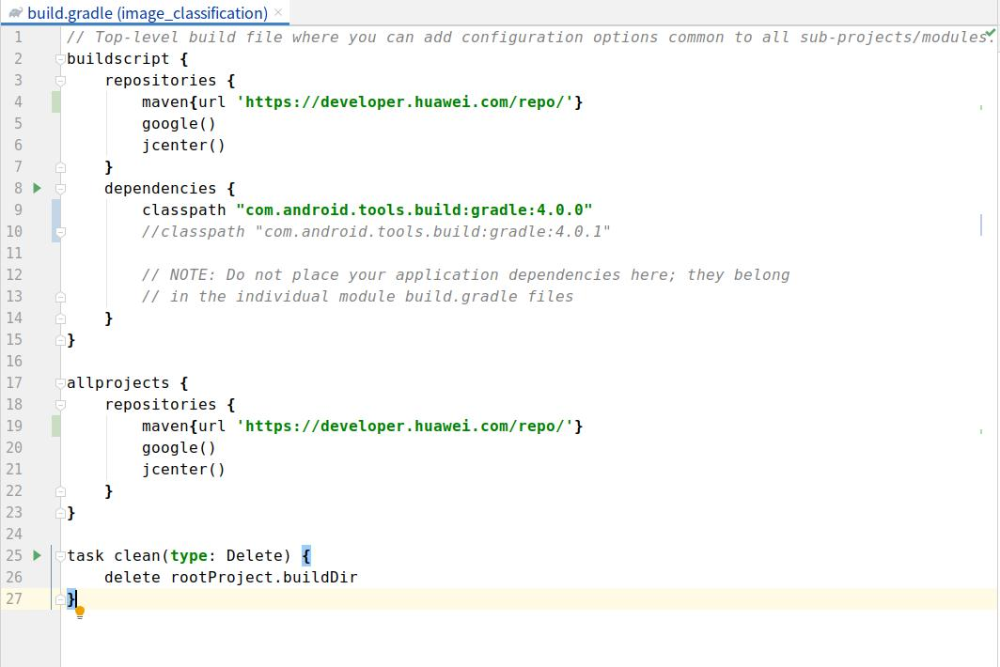

# Demo of Image Segmentation

The following describes how to use the MindSpore Lite JAVA APIs and MindSpore Lite image segmentation models to perform on-device inference, classify the content captured by a device camera, and display the most possible segmentation result on the application's image preview screen.

## Running Dependencies

- Android Studio 3.2 or later (Android 4.0 or later is recommended.)

## Building and Running

1. Load the sample source code to Android Studio.

    

    Start Android Studio, click `File > Settings > System Settings > Android SDK`, and select the corresponding `SDK Tools`. As shown in the following figure, select an SDK and click `OK`. Android Studio automatically installs the SDK.

    

    > Android SDK Tools is the default installation. You can see this by unchecking the `Hide Obsolete Packages`box.
    >
    > If you have any Android Studio configuration problem when trying this demo, please refer to item 4 to resolve it.

2. Connect to an Android device and runs this application.

    Connect to the Android device through a USB cable for debugging. Click `Run 'app'` to run the sample project on your device.

    

    > Android Studio will automatically download MindSpore Lite, model files and other dependencies during the compilation process. Please be patient during this process.
    >
    > For details about how to connect the Android Studio to a device for debugging, see <https://developer.android.com/studio/run/device?hl=zh-cn>.
    >
    > The mobile phone needs to be turn on "USB debugging mode" before Android Studio can recognize the mobile phone. Huawei mobile phones generally turn on "USB debugging model" in Settings -> system and update -> developer Options -> USB debugging.

3. Continue the installation on the Android device. After the installation is complete, you can view the content captured by a camera and the inference result.

    

4. The solutions of configuration problems:

    4.1 Problems of NDK, CMake, JDK Tools:

    If the tools installed in Android Studio are not recognized, you can re-download and install them from the corresponding official website, and configure the path.

    - NDK >= 21.3 [NDK](https://developer.android.google.cn/ndk/downloads?hl=zh-cn)
    - CMake >= 3.10.2   [CMake](https://cmake.org/download)
    - Android SDK >= 26 [SDK](https://developer.microsoft.com/zh-cn/windows/downloads/windows-10-sdk/)
    - JDK >= 1.8 [JDK](https://www.oracle.com/cn/java/technologies/javase/javase-jdk8-downloads.html)

    

    4.2 NDK version does not match:

    Open `Android SDK`, click `Show Package Details`, and select the appropriate NDK version according to the error message.
    

    4.3 Problem of Android Studio version:

    Update the Android Studio version in `Toolbar - Help - Checkout for Updates`.

    4.4 Gradle dependencies installed too slowly:

    As shown in the picture, open the Demo root directory `build. Gradle` file, then add huawei mirror source address: `maven {url 'https://developer.huawei.com/repo/'}`, modify the classpath to 4.0.0 and click ` sync ` . Once the download is complete, restore the classpath version and synchronize it again.

    

## Detailed Description of the Sample Program  

This image segmentation sample program on the Android device is implemented through Java. At the Java layer, the Android Camera 2 API is used to enable a camera to obtain image frames and process images. Then Java API is called to infer.[Runtime](https://www.mindspore.cn/tutorial/lite/en/master/use/runtime.html).

### Sample Program Structure

```text
app
├── src/main
│   ├── assets # resource files
|   |   └── deeplabv3.ms # model file
│   |
│   ├── java # application code at the Java layer
│   │   └── com.mindspore.imagesegmentation
│   │       ├── help # pre-process of image and inference of model
│   │       │   └── ImageUtils # image pre-process
│   │       │   └── ModelTrackingResult # post-process of result of inference
│   │       │   └── TrackingMobile # load model, compile graph and perform
│   │       └── BitmapUtils # image process
│   │       └── MainActivity # interactive page
│   │       └── OnBackgroundImageListener # get images from the photo album
│   │       └── StyleRecycleViewAdapter # get images from the photo album
│   │
│   ├── res # resource files related to Android
│   └── AndroidManifest.xml # Android configuration file
│
├── CMakeList.txt # CMake compilation entry file
│
├── build.gradle # Other Android configuration file
├── download.gradle # MindSpore version download
└── ...
```

### Configuring MindSpore Lite Dependencies

When MindSpore Java APIs are called, related library files are required. You can use MindSpore Lite [source code compilation](https://www.mindspore.cn/tutorial/lite/en/master/use/build.html) to generate the MindSpore Lite version. In this case, you need to use the compile command of generate with image preprocessing module.

In this example, the build process automatically downloads the `mindspore-lite-1.0.1-runtime-arm64-cpu` by the `app/download.gradle` file and saves in the `app/src/main/cpp` directory.

Note: if the automatic download fails, please manually download the relevant library files and put them in the corresponding location.

mindspore-lite-1.0.1-runtime-arm64-cpu.tar.gz [Download link](https://ms-release.obs.cn-north-4.myhuaweicloud.com/1.0.1/lite/android_aarch64/mindspore-lite-1.0.1-runtime-arm64-cpu.tar.gz)

```text
android{
    defaultConfig{
        externalNativeBuild{
            cmake{
                arguments "-DANDROID_STL=c++_shared"
            }
        }

        ndk{
            abiFilters'armeabi-v7a', 'arm64-v8a'  
        }
    }
}
```

Create a link to the `.so` library file in the `app/CMakeLists.txt` file:

```text
# ============== Set MindSpore Dependencies. =============
include_directories(${CMAKE_SOURCE_DIR}/src/main/cpp)
include_directories(${CMAKE_SOURCE_DIR}/src/main/cpp/${MINDSPORELITE_VERSION}/third_party/flatbuffers/include)
include_directories(${CMAKE_SOURCE_DIR}/src/main/cpp/${MINDSPORELITE_VERSION})
include_directories(${CMAKE_SOURCE_DIR}/src/main/cpp/${MINDSPORELITE_VERSION}/include)
include_directories(${CMAKE_SOURCE_DIR}/src/main/cpp/${MINDSPORELITE_VERSION}/include/ir/dtype)
include_directories(${CMAKE_SOURCE_DIR}/src/main/cpp/${MINDSPORELITE_VERSION}/include/schema)

add_library(mindspore-lite SHARED IMPORTED )
add_library(minddata-lite SHARED IMPORTED )

set_target_properties(mindspore-lite PROPERTIES IMPORTED_LOCATION
        ${CMAKE_SOURCE_DIR}/src/main/cpp/${MINDSPORELITE_VERSION}/lib/libmindspore-lite.so)
set_target_properties(minddata-lite PROPERTIES IMPORTED_LOCATION
        ${CMAKE_SOURCE_DIR}/src/main/cpp/${MINDSPORELITE_VERSION}/lib/libminddata-lite.so)
# --------------- MindSpore Lite set End. --------------------

# Link target library.
target_link_libraries(
    ...
     # --- mindspore ---
        minddata-lite
        mindspore-lite
    ...
)
```

### Downloading and Deploying a Model File

In this example, the  download.gradle File configuration auto download `deeplabv3.ms`and placed in the 'app/libs/arm64-v8a' directory.

Note: if the automatic download fails, please manually download the relevant library files and put them in the corresponding location.

deeplabv3.ms [deeplabv3.ms](https://download.mindspore.cn/model_zoo/official/lite/deeplabv3_lite/deeplabv3.ms)

### Compiling On-Device Inference Code

Call MindSpore Lite Java APIs to implement on-device inference.

The inference code process is as follows. For details about the complete code, see `src/java/TrackingMobile.java`.

1. Load the MindSpore Lite model file and build the context, session, and computational graph for inference.

    - Load a model file. Import and configure the context for model inference.

    ```Java
    // Create context and load the .ms model named 'IMAGESEGMENTATIONMODEL'
    model = new Model();
    if (!model.loadModel(Context, IMAGESEGMENTATIONMODEL)) {
      Log.e(TAG, "Load Model failed");
      return;
    }
    ```

    - Create a session.

    ```Java
    // Create and init config.
    msConfig = new MSConfig();
    if (!msConfig.init(DeviceType.DT_CPU, 2, CpuBindMode.MID_CPU)) {
      Log.e(TAG, "Init context failed");
      return;
    }

    // Create the MindSpore lite session.
    session = new LiteSession();
    if (!session.init(msConfig)) {
      Log.e(TAG, "Create session failed");
      msConfig.free();
      return;
    }
    msConfig.free();
    ```

    - Compile graph for inference.

    ```Java
    if (!session.compileGraph(model)) {
      Log.e(TAG, "Compile graph failed");
      model.freeBuffer();
      return;
    }
    // Note: when use model.freeBuffer(), the model can not be compile graph again.
    model.freeBuffer();
    ```

2. Convert the input image into the Tensor format of the MindSpore model.

    ```Java
    List<MSTensor> inputs = session.getInputs();
    if (inputs.size() != 1) {
      Log.e(TAG, "inputs.size() != 1");
      return null;
    }

    // `bitmap` is the picture used to infer.
    float resource_height = bitmap.getHeight();
    float resource_weight = bitmap.getWidth();
    ByteBuffer contentArray = bitmapToByteBuffer(bitmap, imageSize, imageSize, IMAGE_MEAN, IMAGE_STD);

    MSTensor inTensor = inputs.get(0);
    inTensor.setData(contentArray);
    ```

3. Perform inference on the input tensor based on the model, obtain the output tensor, and perform post-processing.

    - Perform graph execution and on-device inference.

    ```Java
    // After the model and image tensor data is loaded, run inference.
    if (!session.runGraph()) {
      Log.e(TAG, "Run graph failed");
      return null;
    }
    ```

    - Obtain the output data.

    ```Java
    // Get output tensor values, the model only outputs one tensor.
    List<String> tensorNames = session.getOutputTensorNames();
    MSTensor output = session.getOutputByTensorName(tensorNames.front());
    if (output == null) {
      Log.e(TAG, "Can not find output " + tensorName);
      return null;
    }
    ```

    - Perform post-processing of the output data.

    ```Java
    // Show output as pictures.
    float[] results = output.getFloatData();

    ByteBuffer bytebuffer_results = floatArrayToByteArray(results);

    Bitmap dstBitmap = convertBytebufferMaskToBitmap(bytebuffer_results, imageSize, imageSize, bitmap, dstBitmap, segmentColors);
    dstBitmap = scaleBitmapAndKeepRatio(dstBitmap, (int) resource_height, (int) resource_weight);
    ```

4. The process of image and output data can refer to methods showing below.

    ```Java
    Bitmap scaleBitmapAndKeepRatio(Bitmap targetBmp, int reqHeightInPixels, int reqWidthInPixels) {
      if (targetBmp.getHeight() == reqHeightInPixels && targetBmp.getWidth() == reqWidthInPixels) {
        return targetBmp;
      }

      Matrix matrix = new Matrix();
      matrix.setRectToRect(new RectF(0f, 0f, targetBmp.getWidth(), targetBmp.getHeight()),
                           new RectF(0f, 0f, reqWidthInPixels, reqHeightInPixels), Matrix.ScaleToFit.FILL;

        return Bitmap.createBitmap(targetBmp, 0, 0, targetBmp.getWidth(), targetBmp.getHeight(), matrix, true);
    }

    ByteBuffer bitmapToByteBuffer(Bitmap bitmapIn, int width, int height, float mean, float std) {
      Bitmap bitmap = scaleBitmapAndKeepRatio(bitmapIn, width, height);
      ByteBuffer inputImage = ByteBuffer.allocateDirect(1 * width * height * 3 * 4);
      inputImage.order(ByteOrder.nativeOrder());
      inputImage.rewind();
      int[] intValues = new int[width * height];
      bitmap.getPixels(intValues, 0, width, 0, 0, width, height);
      int pixel = 0;
      for (int y = 0; y < height; y++) {
        for (int x = 0; x < width; x++) {
          int value = intValues[pixel++];
          inputImage.putFloat(((float) (value >> 16 & 255) - mean) / std);
          inputImage.putFloat(((float) (value >> 8 & 255) - mean) / std);
          inputImage.putFloat(((float) (value & 255) - mean) / std);
        }
      }
      inputImage.rewind();
      return inputImage;
    }

    ByteBuffer floatArrayToByteArray(float[] floats) {
      ByteBuffer buffer = ByteBuffer.allocate(4 * floats.length);
      FloatBuffer floatBuffer = buffer.asFloatBuffer();
      floatBuffer.put(floats);
      return buffer;
    }

    Bitmap convertBytebufferMaskToBitmap(ByteBuffer inputBuffer, int imageWidth, int imageHeight, Bitmap backgroundImage, int[] colors) {
      Bitmap.Config conf = Bitmap.Config.ARGB_8888;
      Bitmap dstBitmap = Bitmap.createBitmap(imageWidth, imageHeight, conf);
      Bitmap scaledBackgroundImage = scaleBitmapAndKeepRatio(backgroundImage, imageWidth, imageHeight);
      int[][] mSegmentBits = new int[imageWidth][imageHeight];
      inputBuffer.rewind();
      for (int y = 0; y < imageHeight; y++) {
        for (int x = 0; x < imageWidth; x++) {
          float maxVal = 0f;
          mSegmentBits[x][y] = 0;
          // NUM_CLASSES is the number of labels, the value here is 21.
          for (int i = 0; i < NUM_CLASSES; i++) {
            float value = inputBuffer.getFloat((y * imageWidth * NUM_CLASSES + x * NUM_CLASSES + i) * 4);
            if (i == 0 || value > maxVal) {
              maxVal = value;
              // Check whether a pixel belongs to a person whose label is 15.
              if (i == 15) {
                mSegmentBits[x][y] = i;
              } else {
                mSegmentBits[x][y] = 0;
              }
            }
          }
          itemsFound.add(mSegmentBits[x][y]);

          int newPixelColor = ColorUtils.compositeColors(
                  colors[mSegmentBits[x][y] == 0 ? 0 : 1],
                  scaledBackgroundImage.getPixel(x, y)
          );
          dstBitmap.setPixel(x, y, mSegmentBits[x][y] == 0 ? colors[0] : scaledBackgroundImage.getPixel(x, y));
        }
      }
      return dstBitmap;
    }
    ```
