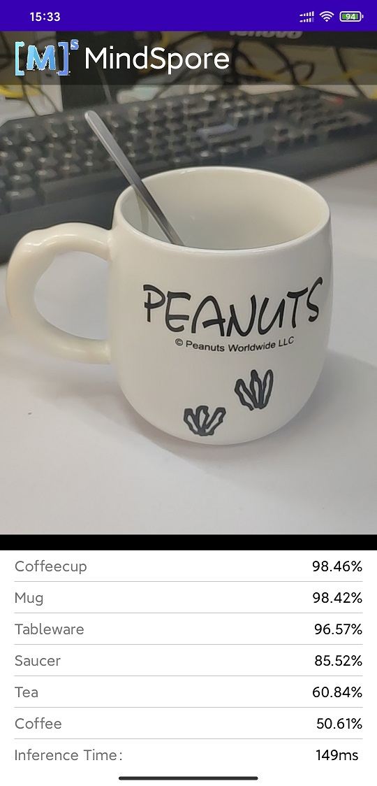
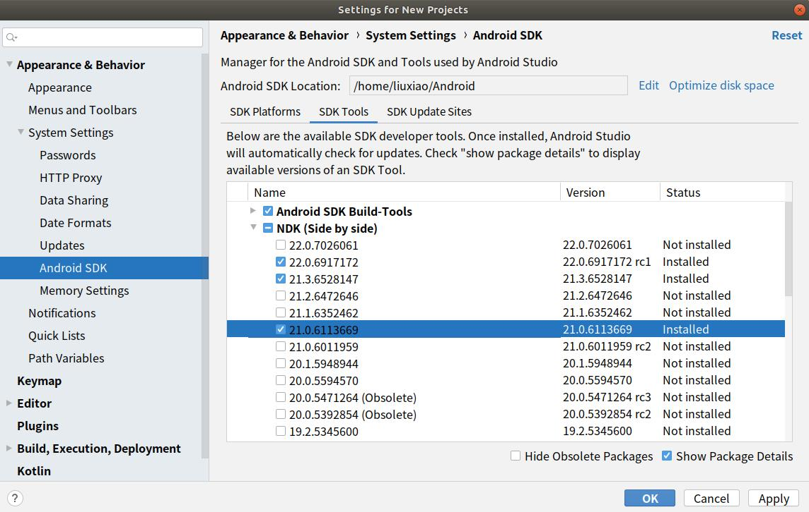

# Demo of Object Detection

The following describes how to use the MindSpore Lite C++ APIs (Android JNIs) and MindSpore Lite object detection models to perform on-device inference, detect the content captured by a device camera, and display the most possible detection result on the application's image preview screen.

## Running Dependencies

- Android Studio 3.2 or later (Android 4.0 or later is recommended.)

## Building and Running

1. Load the sample source code to Android Studio.

    

    Start Android Studio, click `File > Settings > System Settings > Android SDK`, and select the corresponding `SDK Tools`. As shown in the following figure, select an SDK and click `OK`. Android Studio automatically installs the SDK.

    

    > Android SDK Tools is the default installation. You can see this by unchecking the `Hide Obsolete Packages`box.
    >
    > If you have any Android Studio configuration problem when trying this demo, please refer to item 4 to resolve it.

2. Connect to an Android device and runs this application.

    Connect to the Android device through a USB cable for debugging. Click `Run 'app'` to run the sample project on your device.

    

    > Android Studio will automatically download MindSpore Lite, model files and other dependencies during the compilation process. Please be patient during this process.
    >
    > For details about how to connect the Android Studio to a device for debugging, see <https://developer.android.com/studio/run/device?hl=zh-cn>.
    >
    > The mobile phone needs to be turn on "USB debugging mode" before Android Studio can recognize the mobile phone. Huawei mobile phones generally turn on "USB debugging model" in Settings -> system and update -> developer Options -> USB debugging.

3. Continue the installation on the Android device. After the installation is complete, you can view the content captured by a camera and the inference result.

    

4. The solutions of configuration problems:

    4.1 Problems of NDK, CMake, JDK Tools:

    If the tools installed in Android Studio are not recognized, you can re-download and install them from the corresponding official website, and configure the path.

    - NDK >= 21.3 [NDK](https://developer.android.google.cn/ndk/downloads?hl=zh-cn)
    - CMake >= 3.10.2   [CMake](https://cmake.org/download)
    - Android SDK >= 26 [SDK](https://developer.microsoft.com/zh-cn/windows/downloads/windows-10-sdk/)
    - JDK >= 1.8 [JDK](https://www.oracle.com/cn/java/technologies/javase/javase-jdk8-downloads.html)

    

    4.2 NDK version does not match:

    Open `Android SDK`, click `Show Package Details`, and select the appropriate NDK version according to the error message.
    

    4.3 Problem of Android Studio version:

    Update the Android Studio version in `Toolbar - Help - Checkout for Updates`.

    4.4 Gradle dependencies installed too slowly:

    As shown in the picture, open the Demo root directory `build. Gradle` file, then add huawei mirror source address: `maven {url 'https://developer.huawei.com/repo/'}`, modify the classpath to 4.0.0 and click ` sync ` . Once the download is complete, restore the classpath version and synchronize it again.

    

## Detailed Description of the Sample Program  

This object detection sample program on the Android device includes a Java layer and a JNI layer. At the Java layer, the Android Camera 2 API is used to enable a camera to obtain image frames and process images. At the JNI layer, the model inference process is completed .

### Configuring MindSpore Lite Dependencies

When MindSpore C++ APIs are called at the Android JNI layer, related library files are required. You can use MindSpore Lite [source code compilation](https://www.mindspore.cn/tutorial/lite/en/master/use/build.html) to generate the MindSpore Lite version. In this case, you need to use the compile command of generate with image preprocessing module.

In this example, the build process automatically downloads the `mindspore-lite-1.0.1-runtime-arm64-cpu` by the `app/download.gradle` file and saves in the `app/src/main/cpp` directory.

Note: if the automatic download fails, please manually download the relevant library files and put them in the corresponding location.

mindspore-lite-1.0.1-runtime-arm64-cpu.tar.gz [Download link](https://ms-release.obs.cn-north-4.myhuaweicloud.com/1.0.1/lite/android_aarch64/mindspore-lite-1.0.1-runtime-arm64-cpu.tar.gz)

```text
android{
    defaultConfig{
        externalNativeBuild{
            cmake{
                arguments "-DANDROID_STL=c++_shared"
            }
        }

        ndk{
            abiFilters 'arm64-v8a'
        }
    }
}
```

Create a link to the `.so` library file in the `app/CMakeLists.txt` file:

```text
# Set MindSpore Lite Dependencies.
set(MINDSPORELITE_VERSION  mindspore-lite-1.0.1-runtime-arm64-cpu)
include_directories(${CMAKE_SOURCE_DIR}/src/main/cpp/${MINDSPORELITE_VERSION})
add_library(mindspore-lite SHARED IMPORTED )
add_library(minddata-lite SHARED IMPORTED )
set_target_properties(mindspore-lite PROPERTIES IMPORTED_LOCATION
        ${CMAKE_SOURCE_DIR}/src/main/cpp/${MINDSPORELITE_VERSION}/lib/libmindspore-lite.so)
set_target_properties(minddata-lite PROPERTIES IMPORTED_LOCATION
        ${CMAKE_SOURCE_DIR}/src/main/cpp/${MINDSPORELITE_VERSION}/lib/libminddata-lite.so)

# Link target library.
target_link_libraries(
    ...
    mindspore-lite
    minddata-lite
    ...
)
```

### Downloading and Deploying a Model File

In this example, the  download.gradle File configuration auto download `ssd.ms`and placed in the 'app / libs / arm64-v8a' directory.

Note: if the automatic download fails, please manually download the relevant library files and put them in the corresponding location.

ssd.ms [ssd.ms]( https://download.mindspore.cn/model_zoo/official/lite/ssd_mobilenetv2_lite/ssd.ms)

### Compiling On-Device Inference Code

Call MindSpore Lite C++ APIs at the JNI layer to implement on-device inference.

The inference code process is as follows. For details about the complete code, see `src/cpp/MindSporeNetnative.cpp`.

1. Load the MindSpore Lite model file and build the context, session, and computational graph for inference.  

    - Load a model file. Create and configure the context for model inference.

     ```cpp
     // Buffer is the model data passed in by the Java layer
     jlong bufferLen = env->GetDirectBufferCapacity(buffer);
     char *modelBuffer = CreateLocalModelBuffer(env, buffer);  
     ```

    - Create a session.

     ```cpp
     void **labelEnv = new void *;
     MSNetWork *labelNet = new MSNetWork;
     *labelEnv = labelNet;

     // Create context.
     lite::Context *context = new lite::Context;

     context->device_ctx_.type = lite::DT_CPU;
     context->thread_num_ = numThread;  //Specify the number of threads to run inference

     // Create the mindspore session.
     labelNet->CreateSessionMS(modelBuffer, bufferLen, "device label", context);
     delete(context);

     ```

    - Load the model file and build a computational graph for inference.

     ```cpp
     void MSNetWork::CreateSessionMS(char* modelBuffer, size_t bufferLen, std::string name, mindspore::lite::Context* ctx)
     {
         CreateSession(modelBuffer, bufferLen, ctx);  
         session = mindspore::session::LiteSession::CreateSession(ctx);
         auto model = mindspore::lite::Model::Import(modelBuffer, bufferLen);
         int ret = session->CompileGraph(model);
     }
     ```

2. Pre-Process the imagedata and  convert the input image into the Tensor format of the MindSpore model.

   ```cpp
   // Convert the Bitmap image passed in from the JAVA layer to Mat for OpenCV processing
       LiteMat lite_mat_bgr,lite_norm_mat_cut;

       if (!BitmapToLiteMat(env, srcBitmap, lite_mat_bgr)){
           MS_PRINT("BitmapToLiteMat error");
           return NULL;
       }
       int srcImageWidth = lite_mat_bgr.width_;
       int srcImageHeight = lite_mat_bgr.height_;
       if(!PreProcessImageData(lite_mat_bgr, lite_norm_mat_cut)){
           MS_PRINT("PreProcessImageData error");
           return NULL;
       }
       ImgDims inputDims;
       inputDims.channel =lite_norm_mat_cut.channel_;
       inputDims.width = lite_norm_mat_cut.width_;
       inputDims.height = lite_norm_mat_cut.height_;

       // Get the mindsore inference environment which created in loadModel().
       void **labelEnv = reinterpret_cast<void **>(netEnv);
       if (labelEnv == nullptr) {
           MS_PRINT("MindSpore error, labelEnv is a nullptr.");
           return NULL;
       }
       MSNetWork *labelNet = static_cast<MSNetWork *>(*labelEnv);

       auto mSession = labelNet->session;
       if (mSession == nullptr) {
           MS_PRINT("MindSpore error, Session is a nullptr.");
           return NULL;
       }
       MS_PRINT("MindSpore get session.");

       auto msInputs = mSession->GetInputs();
       auto inTensor = msInputs.front();

       float *dataHWC = reinterpret_cast<float *>(lite_norm_mat_cut.data_ptr_);
       // copy input Tensor
       memcpy(inTensor->MutableData(), dataHWC,
              inputDims.channel * inputDims.width * inputDims.height * sizeof(float));
       delete[] (dataHWC);
   ```

3. The input image shall be NHWC(1:300:300:3).

   ```cpp
    bool PreProcessImageData(const LiteMat &lite_mat_bgr, LiteMat *lite_norm_mat_ptr) {
        bool ret = false;
        LiteMat lite_mat_resize;
        LiteMat &lite_norm_mat_cut = *lite_norm_mat_ptr;
        ret = ResizeBilinear(lite_mat_bgr, lite_mat_resize, 300, 300);
        if (!ret) {
            MS_PRINT("ResizeBilinear error");
            return false;
        }
        LiteMat lite_mat_convert_float;
        ret = ConvertTo(lite_mat_resize, lite_mat_convert_float, 1.0 / 255.0);
        if (!ret) {
            MS_PRINT("ConvertTo error");
            return false;
        }

        float means[3] = {0.485, 0.456, 0.406};
        float vars[3] = {1.0 / 0.229, 1.0 / 0.224, 1.0 / 0.225};
        SubStractMeanNormalize(lite_mat_convert_float, lite_norm_mat_cut, means, vars);
        return true;
    }

   ```

4. Perform inference on the input tensor based on the model, obtain the output tensor, and perform post-processing.

   Perform graph execution and on-device inference.

   ```cpp
   // After the model and image tensor data is loaded, run inference.
   auto status = mSession->RunGraph();
   ```

   Obtain the output data.

   ```cpp
    auto names = mSession->GetOutputTensorNames();
       typedef std::unordered_map<std::string,
               std::vector<mindspore::tensor::MSTensor *>> Msout;
    std::unordered_map<std::string,
               mindspore::tensor::MSTensor *> msOutputs;
    for (const auto &name : names) {
           auto temp_dat =mSession->GetOutputByTensorName(name);  
           msOutputs.insert(std::pair<std::string, mindspore::tensor::MSTensor *> {name, temp_dat});  
       }
   std::string retStr = ProcessRunnetResult(msOutputs, ret);
   ```

   The model output the object category scores (1:1917:81) and the object detection location offset (1:1917:4).  The location offset can be calcalation the object location in getDefaultBoxes function .

   ```cpp
   void SSDModelUtil::getDefaultBoxes() {
       float fk[6] = {0.0, 0.0, 0.0, 0.0, 0.0, 0.0};
       std::vector<struct WHBox> all_sizes;
       struct Product mProductData[19 * 19] = {0};

       for (int i = 0; i < 6; i++) {
           fk[i] = config.model_input_height / config.steps[i];
       }
       float scale_rate =
               (config.max_scale - config.min_scale) / (sizeof(config.num_default) / sizeof(int) - 1);
       float scales[7] = {0.0, 0.0, 0.0, 0.0, 0.0, 0.0, 1.0};
       for (int i = 0; i < sizeof(config.num_default) / sizeof(int); i++) {
           scales[i] = config.min_scale + scale_rate * i;
       }

       for (int idex = 0; idex < sizeof(config.feature_size) / sizeof(int); idex++) {
           float sk1 = scales[idex];
           float sk2 = scales[idex + 1];
           float sk3 = sqrt(sk1 * sk2);
           struct WHBox tempWHBox;

           all_sizes.clear();

           if (idex == 0) {
               float w = sk1 * sqrt(2);
               float h = sk1 / sqrt(2);

               tempWHBox.boxw = 0.1;
               tempWHBox.boxh = 0.1;
               all_sizes.push_back(tempWHBox);

               tempWHBox.boxw = w;
               tempWHBox.boxh = h;
               all_sizes.push_back(tempWHBox);

               tempWHBox.boxw = h;
               tempWHBox.boxh = w;
               all_sizes.push_back(tempWHBox);

           } else {
               tempWHBox.boxw = sk1;
               tempWHBox.boxh = sk1;
               all_sizes.push_back(tempWHBox);

               for (int j = 0; j < sizeof(config.aspect_ratios[idex]) / sizeof(int); j++) {
                   float w = sk1 * sqrt(config.aspect_ratios[idex][j]);
                   float h = sk1 / sqrt(config.aspect_ratios[idex][j]);
                   tempWHBox.boxw = w;
                   tempWHBox.boxh = h;
                   all_sizes.push_back(tempWHBox);
                   tempWHBox.boxw = h;
                   tempWHBox.boxh = w;
                   all_sizes.push_back(tempWHBox);
               }

               tempWHBox.boxw = sk3;
               tempWHBox.boxh = sk3;
               all_sizes.push_back(tempWHBox);
           }

           for (int i = 0; i < config.feature_size[idex]; i++) {
               for (int j = 0; j < config.feature_size[idex]; j++) {
                   mProductData[i * config.feature_size[idex] + j].x = i;
                   mProductData[i * config.feature_size[idex] + j].y = j;
               }
           }

           int productLen = config.feature_size[idex] * config.feature_size[idex];

           for (int i = 0; i < productLen; i++) {
               for (int j = 0; j < all_sizes.size(); j++) {
                   struct NormalBox tempBox;
                   float cx = (mProductData[i].y + 0.5) / fk[idex];
                   float cy = (mProductData[i].x + 0.5) / fk[idex];
                   tempBox.y = cy;
                   tempBox.x = cx;
                   tempBox.h = all_sizes[j].boxh;
                   tempBox.w = all_sizes[j].boxw;
                   mDefaultBoxes.push_back(tempBox);
               }
           }
       }
   }
   ```

   - The higher scores  and location  of category can be calcluted by the nonMaximumSuppression function.

     ```cpp
     void SSDModelUtil::nonMaximumSuppression(const YXBoxes *const decoded_boxes,
                                              const float *const scores,
                                              const std::vector<int> &in_indexes,
                                              std::vector<int> &out_indexes, const float nmsThreshold,
                                              const int count, const int max_results) {
         int nR = 0; //number of results
         std::vector<bool> del(count, false);
         for (size_t i = 0; i < in_indexes.size(); i++) {
             if (!del[in_indexes[i]]) {
                 out_indexes.push_back(in_indexes[i]);
                 if (++nR == max_results) {
                     break;
                 }
                 for (size_t j = i + 1; j < in_indexes.size(); j++) {
                     const auto boxi = decoded_boxes[in_indexes[i]], boxj = decoded_boxes[in_indexes[j]];
                     float a[4] = {boxi.xmin, boxi.ymin, boxi.xmax, boxi.ymax};
                     float b[4] = {boxj.xmin, boxj.ymin, boxj.xmax, boxj.ymax};
                     if (IOU(a, b) > nmsThreshold) {
                         del[in_indexes[j]] = true;
                     }
                 }
             }
         }
     }
     ```

   - For the targets whose probability is greater than the threshold value, the output rectangle box needs to be restored to the original size after the rectangular box is filtered by NMS algorithm.

    ```cpp
    std::string SSDModelUtil::getDecodeResult(float *branchScores, float *branchBoxData) {
        std::string result = "";
        NormalBox tmpBox[1917] = {0};
        float mScores[1917][81] = {0};

        float outBuff[1917][7] = {0};

        float scoreWithOneClass[1917] = {0};
        int outBoxNum = 0;
        YXBoxes decodedBoxes[1917] = {0};

        // Copy branch outputs box data to tmpBox.
        for (int i = 0; i < 1917; ++i) {
            tmpBox[i].y = branchBoxData[i * 4 + 0];
            tmpBox[i].x = branchBoxData[i * 4 + 1];
            tmpBox[i].h = branchBoxData[i * 4 + 2];
            tmpBox[i].w = branchBoxData[i * 4 + 3];
        }

        // Copy branch outputs score to mScores.
        for (int i = 0; i < 1917; ++i) {
            for (int j = 0; j < 81; ++j) {
                mScores[i][j] = branchScores[i * 81 + j];
            }
        }

        // NMS processing.
        ssd_boxes_decode(tmpBox, decodedBoxes);
      //  const float nms_threshold = 0.6;
        const float nms_threshold = 0.3;
        for (int i = 1; i < 81; i++) {
            std::vector<int> in_indexes;
            for (int j = 0; j < 1917; j++) {
                scoreWithOneClass[j] = mScores[j][i];
             //   if (mScores[j][i] > 0.1) {
                if (mScores[j][i] > g_thres_map[i]) {
                    in_indexes.push_back(j);
                }
            }
            if (in_indexes.size() == 0) {
                continue;
            }

            sort(in_indexes.begin(), in_indexes.end(),
                 [&](int a, int b) { return scoreWithOneClass[a] > scoreWithOneClass[b]; });
            std::vector<int> out_indexes;

            nonMaximumSuppression(decodedBoxes, scoreWithOneClass, in_indexes, out_indexes,
                                  nms_threshold);
            for (int k = 0; k < out_indexes.size(); k++) {
                outBuff[outBoxNum][0] = out_indexes[k]; //image id
                outBuff[outBoxNum][1] = i; //labelid
                outBuff[outBoxNum][2] = scoreWithOneClass[out_indexes[k]]; //scores
                outBuff[outBoxNum][3] =
                        decodedBoxes[out_indexes[k]].xmin * inputImageWidth / 300;
                outBuff[outBoxNum][4] =
                        decodedBoxes[out_indexes[k]].ymin * inputImageHeight / 300;
                outBuff[outBoxNum][5] =
                        decodedBoxes[out_indexes[k]].xmax * inputImageWidth / 300;
                outBuff[outBoxNum][6] =
                        decodedBoxes[out_indexes[k]].ymax * inputImageHeight / 300;
                outBoxNum++;
            }
        }
        MS_PRINT("outBoxNum %d", outBoxNum);

        for (int i = 0; i < outBoxNum; ++i) {
            std::string tmpid_str = std::to_string(outBuff[i][0]);
            result += tmpid_str; // image ID
            result += "_";
            // tmpid_str = std::to_string(outBuff[i][1]);
            MS_PRINT("label_classes i %d, outBuff %d",i, (int) outBuff[i][1]);
            tmpid_str = label_classes[(int) outBuff[i][1]];
            result += tmpid_str; // label id
            result += "_";
            tmpid_str = std::to_string(outBuff[i][2]);
            result += tmpid_str; // scores
            result += "_";
            tmpid_str = std::to_string(outBuff[i][3]);
            result += tmpid_str; // xmin
            result += "_";
            tmpid_str = std::to_string(outBuff[i][4]);
            result += tmpid_str; // ymin
            result += "_";
            tmpid_str = std::to_string(outBuff[i][5]);
            result += tmpid_str; // xmax
            result += "_";
            tmpid_str = std::to_string(outBuff[i][6]);
            result += tmpid_str; // ymax
            result += ";";
        }

        return result;
    }
    std::string SSDModelUtil::getDecodeResult(float *branchScores, float *branchBoxData) {
        std::string result = "";
        NormalBox tmpBox[1917] = {0};
        float mScores[1917][81] = {0};
        float outBuff[1917][7] = {0};
        float scoreWithOneClass[1917] = {0};
        int outBoxNum = 0;
        YXBoxes decodedBoxes[1917] = {0};

        // Copy branch outputs box data to tmpBox.
        for (int i = 0; i < 1917; ++i) {
            tmpBox[i].y = branchBoxData[i * 4 + 0];
            tmpBox[i].x = branchBoxData[i * 4 + 1];
            tmpBox[i].h = branchBoxData[i * 4 + 2];
            tmpBox[i].w = branchBoxData[i * 4 + 3];
        }

        // Copy branch outputs score to mScores.
        for (int i = 0; i < 1917; ++i) {
            for (int j = 0; j < 81; ++j) {
                mScores[i][j] = branchScores[i * 81 + j];
            }
        }

         ssd_boxes_decode(tmpBox, decodedBoxes);
         const float nms_threshold = 0.3;
         for (int i = 1; i < 81; i++) {
             std::vector<int> in_indexes;
             for (int j = 0; j < 1917; j++) {
                 scoreWithOneClass[j] = mScores[j][i];
                 if (mScores[j][i] > g_thres_map[i]) {
                     in_indexes.push_back(j);
                 }
             }
             if (in_indexes.size() == 0) {
                 continue;
             }

             sort(in_indexes.begin(), in_indexes.end(),
                  [&](int a, int b) { return scoreWithOneClass[a] > scoreWithOneClass[b]; });
             std::vector<int> out_indexes;

             nonMaximumSuppression(decodedBoxes, scoreWithOneClass, in_indexes, out_indexes,
                                   nms_threshold);
             for (int k = 0; k < out_indexes.size(); k++) {
                 outBuff[outBoxNum][0] = out_indexes[k]; //image id
                 outBuff[outBoxNum][1] = i; //labelid
                 outBuff[outBoxNum][2] = scoreWithOneClass[out_indexes[k]]; //scores
                 outBuff[outBoxNum][3] =
                         decodedBoxes[out_indexes[k]].xmin * inputImageWidth / 300;
                 outBuff[outBoxNum][4] =
                         decodedBoxes[out_indexes[k]].ymin * inputImageHeight / 300;
                 outBuff[outBoxNum][5] =
                         decodedBoxes[out_indexes[k]].xmax * inputImageWidth / 300;
                 outBuff[outBoxNum][6] =
                         decodedBoxes[out_indexes[k]].ymax * inputImageHeight / 300;
                 outBoxNum++;
             }
         }
         MS_PRINT("outBoxNum %d", outBoxNum);

         for (int i = 0; i < outBoxNum; ++i) {
             std::string tmpid_str = std::to_string(outBuff[i][0]);
             result += tmpid_str; // image ID
             result += "_";
             // tmpid_str = std::to_string(outBuff[i][1]);
             MS_PRINT("label_classes i %d, outBuff %d",i, (int) outBuff[i][1]);
             tmpid_str = label_classes[(int) outBuff[i][1]];
             result += tmpid_str; // label id
             result += "_";
             tmpid_str = std::to_string(outBuff[i][2]);
             result += tmpid_str; // scores
             result += "_";
             tmpid_str = std::to_string(outBuff[i][3]);
             result += tmpid_str; // xmin
             result += "_";
             tmpid_str = std::to_string(outBuff[i][4]);
             result += tmpid_str; // ymin
             result += "_";
             tmpid_str = std::to_string(outBuff[i][5]);
             result += tmpid_str; // xmax
             result += "_";
             tmpid_str = std::to_string(outBuff[i][6]);
             result += tmpid_str; // ymax
             result += ";";
         }
        return result;
    }
    ```
