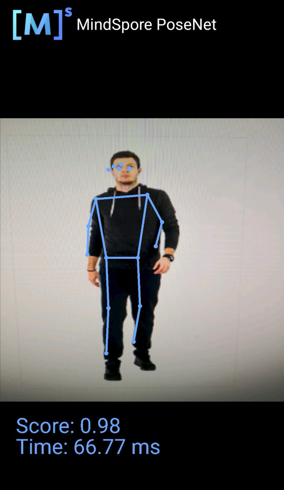

# MindSpore Lite Skeleton Detection Demo (Android)

This sample application demonstrates how to use the MindSpore Lite API and skeleton detection model to perform inference on the device, detect the content captured by the device camera, and display the continuous objective detection result on the image preview screen of the app.

## Running Dependencies

- Android Studio 3.2 or later (Android 4.0 or later is recommended.)
- NDK 21.3
- CMake 3.10
- Android software development kit (SDK) 26 or later

## Building and Running

1. Load the sample source code to Android Studio and install the corresponding SDK. (After the SDK version is specified, Android Studio automatically installs the SDK.)

    

    Start Android Studio, click `File > Settings > System Settings > Android SDK`, and select the corresponding SDK. As shown in the following figure, select an SDK and click `OK`. Android Studio automatically installs the SDK.

    

    If an Android Studio configuration error occurs, solve it by referring to the following solution table in item 4.

2. Connect to an Android device and run the skeleton detection sample application.

    Connect to the Android device through a USB cable for debugging. Click `Run 'app'` to run the sample project on your device.
    > During the building, Android Studio automatically downloads dependencies related to MindSpore Lite and model files. Please wait.

    

    For details about how to connect the Android Studio to a device for debugging, see <https://developer.android.com/studio/run/device>.

3. Continue the installation on the Android device. After the installation is complete, you can view the content captured by a camera and the inference result.

    

    The following figure shows the output of the skeletal detection model.

    The blue points are used to detect facial features and limb bone movement trends. The confidence score of this inference is 0.98/1, and the inference delay is 66.77 ms.

    

4. The following table lists solutions to Android Studio configuration errors.

    | | Error | Solution |
    | ---- | ------------------------------------------------------------ | ------------------------------------------------------------ |
    | 1    | Gradle sync failed: NDK not configured.                      | Specify the NDK installation directory in the local.properties file: ndk.dir={NDK installation directory} |
    | 2    | Requested NDK version did not match the version requested by ndk.dir | Manually download the corresponding [NDK version](https://developer.android.com/ndk/downloads) and specify the SDK location in the `Android NDK location` field (see the following figure). |
    | 3    | This version of Android Studio cannot open this project, please retry with Android Studio or newer. | Choose `Help` > `Checkout for Updates` on the toolbar to update the version. |
    | 4    | SSL peer shut down incorrectly                               | Rebuild. |

    

## Detailed Description of the Sample Application  

The skeleton detection sample application on the Android device uses the Android Camera 2 API to enable a camera to obtain image frames and process images, as well as using [runtime](https://www.mindspore.cn/tutorial/lite/en/master/use/runtime.html) to complete model inference.

### Sample Application Structure

```text

├── app
│   ├── build.gradle # Other Android configuration file.
│   ├── download.gradle # During app building, the .gradle file automatically downloads the dependent library files and model files from the Huawei server.
│   ├── proguard-rules.pro
│   └── src
│       ├── main
│       │   ├── AndroidManifest.xml # Android configuration file.
│       │   ├── java # Application code at the Java layer.
│       │   │   └── com
│       │   │       └── mindspore
│       │   │           └── posenetdemo # Image processing and inference process implementation.
│       │   │               ├── CameraDataDealListener.java
│       │   │               ├── ImageUtils.java
│       │   │               ├── MainActivity.java
│       │   │               ├── PoseNetFragment.java
│       │   │               ├── Posenet.java #
│       │   │               └── TestActivity.java
│       │   └── res # Resource files related to Android.
│       └── test
└── ...

```

### Downloading and Deploying the Model File

Download the model file from MindSpore Model Hub. The objective detection model file used in this sample application is `posenet_model.ms`, which is automatically downloaded during app building using the `download.gradle` script and stored in the `app/src/main/assets` project directory.

> If the download fails, manually download the model file [posenet_model.ms](https://download.mindspore.cn/model_zoo/official/lite/posenet_lite/posenet_model.ms)

### Writing On-Device Inference Code

In the skeleton detection demo, the Java API is used to implement on-device inference. Compared with the C++ API, the Java API can be directly called in the Java Class and does not need to implement the related code at the JNI layer. Therefore, the Java API is more convenient.

- The following example identifies body features such as nose and eyes, obtains their locations, and calculates the confidence score to implement bone detection.

  ```java
  public enum BodyPart {
      NOSE,
      LEFT_EYE,
      RIGHT_EYE,
      LEFT_EAR,
      RIGHT_EAR,
      LEFT_SHOULDER,
      RIGHT_SHOULDER,
      LEFT_ELBOW,
      RIGHT_ELBOW,
      LEFT_WRIST,
      RIGHT_WRIST,
      LEFT_HIP,
      RIGHT_HIP,
      LEFT_KNEE,
      RIGHT_KNEE,
      LEFT_ANKLE,
      RIGHT_ANKLE
  }

  public class Position {
      int x;
      int y;
  }

  public class KeyPoint {
      BodyPart bodyPart = BodyPart.NOSE;
      Position position = new Position();
      float score = 0.0f;
  }

  public class Person {
      List<KeyPoint> keyPoints;
      float score = 0.0f;
  }
  ```

The inference code process of bone detection demo is as follows. For details about the complete code, see `src/main/java/com/mindspore/posenetdemo/Posenet.java`.

1. Load the MindSpore Lite model file and build the context, session, and computational graph for inference.

    - Loading a model: Read a MindSpore Lite model from the file system and parse it.

        ```java
        // Load the .ms model.
        model = new Model();
        if (!model.loadModel(mContext, "posenet_model.ms")) {
            Log.e("MS_LITE", "Load Model failed");
            return false;
        }
        ```

    - Creating a configuration context: Create the configuration context `MSConfig` and save some basic configuration parameters required by the session for guiding graph building and execution.

        ```java
        // Create and init config.
        msConfig = new MSConfig();
        if (!msConfig.init(DeviceType.DT_CPU, NUM_THREADS, CpuBindMode.MID_CPU)) {
            Log.e("MS_LITE", "Init context failed");
            return false;
        }
        ```

    - Creating a session: Create `LiteSession` and call the `init` method to configure the `MSConfig` obtained in the previous step to the session.

        ```java
        // Create the MindSpore lite session.
        session = new LiteSession();
        if (!session.init(msConfig)) {
            Log.e("MS_LITE", "Create session failed");
            msConfig.free();
            return false;
        }
        msConfig.free();
        ```

    - Load the model file and build a computational graph for inference.

        ```java
        // Complile graph.
        if (!session.compileGraph(model)) {
            Log.e("MS_LITE", "Compile graph failed");
            model.freeBuffer();
            return false;
        }

        // Note: when use model.freeBuffer(), the model can not be complile graph again.
        model.freeBuffer();
        ```

2. Input data. Currently, Java supports two types of data: `byte[]` and `ByteBuffer`. Set the data of the input tensor.

   - Before data is input, the bitmap that stores image information needs to be interpreted, analyzed, and converted.

       ```java
        /**
         * Scale the image to a byteBuffer of [-1,1] values.
         */
        private ByteBuffer initInputArray(Bitmap bitmap) {
            final int bytesPerChannel = 4;
            final int inputChannels = 3;
            final int batchSize = 1;
            ByteBuffer inputBuffer = ByteBuffer.allocateDirect(
                    batchSize * bytesPerChannel * bitmap.getHeight() * bitmap.getWidth() * inputChannels
            );
            inputBuffer.order(ByteOrder.nativeOrder());
            inputBuffer.rewind();

            final float mean = 128.0f;
            final float std = 128.0f;
            int[] intValues = new int[bitmap.getWidth() * bitmap.getHeight()];
            bitmap.getPixels(intValues, 0, bitmap.getWidth(), 0, 0, bitmap.getWidth(), bitmap.getHeight());
       ```

       ```java
            int pixel = 0;
            for (int y = 0; y < bitmap.getHeight(); y++) {
                for (int x = 0; x < bitmap.getWidth(); x++) {
                    int value = intValues[pixel++];
                    inputBuffer.putFloat(((float) (value >> 16 & 0xFF) - mean) / std);
                    inputBuffer.putFloat(((float) (value >> 8 & 0xFF) - mean) / std);
                    inputBuffer.putFloat(((float) (value & 0xFF) - mean) / std);
                }
            }
            return inputBuffer;
        }
        ```

   - Input data through `ByteBuffer`.

       ```java
        long estimationStartTimeNanos = SystemClock.elapsedRealtimeNanos();
        ByteBuffer inputArray = this.initInputArray(bitmap);
        List<MSTensor> inputs = session.getInputs();
        if (inputs.size() != 1) {
            return null;
        }

        Log.i("posenet", String.format("Scaling to [-1,1] took %.2f ms",
                1.0f * (SystemClock.elapsedRealtimeNanos() - estimationStartTimeNanos) / 1_000_000));

        MSTensor inTensor = inputs.get(0);
        inTensor.setData(inputArray);
        long inferenceStartTimeNanos = SystemClock.elapsedRealtimeNanos();
       ```

3. Perform inference on the input tensor based on the model, obtain the output tensor, and perform post-processing.

   - Use `runGraph` for model inference.

        ```java
        // Run graph to infer results.
        if (!session.runGraph()) {
            Log.e("MS_LITE", "Run graph failed");
            return null;
        }

        lastInferenceTimeNanos = SystemClock.elapsedRealtimeNanos() - inferenceStartTimeNanos;
        Log.i(
                "posenet",
                String.format("Interpreter took %.2f ms", 1.0f * lastInferenceTimeNanos / 1_000_000)
        );
       ```

   - Obtain the inference result by the output tensor.

        ```java
        // Get output tensor values.
        List<MSTensor> heatmaps_list = session.getOutputsByNodeName("Conv2D-27");
        if (heatmaps_list == null) {
            return null;
        }
        MSTensor heatmaps_tensors = heatmaps_list.get(0);

        float[] heatmaps_results = heatmaps_tensors.getFloatData();
        int[] heatmapsShape = heatmaps_tensors.getShape(); //1, 9, 9 ,17

        float[][][][] heatmaps = new float[heatmapsShape[0]][][][];
        for (int x = 0; x < heatmapsShape[0]; x++) {  // heatmapsShape[0] =1
            float[][][] arrayThree = new float[heatmapsShape[1]][][];
            for (int y = 0; y < heatmapsShape[1]; y++) {  // heatmapsShape[1] = 9
                float[][] arrayTwo = new float[heatmapsShape[2]][];
                for (int z = 0; z < heatmapsShape[2]; z++) { //heatmapsShape[2] = 9
                    float[] arrayOne = new float[heatmapsShape[3]]; //heatmapsShape[3] = 17
                    for (int i = 0; i < heatmapsShape[3]; i++) {
                        int n = i + z * heatmapsShape[3] + y * heatmapsShape[2] * heatmapsShape[3] + x * heatmapsShape[1] * heatmapsShape[2] * heatmapsShape[3];
                        arrayOne[i] = heatmaps_results[n]; //1*9*9*17  ??
                    }
                    arrayTwo[z] = arrayOne;
                }
                arrayThree[y] = arrayTwo;
            }
            heatmaps[x] = arrayThree;
        }
        ```

        ```java
        List<MSTensor> offsets_list = session.getOutputsByNodeName("Conv2D-28");
        if (offsets_list == null) {
            return null;
        }
        MSTensor offsets_tensors = offsets_list.get(0);
        float[] offsets_results = offsets_tensors.getFloatData();
        int[] offsetsShapes = offsets_tensors.getShape();

        float[][][][] offsets = new float[offsetsShapes[0]][][][];
        for (int x = 0; x < offsetsShapes[0]; x++) {
            float[][][] offsets_arrayThree = new float[offsetsShapes[1]][][];
            for (int y = 0; y < offsetsShapes[1]; y++) {
                float[][] offsets_arrayTwo = new float[offsetsShapes[2]][];
                for (int z = 0; z < offsetsShapes[2]; z++) {
                    float[] offsets_arrayOne = new float[offsetsShapes[3]];
                    for (int i = 0; i < offsetsShapes[3]; i++) {
                        int n = i + z * offsetsShapes[3] + y * offsetsShapes[2] * offsetsShapes[3] + x * offsetsShapes[1] * offsetsShapes[2] * offsetsShapes[3];
                        offsets_arrayOne[i] = offsets_results[n];
                    }
                    offsets_arrayTwo[z] = offsets_arrayOne;
                }
                offsets_arrayThree[y] = offsets_arrayTwo;
            }
            offsets[x] = offsets_arrayThree;
        }
        ```

   - Process the output node data, and obtain the return value `person` of the skeleton detection demo to implement the function.

        In `Conv2D-27`, the `height`, `weight`, and `numKeypoints` parameters stored in `heatmaps` can be used to obtain the `keypointPosition` information.

        In `Conv2D-28`, `offset` indicates the position coordinate offset, which can be used together with `keypointPosition` to obtain `confidenceScores` and determine the model inference result.

        Use `keypointPosition` and `confidenceScores` to obtain `person.keyPoints` and `person.score` to obtain the model's return value `person`.

        ```java
        int height = ((Object[]) heatmaps[0]).length;  //9
        int width = ((Object[]) heatmaps[0][0]).length; //9
        int numKeypoints = heatmaps[0][0][0].length; //17

        // Finds the (row, col) locations of where the keypoints are most likely to be.
        Pair[] keypointPositions = new Pair[numKeypoints];
        for (int i = 0; i < numKeypoints; i++) {
            keypointPositions[i] = new Pair(0, 0);
        }

        for (int keypoint = 0; keypoint < numKeypoints; keypoint++) {
            float maxVal = heatmaps[0][0][0][keypoint];
            int maxRow = 0;
            int maxCol = 0;
            for (int row = 0; row < height; row++) {
                for (int col = 0; col < width; col++) {
                    if (heatmaps[0][row][col][keypoint] > maxVal) {
                        maxVal = heatmaps[0][row][col][keypoint];
                        maxRow = row;
                        maxCol = col;
                    }
                }
            }
            keypointPositions[keypoint] = new Pair(maxRow, maxCol);
        }

        // Calculating the x and y coordinates of the keypoints with offset adjustment.
        int[] xCoords = new int[numKeypoints];
        int[] yCoords = new int[numKeypoints];
        float[] confidenceScores = new float[numKeypoints];
        for (int i = 0; i < keypointPositions.length; i++) {
            Pair position = keypointPositions[i];
            int positionY = (int) position.first;
            int positionX = (int) position.second;

            yCoords[i] = (int) ((float) positionY / (float) (height - 1) * bitmap.getHeight() + offsets[0][positionY][positionX][i]);
            xCoords[i] = (int) ((float) positionX / (float) (width - 1) * bitmap.getWidth() + offsets[0][positionY][positionX][i + numKeypoints]);
            confidenceScores[i] = sigmoid(heatmaps[0][positionY][positionX][i]);
        }

        Person person = new Person();
        KeyPoint[] keypointList = new KeyPoint[numKeypoints];
        for (int i = 0; i < numKeypoints; i++) {
            keypointList[i] = new KeyPoint();
        }

        float totalScore = 0.0f;
        for (int i = 0; i < keypointList.length; i++) {
            keypointList[i].position.x = xCoords[i];
            keypointList[i].position.y = yCoords[i];
            keypointList[i].score = confidenceScores[i];
            totalScore += confidenceScores[i];
        }
        person.keyPoints = Arrays.asList(keypointList);
        person.score = totalScore / numKeypoints;

        return person;
        ```
