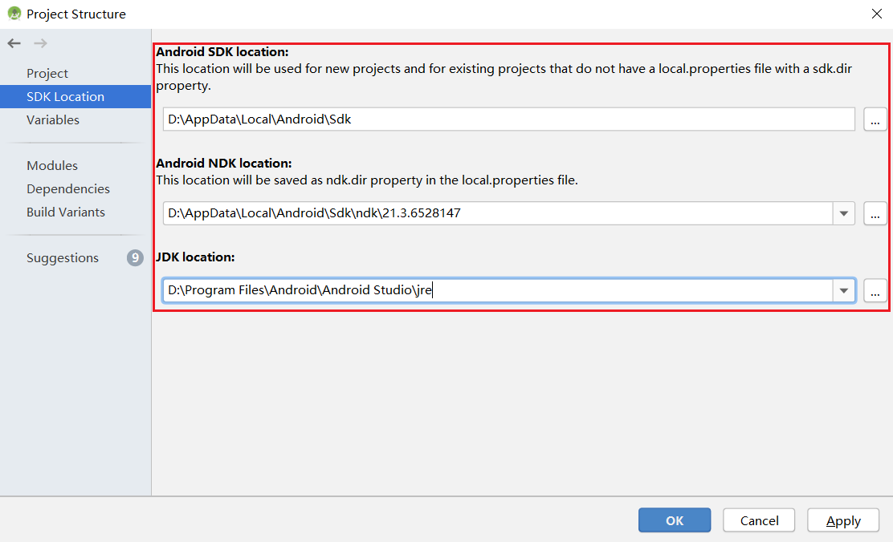

# MindSpore Lite Scene Detection Demo (Android)

This sample application demonstrates how to use the MindSpore Lite C++ API (Android JNI) and MindSpore Lite scene detection model to perform inference on the device, detect the content captured by the device camera, and display the continuous objective detection result on the image preview screen of the app.

## Running Dependencies

- Android Studio 3.2 or later (Android 4.0 or later is recommended.)

## Building and Running

1. Load the sample source code to Android Studio.

    

    Start Android Studio, click `File > Settings > System Settings > Android SDK`, and select the corresponding `SDK Tools`. As shown in the following figure, select an SDK and click `OK`. Android Studio automatically installs the SDK.

    

    > Android SDK Tools is the default installation. You can see this by unchecking the `Hide Obsolete Packages`box.
    >
    > If you have any Android Studio configuration problem when trying this demo, please refer to item 4 to resolve it.

2. Connect to an Android device and runs this application.

    Connect to the Android device through a USB cable for debugging. Click `Run 'app'` to run the sample project on your device.

    

    > Android Studio will automatically download MindSpore Lite, model files and other dependencies during the compilation process. Please be patient during this process.
    >
    > For details about how to connect the Android Studio to a device for debugging, see <https://developer.android.com/studio/run/device?hl=zh-cn>.
    >
    > The mobile phone needs to be turn on "USB debugging mode" before Android Studio can recognize the mobile phone. Huawei mobile phones generally turn on "USB debugging model" in Settings -> system and update -> developer Options -> USB debugging.

3. Continue the installation on the Android device. After the installation is complete, you can view the content captured by a camera and the inference result.

    

4. The solutions of configuration problems:

    4.1 Problems of NDK, CMake, JDK Tools:

    If the tools installed in Android Studio are not recognized, you can re-download and install them from the corresponding official website, and configure the path.

    - NDK >= 21.3 [NDK](https://developer.android.google.cn/ndk/downloads?hl=zh-cn)
    - CMake >= 3.10.2   [CMake](https://cmake.org/download)
    - Android SDK >= 26 [SDK](https://developer.microsoft.com/zh-cn/windows/downloads/windows-10-sdk/)
    - JDK >= 1.8 [JDK](https://www.oracle.com/cn/java/technologies/javase/javase-jdk8-downloads.html)

    

    4.2 NDK version does not match:

    Open `Android SDK`, click `Show Package Details`, and select the appropriate NDK version according to the error message.
    

    4.3 Problem of Android Studio version:

    Update the Android Studio version in `Toolbar - Help - Checkout for Updates`.

    4.4 Gradle dependencies installed too slowly:

    As shown in the picture, open the Demo root directory `build. Gradle` file, then add huawei mirror source address: `maven {url 'https://developer.huawei.com/repo/'}`, modify the classpath to 4.0.0 and click ` sync ` . Once the download is complete, restore the classpath version and synchronize it again.

    

## Detailed Description of the Sample Application  

The scene detection sample application on the Android device includes a Java layer and a JNI layer. At the Java layer, the Android Camera 2 API is used to enable a camera to obtain image frames and process images (drawing frames based on the inference result). At the JNI layer, the model inference process is completed in [runtime](https://www.mindspore.cn/tutorial/lite/en/master/use/runtime.html).

> This following describes the JNI layer implementation of the sample application. At the Java layer, the Android Camera 2 API is used to enable a device camera and process image frames. Readers are expected to have the basic Android development knowledge.

### Sample Application Structure

```text
app
|
├── libs # Library files built by the demo JNI layer
│   └── arm64-v8a
│       │── libmlkit-label-MS.so #
|
├── src/main
│   ├── assets # Resource file
|   |   └── mobilenetv2.ms # Model file
│   |
│   ├── cpp # Main logic encapsulation classes for model loading and prediction
|   |   ├── mindspore-lite-x.x.x-mindata-arm64-cpu # Calling package built from the MindSpore source code, including the library files and related header files on which the demo JNI layer depends
|   |   |   └── ...
│   |   |
|   |   ├── MindSporeNetnative.cpp # JNI methods related to MindSpore calling
│   ├── java # Application code at the Java layer
│   │   └── com.huawei.himindsporedemo
│   │       ├── help # Implementation related to image processing and MindSpore JNI calling
│   │       │   └── ...
│   │       └── obejctdetect # Implementation related to camera enabling and drawing
│   │           └── ...
│   │
│   ├── res # Resource files related to Android
│   └── AndroidManifest.xml # Android configuration file
│
├── CMakeLists.txt # CMake compilation entry file
│
├── build.gradle # Other Android configuration file
├── download.gradle # During app building, the .gradle file automatically downloads the dependent library files and model files from the Huawei server.
└── ...
```

### Configuring MindSpore Lite Dependencies

When MindSpore C++ APIs are called at the Android JNI layer, related library files are required. You can refer to [Building MindSpore Lite](https://www.mindspore.cn/tutorial/lite/en/master/use/build.html) to generate the `mindspore-lite-{version}-minddata-{os}-{device}.tar.gz` library file package (including the `libmindspore-lite.so` library file and related header files) and decompress it. The following example uses the build command with the image preprocessing module.

> version: version number in the output file, which is the same as the version number of the built branch code.
>
> device: The value can be cpu (built-in CPU operator) or gpu (built-in CPU and GPU operator).
>
> os: operating system to be deployed in the output file.

In this example, the MindSpore Lite version file is automatically downloaded by the download.gradle file during the build process and stored in the `app/src/main/cpp/` directory.

> If the automatic download fails, manually download the library file [mindspore-lite-1.0.1-runtime-arm64-cpu.tar.gz](https://ms-release.obs.cn-north-4.myhuaweicloud.com/1.0.1/lite/android_aarch64/mindspore-lite-1.0.1-runtime-arm64-cpu.tar.gz), and decompress and save it to the directory.

In the `build.gradle` file of the app, configure the build support of both CMake and `arm64-v8a`:

```text
android{
    defaultConfig{
        externalNativeBuild{
            cmake{
                arguments "-DANDROID_STL=c++_shared"
            }
        }

        ndk{
            abiFilters 'arm64-v8a'
        }
    }
}
```

Create a link to the `.so` library file in the `app/CMakeLists.txt` file:

```text
# Set MindSpore Lite Dependencies.
set(MINDSPORELITE_VERSION  mindspore-lite-1.0.1-runtime-arm64-cpu)
include_directories(${CMAKE_SOURCE_DIR}/src/main/cpp/${MINDSPORELITE_VERSION})
add_library(mindspore-lite SHARED IMPORTED )
add_library(minddata-lite SHARED IMPORTED )
set_target_properties(mindspore-lite PROPERTIES IMPORTED_LOCATION
        ${CMAKE_SOURCE_DIR}/src/main/cpp/${MINDSPORELITE_VERSION}/lib/libmindspore-lite.so)
set_target_properties(minddata-lite PROPERTIES IMPORTED_LOCATION
        ${CMAKE_SOURCE_DIR}/src/main/cpp/${MINDSPORELITE_VERSION}/lib/libminddata-lite.so)

# Link target library.
target_link_libraries(
    ...
    mindspore-lite
    minddata-lite
    ...
)
```

### Downloading and Deploying the Model File

Download the model file from MindSpore Model Hub. The scene detection model file used in this sample application is `mobilenetv2.ms`, which is automatically downloaded during app building using the `download.gradle` script and stored in the `app/src/main/assets` project directory.

> If the download fails, manually download the model file [mobilenetv2.ms](https://download.mindspore.cn/model_zoo/official/lite/mobilenetv2_openimage_lite/mobilenetv2.ms).

### Writing On-Device Inference Code

Call MindSpore Lite C++ APIs at the JNI layer to implement on-device inference.

The inference code process is as follows. For details about the complete code, see `src/cpp/MindSporeNetnative.cpp`.

1. Load the MindSpore Lite model file and build the context, session, and computational graph for inference.  

    - Load a model file.

        ```cpp
        jlong bufferLen = env->GetDirectBufferCapacity(model_buffer);
        if (0 == bufferLen) {
            MS_PRINT("error, bufferLen is 0!");
            return (jlong) nullptr;
        }

        char *modelBuffer = CreateLocalModelBuffer(env, model_buffer);
        if (modelBuffer == nullptr) {
            MS_PRINT("modelBuffer create failed!");
            return (jlong) nullptr;
        }
        ```

    - Create a session.

        ```cpp
        void **labelEnv = new void *;
        MSNetWork *labelNet = new MSNetWork;
        *labelEnv = labelNet;

        mindspore::lite::Context *context = new mindspore::lite::Context;
        context->thread_num_ = num_thread;
        context->device_list_[0].device_info_.cpu_device_info_.cpu_bind_mode_ = mindspore::lite::NO_BIND;
        context->device_list_[0].device_info_.cpu_device_info_.enable_float16_ = false;
        context->device_list_[0].device_type_ = mindspore::lite::DT_CPU;

        labelNet->CreateSessionMS(modelBuffer, bufferLen, context);
        delete context;
        ```

    - Load the model file and build a computational graph for inference.

        ```cpp
        void
        MSNetWork::CreateSessionMS(char *modelBuffer, size_t bufferLen, mindspore::lite::Context *ctx) {
            session_ = mindspore::session::LiteSession::CreateSession(ctx);
            if (session_ == nullptr) {
                MS_PRINT("Create Session failed.");
                return;
            }

            // Compile model.
            model_ = mindspore::lite::Model::Import(modelBuffer, bufferLen);
            if (model_ == nullptr) {
                ReleaseNets();
                MS_PRINT("Import model failed.");
                return;
            }

            int ret = session_->CompileGraph(model_);
            if (ret != mindspore::lite::RET_OK) {
                ReleaseNets();
                MS_PRINT("CompileGraph failed.");
                return;
            }
        }
        ```

2. Convert the input image into the Tensor format of the MindSpore model.

    ```cpp
    // Convert the Bitmap image passed in from the JAVA layer to Mat for OpenCV processing
        LiteMat lite_mat_bgr,lite_norm_mat_cut;

       if (!BitmapToLiteMat(env, srcBitmap, lite_mat_bgr)){
        MS_PRINT("BitmapToLiteMat error");
           return NULL;
       }
       int srcImageWidth = lite_mat_bgr.width_;
       int srcImageHeight = lite_mat_bgr.height_;
       if(!PreProcessImageData(lite_mat_bgr, lite_norm_mat_cut)){
        MS_PRINT("PreProcessImageData error");
           return NULL;
       }
       ImgDims inputDims;
       inputDims.channel =lite_norm_mat_cut.channel_;
       inputDims.width = lite_norm_mat_cut.width_;
       inputDims.height = lite_norm_mat_cut.height_;

       // Get the mindsore inference environment which created in loadModel().
       void **labelEnv = reinterpret_cast<void **>(netEnv);
       if (labelEnv == nullptr) {
           MS_PRINT("MindSpore error, labelEnv is a nullptr.");
           return NULL;
       }
       MSNetWork *labelNet = static_cast<MSNetWork *>(*labelEnv);

       auto mSession = labelNet->session;
       if (mSession == nullptr) {
           MS_PRINT("MindSpore error, Session is a nullptr.");
           return NULL;
       }
       MS_PRINT("MindSpore get session.");

       auto msInputs = mSession->GetInputs();
       auto inTensor = msInputs.front();

       float *dataHWC = reinterpret_cast<float *>(lite_norm_mat_cut.data_ptr_);
       // copy input Tensor
       memcpy(inTensor->MutableData(), dataHWC,
              inputDims.channel * inputDims.width * inputDims.height * sizeof(float));
       delete[] (dataHWC);
   ```

3. Perform inference on the input tensor based on the model to obtain the output tensor.

   - Perform graph execution and on-device inference.

        ```cpp
        // After the model and image tensor data is loaded, run inference.
        auto status = mSession->RunGraph();

        if (status != mindspore::lite::RET_OK) {
            MS_PRINT("MindSpore run net error.");
            return NULL;
        }
        ```

   - Obtain the output data.

        ```cpp
        /**
         * Get the mindspore inference results.
         * Return the map of output node name and MindSpore Lite MSTensor.
         */
        auto names = mSession->GetOutputTensorNames();
        std::unordered_map<std::string, mindspore::tensor::MSTensor *> msOutputs;
        for (const auto &name : names) {
            auto temp_dat = mSession->GetOutputByTensorName(name);
            msOutputs.insert(std::pair<std::string, mindspore::tensor::MSTensor *>{name, temp_dat});
        }
        ```
