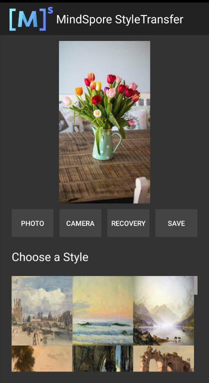

# MindSpore Lite Style Transfer Demo (Android)

This sample application demonstrates how to use the MindSpore Lite API and MindSpore Lite style transfer model to perform inference on the device, replace the art style of the target image based on the built-in standard image in the demo, and display the image on the image preview screen of the app.

## Running Dependencies

- Android Studio 3.2 or later (Android 4.0 or later is recommended.)
- NDK 21.3
- CMake 3.10
- Android software development kit (SDK) 26 or later

## Building and Running

1. Load the sample source code to Android Studio and install the corresponding SDK. (After the SDK version is specified, Android Studio automatically installs the SDK.)

    

    Start Android Studio, click `File > Settings > System Settings > Android SDK`, and select the corresponding SDK. As shown in the following figure, select an SDK and click `OK`. Android Studio automatically installs the SDK.

    

    If an Android Studio configuration error occurs, solve it by referring to the following solution table in item 4.

2. Connect to an Android device and run the style transfer sample application.

    Connect to the Android device through a USB cable for debugging. Click `Run 'app'` to run the sample project on your device.
    > During the building, Android Studio automatically downloads dependencies related to MindSpore Lite and model files. Please wait.

    

    For details about how to connect the Android Studio to a device for debugging, see <https://developer.android.com/studio/run/device>.

3. Continue the installation on the Android device. After the installation is complete, you can view the inference result.

    

    When using the style transfer demo, you can import or take a photo, select a built-in style to obtain a new photo after inference, and then restore or save the new photo.

    Before style transfer:

    

    After style transfer:

    

4. The following table lists solutions to Android Studio configuration errors.

    | | Error | Solution |
    | ---- | ------------------------------------------------------------ | ------------------------------------------------------------ |
    | 1    | Gradle sync failed: NDK not configured.                      | Specify the NDK installation directory in the local.properties file: ndk.dir={NDK installation directory} |
    | 2    | Requested NDK version did not match the version requested by ndk.dir | Manually download the corresponding [NDK version](https://developer.android.com/ndk/downloads) and specify the SDK location in the `Android NDK location` field (see the following figure). |
    | 3    | This version of Android Studio cannot open this project, please retry with Android Studio or newer. | Choose `Help` > `Checkout for Updates` on the toolbar to update the version. |
    | 4    | SSL peer shut down incorrectly                               | Rebuild. |

    

## Detailed Description of the Sample Application  

The style transfer sample application on the Android device uses the Android Camera 2 API to enable a camera to obtain image frames and process images, as well as using [runtime](https://www.mindspore.cn/tutorial/lite/en/master/use/runtime.html) to complete model inference.

### Sample Application Structure

```text

├── app
│   ├── build.gradle # Other Android configuration file.
│   ├── download.gradle # During app building, the .gradle file automatically downloads the dependent library files and model files from the Huawei server.
│   ├── proguard-rules.pro
│   └── src
│       ├── main
│       │   ├── AndroidManifest.xml # Android configuration file.
│       │   ├── java # Application code at the Java layer.
│       │   │   └── com
│       │   │       └── mindspore
│       │   │           └── posenetdemo # Image processing and inference process implementation
│       │   │               ├── CameraDataDealListener.java
│       │   │               ├── ImageUtils.java
│       │   │               ├── MainActivity.java
│       │   │               ├── PoseNetFragment.java
│       │   │               ├── Posenet.java #
│       │   │               └── TestActivity.java
│       │   └── res # Resource files related to Android.
│       └── test
└── ...

```

### Downloading and Deploying the Model File

Download the model file from MindSpore Model Hub. The objective detection model file used in this sample application is `posenet_model.ms`, which is automatically downloaded during app building using the `download.gradle` script and stored in the `app/src/main/assets` project directory.

> If the download fails, manually download the model files [style_predict_quant.ms](https://download.mindspore.cn/model_zoo/official/lite/style_lite/style_predict_quant.ms) and [style_transfer_quant.ms](https://download.mindspore.cn/model_zoo/official/lite/style_lite/style_transfer_quant.ms).

### Writing On-Device Inference Code

In the style transfer demo, the Java API is used to implement on-device inference. Compared with the C++ API, the Java API can be directly called in the Java Class and does not need to implement the related code at the JNI layer. Therefore, the Java API is more convenient.

The inference code process of style transfer demo is as follows. For details about the complete code, see `src/main/java/com/mindspore/styletransferdemo/StyleTransferModelExecutor.java`.

1. Load the MindSpore Lite model file and build the context, session, and computational graph for inference.

    - Loading a model: Read a MindSpore Lite model from the file system and parse it.

        ```java
        // Load the .ms model.
        style_predict_model = new Model();
        if (!style_predict_model.loadModel(mContext, "style_predict_quant.ms")) {
            Log.e("MS_LITE", "Load style_predict_model failed");
        }

        style_transform_model = new Model();
        if (!style_transform_model.loadModel(mContext, "style_transfer_quant.ms")) {
            Log.e("MS_LITE", "Load style_transform_model failed");
        }
        ```

    - Creating a configuration context: Create the configuration context `MSConfig` and save some basic configuration parameters required by the session for guiding graph building and execution.

        ```java
        msConfig = new MSConfig();
        if (!msConfig.init(DeviceType.DT_CPU, NUM_THREADS, CpuBindMode.MID_CPU)) {
            Log.e("MS_LITE", "Init context failed");
        }
        ```

    - Creating a session: Create `LiteSession` and call the `init` method to configure the `MSConfig` obtained in the previous step to the session.

        ```java
        // Create the MindSpore lite session.
        Predict_session = new LiteSession();
        if (!Predict_session.init(msConfig)) {
            Log.e("MS_LITE", "Create Predict_session failed");
            msConfig.free();
        }

        Transform_session = new LiteSession();
        if (!Transform_session.init(msConfig)) {
            Log.e("MS_LITE", "Create Predict_session failed");
            msConfig.free();
        }
        msConfig.free();
        ```

    - Load the model file and build a computational graph for inference.

        ```java
        // Complile graph.
        if (!Predict_session.compileGraph(style_predict_model)) {
            Log.e("MS_LITE", "Compile style_predict graph failed");
            style_predict_model.freeBuffer();
        }
        if (!Transform_session.compileGraph(style_transform_model)) {
            Log.e("MS_LITE", "Compile style_transform graph failed");
            style_transform_model.freeBuffer();
        }

        // Note: when use model.freeBuffer(), the model can not be complile graph again.
        style_predict_model.freeBuffer();
        style_transform_model.freeBuffer();
        ```

2. Input data. Currently, Java supports two types of data: `byte[]` and `ByteBuffer`. Set the data of the input tensor.

   - Convert a float array to a byte array before data is input.

       ```java

        public static byte[] floatArrayToByteArray(float[] floats) {
            ByteBuffer buffer = ByteBuffer.allocate(4 * floats.length);
            buffer.order(ByteOrder.nativeOrder());
            FloatBuffer floatBuffer = buffer.asFloatBuffer();
            floatBuffer.put(floats);
            return buffer.array();
        }
       ```

   - Input data through `ByteBuffer`. `contentImage` is the image provided by users, and `styleBitmap` is the built-in style image.

       ```java
        public ModelExecutionResult execute(Bitmap contentImage, Bitmap styleBitmap) {
            Log.i(TAG, "running models");
            fullExecutionTime = SystemClock.uptimeMillis();
            preProcessTime = SystemClock.uptimeMillis();
            ByteBuffer contentArray =
                    ImageUtils.bitmapToByteBuffer(contentImage, CONTENT_IMAGE_SIZE, CONTENT_IMAGE_SIZE, 0, 255);
            ByteBuffer input = ImageUtils.bitmapToByteBuffer(styleBitmap, STYLE_IMAGE_SIZE, STYLE_IMAGE_SIZE, 0, 255);
       ```

3. Perform inference on the input tensor based on the model, obtain the output tensor, and perform post-processing.

   - Use `runGraph` to perform model inference on the built-in image and obtain the result `Predict_results`.

        ```java
        List<MSTensor> Predict_inputs = Predict_session.getInputs();
        if (Predict_inputs.size() != 1) {
            return null;
        }
        MSTensor Predict_inTensor = Predict_inputs.get(0);
        Predict_inTensor.setData(input);

        preProcessTime = SystemClock.uptimeMillis() - preProcessTime;
        stylePredictTime = SystemClock.uptimeMillis();
        ```

        ```java
        if (!Predict_session.runGraph()) {
            Log.e("MS_LITE", "Run Predict_graph failed");
            return null;
        }
        stylePredictTime = SystemClock.uptimeMillis() - stylePredictTime;
        Log.d(TAG, "Style Predict Time to run: " + stylePredictTime);

        // Get output tensor values.
        List<String> tensorNames = Predict_session.getOutputTensorNames();
        Map<String, MSTensor> outputs = Predict_session.getOutputMapByTensor();
        Set<Map.Entry<String, MSTensor>> entrys = outputs.entrySet();

        float[] Predict_results = null;
        for (String tensorName : tensorNames) {
            MSTensor output = outputs.get(tensorName);
            if (output == null) {
                Log.e("MS_LITE", "Can not find Predict_session output " + tensorName);
                return null;
            }
            int type = output.getDataType();
            Predict_results = output.getFloatData();
        }
       ```

   - Perform model inference on the user image again based on the previous result to obtain the style transfer result `transform_results`.

        ```java
            List<MSTensor> Transform_inputs = Transform_session.getInputs();
            // transform model have 2 input tensor,  tensor0: 1*1*1*100, tensor1; 1*384*384*3
            MSTensor Transform_inputs_inTensor0 = Transform_inputs.get(0);
            Transform_inputs_inTensor0.setData(floatArrayToByteArray(Predict_results));

            MSTensor Transform_inputs_inTensor1 = Transform_inputs.get(1);
            Transform_inputs_inTensor1.setData(contentArray);
        ```

        ```java

            styleTransferTime = SystemClock.uptimeMillis();

            if (!Transform_session.runGraph()) {
                Log.e("MS_LITE", "Run Transform_graph failed");
                return null;
            }

            styleTransferTime = SystemClock.uptimeMillis() - styleTransferTime;
            Log.d(TAG, "Style apply Time to run: " + styleTransferTime);

            postProcessTime = SystemClock.uptimeMillis();

            // Get output tensor values.
            List<String> Transform_tensorNames = Transform_session.getOutputTensorNames();
            Map<String, MSTensor> Transform_outputs = Transform_session.getOutputMapByTensor();

            float[] transform_results = null;
            for (String tensorName : Transform_tensorNames) {
                MSTensor output1 = Transform_outputs.get(tensorName);
                if (output1 == null) {
                    Log.e("MS_LITE", "Can not find Transform_session output " + tensorName);
                    return null;
                }
                transform_results = output1.getFloatData();
            }
        ```

   - Process the output node data to obtain the final inference result.

        ```java
        float[][][][] outputImage = new float[1][][][];  // 1 384 384 3
        for (int x = 0; x < 1; x++) {
            float[][][] arrayThree = new float[CONTENT_IMAGE_SIZE][][];
            for (int y = 0; y < CONTENT_IMAGE_SIZE; y++) {
                float[][] arrayTwo = new float[CONTENT_IMAGE_SIZE][];
                for (int z = 0; z < CONTENT_IMAGE_SIZE; z++) {
                    float[] arrayOne = new float[3];
                    for (int i = 0; i < 3; i++) {
                        int n = i + z * 3 + y * CONTENT_IMAGE_SIZE * 3 + x * CONTENT_IMAGE_SIZE * CONTENT_IMAGE_SIZE * 3;
                        arrayOne[i] = transform_results[n];
                    }
                    arrayTwo[z] = arrayOne;
                }
                arrayThree[y] = arrayTwo;
            }
            outputImage[x] = arrayThree;
        }
        ```

        ```java
        Bitmap styledImage =
                ImageUtils.convertArrayToBitmap(outputImage, CONTENT_IMAGE_SIZE, CONTENT_IMAGE_SIZE);
        postProcessTime = SystemClock.uptimeMillis() - postProcessTime;

        fullExecutionTime = SystemClock.uptimeMillis() - fullExecutionTime;
        Log.d(TAG, "Time to run everything: $" + fullExecutionTime);

        return new ModelExecutionResult(styledImage,
                preProcessTime,
                stylePredictTime,
                styleTransferTime,
                postProcessTime,
                fullExecutionTime,
                formatExecutionLog());
        ```
