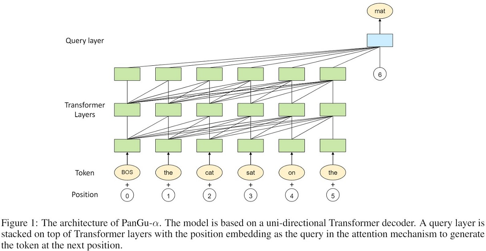

# Contents

- [Contents](#contents)
- [PanGu-Alpha Description](#pangu-alpha-description)
- [Model Architecture](#model-architecture)
- [Dataset](#dataset)
- [Environment Requirements](#environment-requirements)
- [Quick Start](#quick-start)
    - [Install Requirements](#install-requirements)
    - [Dataset Generation](#dataset-generation)
    - [Training](#training)
        - [Training on Ascend](#training-on-ascend)
        - [Training on GPU](#training-on-gpu)
        - [Incremental Training](#incremental-training-1)
    - [Prediction](#prediction)
        - [Download Checkpoint](#download-checkpoint)
        - [Prediction in Distributed mode](#prediction-in-distributed-mode)
        - [Prediction in Standalone mode](#prediction-in-standalone-mode)
    - [Serving](#serving)
        - [Preparation](#preparation)
        - [Serving 13B or 2.6B in Standalone mode](#serving-13b-or-26b-in-standalone-mode-ascend910nvidia-gpu)
        - [Serving 13B or 2.6B in Distributed mode](#serving-13b-or-26b-in-distributed-mode-ascend910-8-cards)
        - [Serving in Distributed mode [multi machines]](#serving-in-distributed-mode-ascend910-8-cards--n-machine)
- [Script Description](#script-description)
- [ModelZoo Homepage](#modelzoo-homepage)
- [Requirements](#requirements)
- [FAQ](#faq)

# [PanGu-Alpha Description](#contents)

We release the code to explore the new front-edge of training large model with billions or even trillions of parameters.
By MindSpore's parallel feature, we adopt the efficient model parallel and data parallel technology such as operator level parallelism,
to minimize the communication cost and maximize computation efficiency.
The code is easy to scale to thousands of NPUs and trillion parameters with little modifications.

In the mean while, we run our parallel training upon a language model, named PanGu-Alpha, to demonstrate the large model can be trained easily
with our parallel setting. We summarized the training tricks as followings:

1. Op-level Model Parallelism
2. Pipeline Model Parallelism
3. Optimizer Model Parallelism

The above features can be found [here](https://www.mindspore.cn/docs/programming_guide/en/master/auto_parallel.html).
More amazing features are still under developing.

The technical report and checkpoint file can be found [here](https://git.openi.org.cn/PCL-Platform.Intelligence/PanGu-AIpha).

# [Model Architecture](#contents)



The architecture of PanGu-α is based on Transformer, which has been extensively used as the backbone of a variety of
pretrained language models such as BERT and GPT. Different from them, we develop an additional query layeron top of
Transformer layers to predict the next token. The diagram of the model is shown in Figure 1.

# [Dataset](#contents)

- Open Source Dataset.

The above dataset is preprocessed with 1024 tokens for each example. The default column key in dataset.py is `input_ids`.

# [Environment Requirements](#contents)

- Hardware（Ascend）
    - Prepare hardware environment with Ascend processor.
- Framework
    - [MindSpore](https://gitee.com/mindspore/mindspore)
- For more information, please check the resources below：
    - [MindSpore Tutorials](https://www.mindspore.cn/tutorials/en/master/index.html)
    - [MindSpore Python API](https://www.mindspore.cn/docs/api/en/master/index.html)

# [Quick Start](#contents)

## Install Requirements

The following table gives a description of the tested environment, scripts and MindSpore version.

| Parallel Mode      | MindSpore Version | GPU(V100)              | Ascend (Ascend 910)              |
| -----------------  | ----------------- | ---------------------- | -------------------------------- |
| data parallel      | 1.3.0 & master    | Supported              | Supported                        |
| model parallel     | 1.3.0 & master    | Supported              | Supported                        |
| optimizer parallel | 1.3.0 & master    | Supported              | Supported                        |
| recompute          | 1.3.0 & master    | Supported              | Supported                        |
| pipeline parallel  | 1.3.0 & master    | Not Supported          | Supported                        |

To obtain the pangu_alpha's script, you need `git` to clone the mindspore's code as followings:

```bash
git clone https://gitee.com/mindspore/mindspore.git -b master
cd mindspore/model_zoo/official/nlp/pangu_alpha
```

For requirements, please refer to [Requirements](#requirements) to install the dependency.

## Dataset Generation

As the format of the downstream tasks can be various, the `preprocess.py` provides a basic usage of how to process your raw text files. Please prepare your data with following format, each line is a piece of continuous text  for each file:

```text
今天是一个好天气，小明很高兴的背起书包上学去。但是...
突然刮起了狂风暴雨！
```

Suppose the text data is under the `./data` and **each text file ends with 'txt'**, we can run the following command to generate the mindrecord files with seq_length=1025.

```bash
python -m src.preprocess --input_glob  data/*.txt --tokenizer gpt --eot 50256 --data_column_name input_ids --seq_length 1025
```

The script will chunk the each line with 1025 tokens. For the chunk with no more 1025 tokens, the chunk will be ignored.

The output files is under `./output`.  The default tokenizer adopts the transformers's tokenizer. Note the `vocab_szie` is determined by the vocab file.

- tokenizer: The tokenizer used for tokening the  text. It can be `gpt`(required `transformers`) or `jieba`. Note the `gpt` tokenizer requires the `transformers`,`pytorch` or `tensorflow`.  `jieba` tokenizer requires two addition files `vocab.model` and `vocab.vocab`. Click [here](https://git.openi.org.cn/PCL-Platform.Intelligence/PanGu-Alpha/src/branch/master/tokenizer) to download them.
- eod_id: The id of `end of the document`.
- data_column_name: The name of feature columns for mindrecord.
- seq_length: Default 1025. The preprocess will generate mindrecord with sequence length 1025 for each example.

### Incremental Training

For users who want to do incremental training on the ckpts released by [PCL-Platform](https://git.openi.org.cn/PCL-Platform.Intelligence/PanGu-Alpha), please download the `vocab.model` and `vocab.vocab` from [here](https://git.openi.org.cn/PCL-Platform.Intelligence/PanGu-Alpha/src/branch/master/tokenizer). Then run the following command to tokenize the raw text with same vocab used for pre-training (**using jieba tokenizer**).

```bash
python -m src.preprocess --input_glob  data/*.txt --tokenizer jieba --vocab_file vocab.vocab --model_file vocab.model --eot 6
```

The vocab size of `vocab.vocab` is 40000, and the `eod id` is 6.

## [Training](#contents)

### Training on Ascend

Currently the scripts provide three default configures : `2.6B` `13B` and `200B`. The following command will start training `2.6B` model on 8 **Ascend cards**.

```bash

# run distributed training example

bash scripts/run_distribute_train.sh DATASET RANK_TABLE RANK_SIZE TYPE MODE STAGE_NUM MICRO_SIZE PER_BATCH RANK_START

```

The above command involves some `args` described below:

- DATASET: The path to the mindrecord files's parent directory . For example: `/home/work/mindrecord/`.
- RANK_TABLE: The details of the rank table can be found [here](https://www.mindspore.cn/docs/programming_guide/en/master/distributed_training_ascend.html). It's a json file describes the `device id`, `service ip` and `rank`.
- RANK_SIZE: The device number. This can be your total device numbers. For example, 8, 16, 32 ...
- TYPE: The param init type. The parameters will be initialized with float32. Or you can replace it with `fp16`. This will save a little memory used on the device.
- MODE: The configure mode. This mode will set the `hidden size` and `layers` to make the parameter number near 2.6 billions. The other mode can be `13B` (`hidden size` 5120 and `layers` 40, which needs at least 16 cards to train.) and `200B`.
- STAGE_NUM: The number of pipeline stages. When the `stage_num` is large than 1, the pipeline parallel mode would be applied. This configure indicates the number of sub graphs in pipeline parallel mode.
- MICRO_SIZE: The number of micro batches in pipeline parallel mode. It should large than `stage_num`.
- PER_BATCH: The batch size for each data parallel-way. default 8.
- RANK_START: The start of rank_id in current machines, it helps to set the rank_id for each machine in multi-machine scenario.
- LOCAL_DEVICE_NUM: The device number of the local machine.

The following command will launch he program will train 2.6B model with the following command:

```bash
# run distributed training example in one ascend machine

bash scripts/run_distribute_train.sh /path/dataset /path/hccl.json 8 fp32 2.6B 1 1 8 0 8
```

```bash
# run distributed training example in two ascend machine

# machine A
bash scripts/run_distribute_train.sh /path/dataset /path/hccl.json 16 fp32 2.6B 2 4 8 0 8
# machine B
bash scripts/run_distribute_train.sh /path/dataset /path/hccl.json 16 fp32 2.6B 2 4 8 8 8
```

For distributed training, an hccl configuration file with JSON format needs to be created in advance.
Please follow the instructions in the link below:
https:gitee.com/mindspore/mindspore/tree/master/model_zoo/utils/hccl_tools.

### Training on GPU

The script will launch the GPU training through `mpirun`, the user can run the following command on any machine to start training.

```bash
bash scripts/run_distributed_train_gpu.sh RANK_SIZE HOSTFILE DATASET PER_BATCH MOD
```

- RANK_SIZE: The device number. This can be your total device numbers. For example, 8, 16, 32 ...
- HOSTFILE:  It's a text file describes the host ip and its devices. Please see our [tutorial](https://www.mindspore.cn/docs/programming_guide/en/master/distributed_training_gpu.html) or [OpenMPI](https://www.open-mpi.org/) for more details.
- DATASET: The path to the mindrecord files's parent directory . For example: `/home/work/mindrecord/`.
- PER_BATCH: The batch size for each data parallel-way.
- MODE: Can be `2.6B`, `13B` and `200B`.

### Incremental Training

 Before we start Incremental Training, the following two steps must be done:

1. Process the dataset using the released vocab, please refer to the [Increnmental Training in Dataset Generatiogn](#Incremental Training)
2. Download the`checkpoint` and `strategy` file according to the  [Download Checkpoint](#Download Checkpoint). Each host should own the complete checkpoint files.

Then run the following command to start incremental training with `2.6B` configure:

```bash
export FILE_PATH=/home/your_path/ckpts
bash scripts/run_distribute_incremental_train.sh DATASET RANK_TABLE 8 fp32 2.6B 8 ${FILE_PATH}/strategy_load_ckpt/strategy.ckpt  ${FILE_PATH}/checkpoint_file filitered
```

## [Prediction](#contents)

### Download Checkpoint

Please refer to the [website](https://git.openi.org.cn/PCL-Platform.Intelligence/PanGu-Alpha) to download the following parts:

- tokenizer: vocab.txt and vocab.model
- checkpoint file: \*.part\[0-4\] (need to extract) and *.npy under the same parameter size
- strategy file: a file described how the parameters are sliced across different devices.

Here we suppose the downloaded checkpoint, tokenizer and strategy file is organized as follows:

```shell
ckpts
├── checkpoint_file
│   ├── filtered_*.ckpt
│   ├── word_embedding.npy
│   ├── top_query_embedding.npy
│   └── position_embedding.npy
├── strategy_load_ckpt
│   └── strategy.ckpt
└── tokenizer
    ├── vocab10.model
    └── vocab10.vocab
```

We provide two predict methods. The first one is the normal way which needs to pad the input to a certain length every
iteration. Due to the redundant calculation, the latency of this method is quite high and to accelerate the speed
performance, we provide the second state reuse (incremental inference) method.

The state reuse method is the default mode, and you can disable it by changing the argument 'use_past' to False.

### Prediction in Distributed mode

The following script will run prediction on 8 Ascend cards.

```bash
export FILE_PATH=/home/your_path/ckpts
bash scripts/run_distribute_predict.sh 8 /home/config/rank_table_8p.json ${FILE_PATH}/strategy_load_ckpt/strategy.ckpt \
${FILE_PATH}/tokenizer/  ${FILE_PATH}/checkpoint_file filitered 2.6B fp32
```

### Prediction in Standalone mode

The following script will run prediction on 1 Ascend cards or 1 Nvidia GPU. The difference is the net is initialized with float16 type.

```bash
$FILE_PATH=/home/your_path/ckpts
$DEVICE_TARGET=Ascend # or GPU
bash scripts/run_standalone_predict.sh ${FILE_PATH}/strategy_load_ckpt/strategy.ckpt \
${FILE_PATH}/tokenizer/  ${FILE_PATH}/checkpoint_file filitered 2.6B $DEVICE_TARGET
```

## [Serving](#contents)

### Preparation

- Pip install MindSpore and MindSpore Serving 1.3 or later.
- Pip install flask, flask-apscheduler, jieba, sentencepiece and other whl package if needed.
- Download [PanGu-Alpha repository](https://git.openi.org.cn/PCL-Platform.Intelligence/PanGu-Alpha), we will need
  `pangu-alpha/strategy_load_ckpt` and `pangu-alpha/tokenizer` in the following process.
- Download 13B or 2.6B checkpoint files and `*embedding` files
  from [PanGu-Alpha repository](https://git.openi.org.cn/PCL-Platform.Intelligence/PanGu-Alpha).

  For 13B, we will need `13B_part0` to `13B_part3`, `13B_word_embedding`, `13B_top_query_embedding`
  , `13B_position_embedding`.

  For 2.6B, we will need `2.6B_part0` to `2.6B_part3`, `13B_word_embedding`, `2.6B_top_query_embedding`
  , `2.6B_position_embedding`.

  Decompress all the `13B_part*` or `2.6B_part*` tar files and a large number of `*ckpt` files will generate. Move
  all `*embedding` to the same directory of `*.ckpt` files.

### Serving 13B or 2.6B in Standalone mode [Ascend910/Nvidia GPU]

- Use scripts/run_standalone_export.sh to export MindIR models, and move all device_0/* to
  'serving_increment/pangu_standalone/pangu/1/'.

  ```shell
  >>> cd scripts
  >>> bash run_standalone_export.sh ${strategy_file_path} ${ckpt_dir_path}
  ```  

  Update the parameter `MODE` in `run_standalone_export.sh` from `13B` to `2.6B` if we want to export 2.6B model.

  Update the parameter `DEVICE_TARGET` in `run_standalone_export.sh` from `Ascend` to `GPU` when running in GPU environment.

  The `${strategy_file_path}` is file path of `pangu-alpha/strategy_load_ckpt/angu_alpha_13B_cktp_strategy.ckpt` for 13B
  and `pangu-alpha/strategy_load_ckpt/angu_alpha_2.6B_cktp_strategy.ckpt` for 2.6B.

  The `${ckpt_dir_path}` is the directory the `*ckpt` files generated by decompression and `*embedding` files.

  The model will be exported for some minutes. Check log device_0/log0.log, confirm that there is no exception at last.
  Confirm that mindir files have been generated in device_0/ which means that the model is exported successfully.

  ```shell
  >>> ls device_0
  pangu_alpha_1024_graph.mindir  pangu_alpha_1024_variables  pangu_alpha_1_graph.mindir  pangu_alpha_1_variables
  >>> cd - && mkdir serving_increment/pangu_standalone/pangu/1/
  >>> mv scripts/device_0/* serving_increment/pangu_standalone/pangu/1/
  >>> cd serving_increment
  ```  

- Copy `pangu-alpha/tokenizer` to directory serving_increment/pangu_standalone/pangu/tokenizer.

  The directory hierarchy of the required files is shown below. The pangu_alpha_1024_variables and pangu_alpha_1_variables are folded for easy display.

  ```shell
  >>> tree pangu_distributed
  pangu_standalone/
  ├── pangu
  │   ├── 1
  │   │   ├── pangu_alpha_1024_graph.mindir
  │   │   ├── pangu_alpha_1024_variables/
  │   │   ├── pangu_alpha_1_graph.mindir
  │   │   └── pangu_alpha_1_variables/
  │   ├── servable_config.py
  │   ├── tokenization_jieba.py
  │   └── tokenizer
  │       ├── vocab.model
  │       └── vocab.vocab
  └── serving_server.py
  ```

- Run `bash start_pangu_standalone.sh` to start new execution, and wait until the serving and flask server are started
  successfully.
- If any error happened, log can be viewed in serving_server.log, serving_logs/*.log and flask.log.
- If anything all right, access address {ip}:5000 in one browser. It will take some time to return the reply.
- Run `bash stop_pangu.sh` to stop the existing execution.

### Serving 13B or 2.6B in Distributed mode [Ascend910 8 cards]

- Generate [rank table file](https://gitee.com/mindspore/mindspore/tree/master/model_zoo/utils/hccl_tools).

  ```shell
  # mindspore/model_zoo/utils/hccl_tools/hccl_tools.py
  >>> python3 ../../../utils/hccl_tools/hccl_tools.py --device_num "[0,8]"
  >>> mv hccl_8p_01234567*.json serving_increment/pangu_distributed/hccl_8p.json
  ```

- Use scripts/run_distribute_export.sh to export MindIR models, and move all device* to
  'serving_increment/pangu_distributed/models/'.

  ```shell
  >>> cd scripts
  >>> bash run_distribute_export.sh ${strategy_file_path} ${ckpt_dir_path}
  ```

  Update the parameter `MODE` in `run_distribute_export.sh` from `13B` to `2.6B` if we want to export 2.6B model.

  The `${strategy_file_path}` is file path of `pangu-alpha/strategy_load_ckpt/angu_alpha_13B_cktp_strategy.ckpt` for 13B
  and `pangu-alpha/strategy_load_ckpt/angu_alpha_2.6B_cktp_strategy.ckpt` for 2.6B.

  The `${ckpt_dir_path}` is the directory the *ckpt files generated by decompression and *embedding files.

  The model will be exported for some minutes. Check log device_[0-7]/log[0-7].log, confirm that there is no exception at
  last. Confirm that mindir files have been generated in device_[0-7]/ which means that the model is exported
  successfully.

  ```shell
  >>> cd - && mkdir serving_increment/pangu_distributed/models/
  >>> mv scripts/device_* serving_increment/pangu_distributed/models/
  >>> cd serving_increment
  ```  

- Update MindIR file name serving_increment/pangu_distributed/serving_agent.py if needed.
- Copy `pangu-alpha/tokenizer` to directory serving_increment/pangu_distributed/pangu/tokenizer.

  The directory hierarchy of the required files is shown below. The device_1 to device_7 are folded for easy display.

  ```shell
  >>> tree pangu_distributed
  pangu_distributed/
  ├── hccl_8p.json
  ├── models
  │   ├── device_0
  │   │   ├── pangu_alpha_1024_graph.mindir
  │   │   ├── pangu_alpha_1024_variables
  │   │   │   ├── data_0
  │   │   │   ├── data_1
  │   │   │   ├── data_2
  │   │   │   ├── data_3
  │   │   │   └── data_4
  │   │   ├── pangu_alpha_1_graph.mindir
  │   │   └── pangu_alpha_1_variables
  │   │       ├── data_0
  │   │       ├── data_1
  │   │       ├── data_2
  │   │       ├── data_3
  │   │       └── data_4
  │   ├── device_1/
  │   ├── device_2/
  │   ├── device_3/
  │   ├── device_4/
  │   ├── device_5/
  │   ├── device_6/
  │   └── device_7/
  ├── pangu
  │   ├── servable_config.py
  │   ├── tokenization_jieba.py
  │   └── tokenizer
  │       ├── vocab.model
  │       └── vocab.vocab
  ├── serving_agent.py
  └── serving_server.py
  ```

- Run `bash start_pangu_distributed.sh` to start new execution, and wait until the serving and flask server are started
  successfully.
- If any error happened, log can be viewed in serving_server.log, serving_agent.log, serving_logs/*.log and flask.log.
- If anything all right, access address {ip}:5000 in one browser. It will take some time to return the reply.
- Run `bash stop_pangu.sh` to stop the existing execution.

### Serving in Distributed mode [Ascend910 8 cards * N machine]

- Generate [rank table file](https://gitee.com/mindspore/mindspore/tree/master/model_zoo/utils/hccl_tools).
- In every machine, prepare for checkpoint files and embedding files. We can also use 13B as a test example.
- In every machine, use scripts/run_cluster_export.sh to export MindIR models, and move all device* to
  'serving_increment/pangu_distributed/models/'.

```shell
>>> cd scripts
>>> bash run_cluster_export.sh ${strategy_file_path} ${ckpt_dir_path} ${rank_table_file} ${rank_size} ${rank_start}
```

Update the parameter `MODE` in `run_distribute_export.sh` from `200B` to `13B` if we want to export 13B model.

The `${rank_start}` is the first rank id in every machine, likes 0,8,16,24.

The model will be exported for some minutes. Check log device_[0-7]/log[0-7].log, confirm that there is no exception at
last. Confirm that mindir files have been generated in device_[0-7]/ which means that the model is exported
successfully.

```shell
>>> cd - && mkdir serving_increment/pangu_distributed/models/
>>> mv scripts/device_* serving_increment/pangu_distributed/models/
>>> cd serving_increment
```  

- In the first machine, update the parameter `rank_size` and `stage_size`(Pipeline stage size) of `serving_increment/pangu_distributed/pangu/servable_config.py`.
- In the first machine, update the parameter `rank_table_json_file` of `serving_increment/pangu_distributed/serving_server.py`.
- In every machine, update MindIR file name serving_increment/pangu_distributed/serving_agent.py if needed.
- In every machine, update the parameter `distributed_address` of `serving_increment/pangu_distributed/serving_agent.py` and
  `serving_increment/pangu_distributed/serving_server.py` to the first machine ip address.
- In the first machine, copy `pangu-alpha/tokenizer` to directory serving_increment/pangu_distributed/pangu/tokenizer.
- In the first machine, run `bash start_pangu_distributed.sh` to start new execution.
- Meanwhile, in other machines, run `python serving_agent.py` to start serving agent process.

  ```shell
  >>> unset http_proxy && unset https_proxy
  >>> python pangu_distributed/serving_agent.py > serving_agent.log 2>&1 &
  ```

- Wait until the serving and flask server are started successfully.
- If any error happened, log can be viewed in serving_server.log, serving_agent.log, serving_logs/*.log and flask.log.
- If anything all right, access address {first_machine_ip}:5000 in one browser. It will take some time to return the reply.
- Run `bash stop_pangu.sh` to stop the existing execution in every machine.

# [Script Description](#contents)

## Script and Sample Code

```bash
.
├── docs
│         └── model.png
├── predict.py
├── README.md
├── scripts
│         ├── run_distribute_predict.sh
│         └── run_distribute_train.sh
├── src
│         ├── dataset.py
│         ├── generate.py
│         ├── pangu_alpha_config.py
│         ├── pangu_alpha.py
│         ├── pangu_alpha_wrapcell.py
│         ├── preprocess.py
│         ├── tokenization_jieba.py
│         └── utils.py
└── train.py
```

# [ModelZoo Homepage](#contents)

Please check the official [homepage](https://gitee.com/mindspore/mindspore/tree/master/model_zoo).

# [Requirements](#contents)

- mindspore 1.2.1 or higher version
- jieba 0.42.1
- sentencepiece 0.1.94
- transformers >= 4.7.0

For Serving and flask server, extra requirements:

- MindSpore Serving 1.3.0
- flask-apscheduler 1.12.2
- flask 1.1.2

# [FAQ](#contents)

Q: `Unexpected error. MindRecordOp init failed, illegal column list`.

A: It's because the feature column name in `dataset.py` is not consistent with the name in mindrecord. Pleasse pass args `--data_column_name your_feature name` to the `run_distribute_train.sh`
