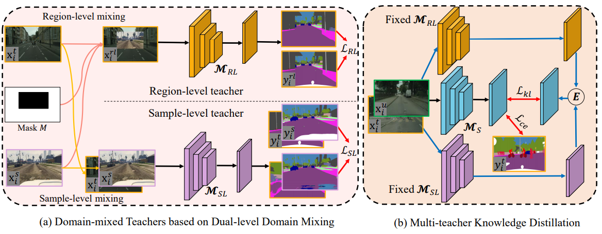
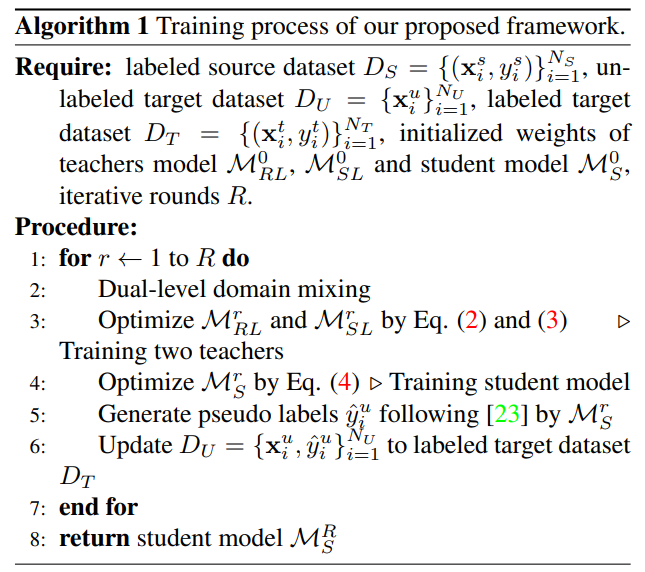

# Semi-Supervised Domain Adaptation based on Dual-level Domain Mixing for Semantic Segmentation (DDM)

This repository is an official implementation of the paper "Semi-Supervised Domain Adaptation based on Dual-level Domain Mixing for Semantic Segmentation" from CVPR 2021.

Data-driven based approaches, in spite of great success in many tasks, have poor generalization when applied to unseen image domains, and require expensive cost of annotation especially for dense pixel prediction tasks such as semantic segmentation. We focus on a more practical setting of semi-supervised domain adaptation (SSDA) where both a small set of labeled target data and large amounts of labeled source data are available. We propose a novel framework based on dual-level domain mixing, named DDM, to address the task of SSDA. The proposed framework consists of three stages. First, two kinds of data mixing methods are proposed to reduce domain gap in both region-level and sample-level respectively. We can obtain two complementary domain-mixed teachers based on dual-level mixed data from holistic and partial views respectively. Then, a student model is learned by distilling knowledge from these two teachers. Finally, pseudo labels of unlabeled data are generated in a self-training manner for another few rounds of teachers training. Extensive experimental results have demonstrated the effectiveness of our proposed framework on synthetic-to-real semantic segmentation benchmarks.

If you find our work useful in your research or publication, please cite our work:
[1] Shuaijun Chen, Xu Jia, Jianzhong He, Yongjie Shi and Jianzhuang Liu. **"Semi-supervised Domain Adaptation based on Dual-level Domain Mixing for Semantic Segmentation"**. **CVPR 2021**. [[arXiv](https://arxiv.org/pdf/2103.04705.pdf)]

@inproceedings{chen2021semi,
    title={Semi-supervised Domain Adaptation based on Dual-level Domain Mixing for Semantic Segmentation},
    author={Chen, Shuaijun and Jia, Xu and He, Jianzhong and Shi, Yongjie and Liu, Jianzhuang},
    booktitle={CVPR},
    year={2021}
}

## Model architecture

### The overall network architecture and algorithm pseudo code of DDM is shown as below





## Dataset

The benchmark datasets can be downloaded as follows:

The real dataset:

[Cityscapes](https://www.cityscapes-dataset.com/),

The synthetic dataset:

[GTA5](https://download.visinf.tu-darmstadt.de/data/from_games/).

## Requirements

### Hardware (Ascend)

> Prepare hardware environment with Ascend.

### Framework

> [MindSpore](https://www.mindspore.cn/install/en)

### For more information, please check the resources below

[MindSpore Tutorials](https://www.mindspore.cn/tutorials/en/r1.3/index.html)
[MindSpore Python API](https://www.mindspore.cn/docs/api/en/r1.3/index.html)

## Script Description

> This is the inference script of our framework, you can following steps to finish the test of different settings of DDM via the corresponding pretrained models.

### Scripts and Sample Code

```bash
DDM/
├── config.py # Hyper-parameters
├── dataset # Dataloader folder
│   ├── base_dataset.py # basic dataset setting
│   ├── cityscapes_list # folder contains image list and class information
│   │   ├── info_16.json # 16 class information
│   │   ├── info.json # 19 class information
│   │   ├── label.txt # the label list of val dataset
│   │   ├── train_round0.txt # train images for round0
│   │   ├── train.txt # train images
│   │   └── val.txt # val image list of val dataset
│   ├── cityscapes.py # dataloader of cityscapes
│   └── __init__.py # data init
├── net
│   ├── deeplabv2_mindspore.py # architecture of deeplabv2
│   └── __init__.py # net init
├── eval.py # the test script
└── utils
    ├── func.py # some functions
    ├── __init__.py # utils init
    └── serialization.py # yaml and json files processing script
```

### Script Parameter

> For details about hyperparameters, see config.py.

## Training Process

### Sample-level teacher

```markdown
To be done
```

### Region-level teacher

```markdown
To be done
```

### Multi-teacher distillation

```markdown
To be done
```

### Self-training

```markdown
To be done
```

## Evaluation

### Evaluation Process

> Inference:

```bash
python eval.py --data_path [data_path] --pretrained [model_weight]
# For example: For 100 labeled target images on GTA5->Cityscapes:
python eval.py --data_path ./data/cityscapes/ --pretrained ./weights/100/best_model.ckpt
```

### Evaluation Result

The result are evaluated by the value of mIoU.

## Performance

### Inference Performance

The Results on all numbers of labeled target images on GTA5->Cityscapes are listed as below.

| Num | 100 | 200 | 500 | 1000 | 2975 |
| ----- | ----- | ----- | ----- | ----- | ----- |
| DDM    | 61.15 | 60.46 | 64.25 | 66.55 | 69.77 |

## ModeZoo Homepage

Please check the official [homepage](https://gitee.com/mindspore/mindspore/tree/master/model_zoo).
