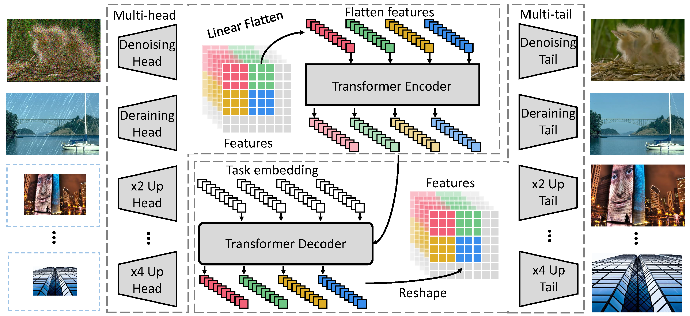

<TOC>

# Pre-Trained Image Processing Transformer (IPT)

This repository is an official implementation of the paper "Pre-Trained Image Processing Transformer" from CVPR 2021.

We study the low-level computer vision task (e.g., denoising, super-resolution and deraining) and develop a new pre-trained model, namely, image processing transformer (IPT). To maximally excavate the capability of transformer, we present to utilize the well-known ImageNet benchmark for generating a large amount of corrupted image pairs. The IPT model is trained on these images with multi-heads and multi-tails. In addition, the contrastive learning is introduced for well adapting to different image processing tasks. The pre-trained model can therefore efficiently employed on desired task after fine-tuning. With only one pre-trained model, IPT outperforms the current state-of-the-art methods on various low-level benchmarks.

If you find our work useful in your research or publication, please cite our work:
[1] Hanting Chen, Yunhe Wang, Tianyu Guo, Chang Xu, Yiping Deng, Zhenhua Liu, Siwei Ma, Chunjing Xu, Chao Xu, and Wen Gao. **"Pre-trained image processing transformer"**. <i>**CVPR 2021**.</i> [[arXiv](https://arxiv.org/abs/2012.00364)]

    @inproceedings{chen2020pre,
      title={Pre-trained image processing transformer},
      author={Chen, Hanting and Wang, Yunhe and Guo, Tianyu and Xu, Chang and Deng, Yiping and Liu, Zhenhua and Ma, Siwei and Xu, Chunjing and Xu, Chao and Gao, Wen},
      booktitle={CVPR},
      year={2021}
     }

## Model architecture

### The overall network architecture of IPT is shown as below



## Dataset

The benchmark datasets can be downloaded as follows:

For super-resolution:

 Set5,
[Set14](https://sites.google.com/site/romanzeyde/research-interests),
[B100](https://www2.eecs.berkeley.edu/Research/Projects/CS/vision/bsds/),
Urban100.

For denoising:

[CBSD68](https://www2.eecs.berkeley.edu/Research/Projects/CS/vision/bsds/).

For deraining:

[Rain100L](https://www.icst.pku.edu.cn/struct/Projects/joint_rain_removal.html)

The result images are converted into YCbCr color space. The PSNR is evaluated on the Y channel only.

## Requirements

### Hardware (GPU)

> Prepare hardware environment with GPU.

### Framework

> [MindSpore](https://www.mindspore.cn/install/en)

### For more information, please check the resources below

[MindSpore Tutorials](https://www.mindspore.cn/tutorial/training/en/master/index.html)
[MindSpore Python API](https://www.mindspore.cn/doc/api_python/en/master/index.html)

## Script Description

> This is the inference script of IPT, you can following steps to finish the test of image processing tasks, like SR, denoise and derain, via the corresponding pretrained models.

### Scripts and Sample Code

```bash
IPT
├── eval.py # inference entry
├── image
│   └── ipt.png # the illustration of IPT network
├── model
│   ├── IPT_denoise30.ckpt # denoise model weights for noise level 30
│   ├── IPT_denoise50.ckpt # denoise model weights for noise level 50
│   ├── IPT_derain.ckpt # derain model weights
│   ├── IPT_sr2.ckpt # X2 super-resolution model weights
│   ├── IPT_sr3.ckpt # X3 super-resolution model weights
│   └── IPT_sr4.ckpt # X4 super-resolution model weights
├── readme.md # Readme
├── scripts
│   └── run_eval.sh # inference script for all tasks
└── src
    ├── args.py # options/hyper-parameters of IPT
    ├── data
    │   ├── common.py # common dataset
    │   ├── __init__.py # Class data init function
    │   └── srdata.py # flow of loading sr data
    ├── foldunfold_stride.py # function of fold and unfold operations for images
    ├── metrics.py # PSNR calculator
    ├── template.py # setting of model selection
    └── vitm.py # IPT network
```

### Script Parameter

> For details about hyperparameters, see src/args.py.

## Evaluation

### Evaluation Process

> Inference example:
> For SR x4:

```bash
python eval.py --dir_data ../../data/ --data_test Set14 --nochange --test_only --ext img --chop_new --scale 4 --pth_path ./model/IPT_sr4.ckpt
```

> Or one can run following script for all tasks.

```bash
sh scripts/run_eval.sh
```

### Evaluation Result

The result are evaluated by the value of PSNR (Peak Signal-to-Noise Ratio), and the format is as following.

```bash
result: {"Mean psnr of Se5 x4 is 32.68"}
```

## Performance

### Inference Performance

The Results on all tasks are listed as below.

Super-resolution results:

| Scale | Set5 | Set14 | B100 | Urban100 |
| ----- | ----- | ----- | ----- | ----- |
| ×2    | 38.36 | 34.54 | 32.50 | 33.88 |
| ×3    | 34.83 | 30.96 | 29.39 | 29.59 |
| ×4    | 32.68 | 29.01 | 27.81 | 27.24 |

Denoising results:

| noisy level | CBSD68 | Urban100 |
| ----- | ----- | ----- |
| 30    | 32.37 | 33.82 |
| 50    | 29.94 | 31.56 |

Derain results:

| Task | Rain100L |
| ----- | ----- |
| Derain   | 41.98 |

## ModeZoo Homepage

Please check the official [homepage](https://gitee.com/mindspore/mindspore/tree/master/model_zoo).
