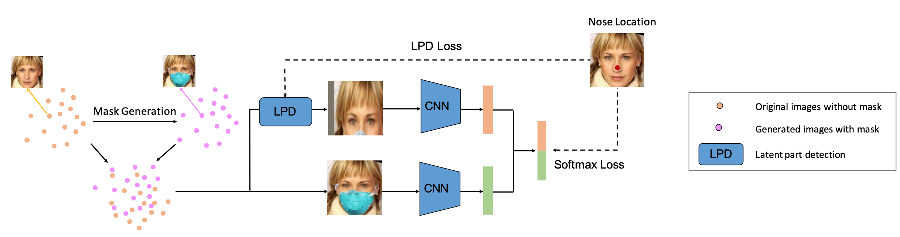
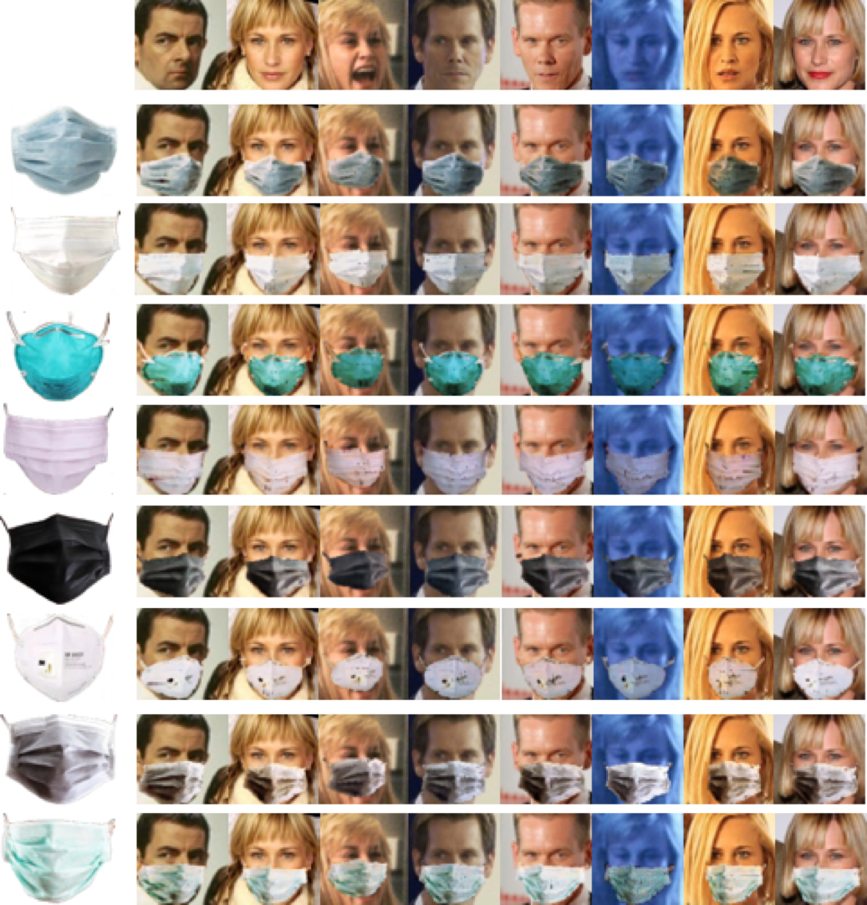

# Contents

- [Masked Face Recognition Description](#masked-face-recognition-description)
- [Dataset](#dataset)
- [Environment Requirements](#environment-requirements)
- [Script Description](#script-description)
- [Training](#training)
- [Evaluation](#evaluation)
- [ModelZoo Homepage](#modelzoo-homepage)

## [Masked Face Recognition Description](#contents)

<p align="center">
 
</p>

This is a **MindSpore** implementation of [Masked Face Recognition with Latent Part Detection (ACM MM20)](https://dl.acm.org/doi/10.1145/3394171.3413731) by *Feifei Ding, Peixi Peng, Yangru Huang, Mengyue Geng and Yonghong Tian*.

*Masked Face Recognition* aims to match masked faces with common faces and is important especially during the global outbreak of COVID-19. It is challenging to identify masked faces since most facial cues are occluded by mask.

*Latent Part Detection* (LPD) is a differentiable module that can locate the latent facial part which is robust to mask wearing, and the latent part is further used to extract discriminative features. The proposed LPD model is trained in an end-to-end manner and only utilizes the original and synthetic training data.

## [Dataset](#contents)

## Training Dataset

We use [CASIA-WebFace Dataset](http://www.cbsr.ia.ac.cn/english/casia-webFace/casia-webfAce_AgreEmeNtS.pdf) as the training dataset. After downloading CASIA-WebFace, we first detect faces and facial landmarks using `MTCNN` and align faces to a canonical pose using similarity transformation. (see: [MTCNN - face detection & alignment](https://github.com/kpzhang93/MTCNN_face_detection_alignment)).

Collecting and labeling realistic masked facial data requires a great deal of human labor. To address this issue, we generate masked face images based on CASIA-WebFace. We generate 8 kinds of synthetic masked face images to augment training data based on 8 different styles of masks, such as surgical masks, N95 respirators and activated carbon masks. We mix the original face images with the synthetic masked images as the training data.

<p align="center">
 
</p>

## Evaluating Dataset

We use [PKU-Masked-Face Dataset](https://pkuml.org/resources/pku-masked-face-dataset.html) as the evaluating dataset. The dataset contains 10,301 face images of 1,018 identities. Each identity has masked and common face images with various orientations, lighting conditions and mask types. Most identities have 5 holistic face images and 5 masked face images with 5 different views: front, left, right, up and down.

The directory structure is as follows:

```python
.
└─ dataset
  ├─ train dataset
    ├─ ID1
      ├─ ID1_0001.jpg
      ├─ ID1_0002.jpg
      ...
    ├─ ID2
      ...
    ├─ ID3
      ...
    ...
  ├─ test dataset
    ├─ ID1
      ├─ ID1_0001.jpg
      ├─ ID1_0002.jpg
      ...
    ├─ ID2
      ...
    ├─ ID3
      ...
    ...
```

## [Environment Requirements](#contents)

- Hardware（Ascend）
    - Prepare hardware environment with Ascend processor.
- Framework
    - [MindSpore](https://www.mindspore.cn/install/en)
- For more information, please check the resources below：
    - [MindSpore tutorials](https://www.mindspore.cn/tutorial/training/en/master/index.html)
    - [MindSpore Python API](https://www.mindspore.cn/doc/api_python/en/master/index.html)

## [Script Description](#contents)

The entire code structure is as following:

```python
└─ face_recognition
  ├── README.md                             // descriptions about face_recognition
  ├── scripts
  │   ├── run_train.sh                      // shell script for training on Ascend
  │   ├── run_eval.sh                       // shell script for evaluation on Ascend
  ├── src
  │   ├── dataset
  │   │   ├── Dataset.py                    // loading evaluating dataset
  │   │   ├── MGDataset.py                  // loading training dataset
  │   ├── model
  │   │   ├── model.py                      // lpd model
  │   │   ├── stn.py                        // spatial transformer network module
  │   ├── utils
  │   │   ├── distance.py                   // calculate distance of two features
  │   │   ├── metric.py                     // calculate mAP and CMC scores
  ├─ config.py                              // hyperparameter setting
  ├─ train_dataset.py                       // training data format setting
  ├─ test_dataset.py                        // evaluating data format setting
  ├─ train.py                               // training scripts
  ├─ test.py                                // evaluation scripts
```

## [Training](#contents)

```bash
sh scripts/run_train.sh [USE_DEVICE_ID]
```

You will get the loss value of each epoch as following in "./scripts/data_parallel_log_[DEVICE_ID]/outputs/logs/[TIME].log" or "./scripts/log_parallel_graph/face_recognition_[DEVICE_ID].log":

```python
epoch[0], iter[100], loss:(Tensor(shape=[], dtype=Float32, value= 50.2733), Tensor(shape=[], dtype=Bool, value= False), Tensor(shape=[], dtype=Float32, value= 32768)), cur_lr:0.000660, mean_fps:743.09 imgs/sec
epoch[0], iter[200], loss:(Tensor(shape=[], dtype=Float32, value= 49.3693), Tensor(shape=[], dtype=Bool, value= False), Tensor(shape=[], dtype=Float32, value= 32768)), cur_lr:0.001314, mean_fps:4426.42 imgs/sec
epoch[0], iter[300], loss:(Tensor(shape=[], dtype=Float32, value= 48.7081), Tensor(shape=[], dtype=Bool, value= False), Tensor(shape=[], dtype=Float32, value= 16384)), cur_lr:0.001968, mean_fps:4428.09 imgs/sec
epoch[0], iter[400], loss:(Tensor(shape=[], dtype=Float32, value= 45.7791), Tensor(shape=[], dtype=Bool, value= False), Tensor(shape=[], dtype=Float32, value= 16384)), cur_lr:0.002622, mean_fps:4428.17 imgs/sec

...
epoch[8], iter[27300], loss:(Tensor(shape=[], dtype=Float32, value= 2.13556), Tensor(shape=[], dtype=Bool, value= False), Tensor(shape=[], dtype=Float32, value= 65536)), cur_lr:0.004000, mean_fps:4429.38 imgs/sec
epoch[8], iter[27400], loss:(Tensor(shape=[], dtype=Float32, value= 2.36922), Tensor(shape=[], dtype=Bool, value= False), Tensor(shape=[], dtype=Float32, value= 65536)), cur_lr:0.004000, mean_fps:4429.88 imgs/sec
epoch[8], iter[27500], loss:(Tensor(shape=[], dtype=Float32, value= 2.08594), Tensor(shape=[], dtype=Bool, value= False), Tensor(shape=[], dtype=Float32, value= 65536)), cur_lr:0.004000, mean_fps:4430.59 imgs/sec
epoch[8], iter[27600], loss:(Tensor(shape=[], dtype=Float32, value= 2.38706), Tensor(shape=[], dtype=Bool, value= False), Tensor(shape=[], dtype=Float32, value= 65536)), cur_lr:0.004000, mean_fps:4430.37 imgs/sec
```

## [Evaluation](#contents)

```bash
sh scripts/run_eval.sh [USE_DEVICE_ID]
```

You will get the result as following in "./scripts/log_inference/outputs/models/logs/[TIME].log":
[test_dataset]: zj2jk=0.9495, jk2zj=0.9480, avg=0.9487

| model    | mAP   | rank1 | rank5 | rank10|
| ---------| ------| ----- | ----- | ----- |
| Baseline | 27.09 | 70.17 | 87.95 | 91.80 |
| MG       | 36.55 | 94.12 | 98.01 | 98.66 |
| LPD      | 42.14 | 96.22 | 98.11 | 98.75 |

## [ModelZoo Homepage](#contents)

Please check the official [homepage](https://gitee.com/mindspore/mindspore/tree/master/model_zoo).
