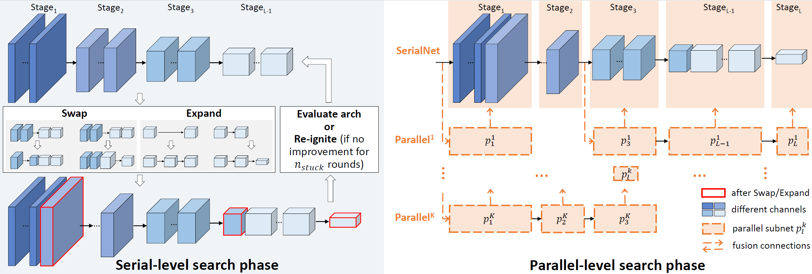

# SP-NAS (Serial-to-Parallel Backbone Search for Object Detection)

## Algorithm Introduction

SP-NAS is an efficient architecture search algorithm for object detection and semantic segmentation based on the backbone network architecture. The existing object detectors usually use the feature extraction network designed and pre-trained on the image classification task as the backbone. We propose an efficient, flexible and task-oriented search scheme based on NAS. which is a two-phase search solution from serial to parallel to reduce repeated ImageNet pre-training or long-time training from scratch.

## Algorithm Principles

This method has two phases:

1. In serial phase, the block sequence with optimal scaling ratio and output channel is found by using the "swap-expand-reignite" search policy. This search policy can guranteen a new searched architecture to completely inherit of weight from arichtectures before morphism.
2. In parallel phase, parallized network structures are designed, sub-networks integrated by different feature layers are searched to better fuse the high-level and low-level semantic features. The following figure shows the search policy.



## Search Space and Search Policy

**Serial-level**

- Swap-expand-reignite policy:  Growing starts from a small network to avoid repeated ImageNet pre-training.
  - The new candidate network is obtained by "switching" or "expanding" the grown network for many times.
  - Quickly train and evaluate candidate networks based on inherited parameters.
  - When the growth reaches the bottleneck, the network is re-trained using ImageNet. The number of ignition times is no more than 2.

- Constrained optimal network: A serial network with limited network resources (latency, video memory usage, or complexity) is selected to obtain the maximum performance.

- Search space configuration:
  - Block type: Basic Block, BottleNeck Block, and ResNext;
  - Network depth: 8 to 60 blocks;
  - Number of stages: 5 to 7;
  - Width: Position where the channel size is doubled in the entire sequence.

**Parallel-level**

- Based on the result SerialNet from the serial search phase (or the existing handcraft serial network such as ResNet series), search for the parallel structure stacked on SerialNet to better utilize and fuse feature information with different resolutions from different feature layers.
- Search policy: Random sampling to meet the resource constraints: The probability of adding additional subnets is inversely proportional to the FLOPS of the subnets to be added.
- Search space: SerialNet is divided into L self-networks based on the number of feature layers and K sub-networks are searched for in each phase.

## Dataset

The benchmark datasets can be downloaded as follows:

 COCO,
[COCO2017](https://cocodataset.org/#download),


## Requirements

### Hardware (Ascend)

> Prepare hardware environment with Ascend.

### Framework

> [MindSpore](https://www.mindspore.cn/install/en)

### For more information, please check the resources below

[MindSpore Tutorials](https://www.mindspore.cn/tutorials/en/r1.3/index.html)
[MindSpore Python API](https://www.mindspore.cn/docs/api/en/r1.3/index.html)

## Script Description

### Scripts and Sample Code

```bash
Spnas
├── eval.py # inference entry
├── train.py # pre-training entry
├── image
│   └── spnas.png # the illustration of Spnas network
├── readme.md # Readme
├── scripts
│   ├── run_distributed.sh # pre-training script for all tasks
└── src
    ├── spnas.yml # options/hyper-parameters of Spnas
    └── spnas_distributed.yml # options/hyper-parameters of Spnas

```

### Script Parameter

> For details about hyperparameters, see src/spnas.yml.

## Training Process

### For training

```bash
python3 train.py
```

> Or one can run following script for all tasks.

```bash
sh scripts/run_distributed.sh
```

## Evaluation

### Evaluation Process

> Inference example:

Modify src/eval.yml:
```bash
models_folder: [CHECKPOINT_PATH]
```

```bash
python3 eval.py
```

### Evaluation Result

The result are evaluated by the value of AP (mean Average Precision), and the format is as following.

```bash
current valid perfs [mAP: 49.1, AP50: 67.1, AP_small: 31.0, AP_medium: 52.6, AP_large: 63.7]
```

## Performance

### Inference Performance

The Results on detection tasks are listed as below.

COCO results:

| Method | mAP | AP50 | AP_small | AP_medium | AP_large |
| ----- | ----- | ----- | ----- | ----- | ----- |
| **SPNet** | **49.1** | **67.1** | **31.0** | **52.6** | **63.7** |
| AmoebaNet | 43.4 | - | - | - | - |
| NAS-FPN | 48.0 | - | - | - | - |


## ModeZoo Homepage

Please check the official [homepage](https://gitee.com/mindspore/mindspore/tree/master/model_zoo).
