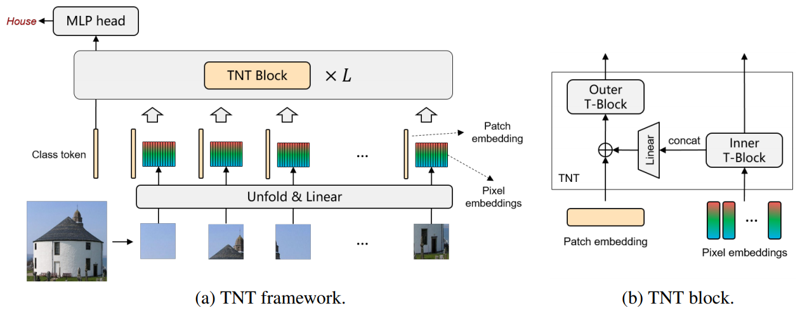

# Contents

- [TNT Description](#tnt-description)
- [Model Architecture](#model-architecture)
- [Dataset](#dataset)
- [Environment Requirements](#environment-requirements)
- [Script Description](#script-description)
    - [Script and Sample Code](#script-and-sample-code)
        - [Training Process](#training-process)
        - [Evaluation Process](#evaluation-process)
            - [Evaluation](#evaluation)
- [Model Description](#model-description)
    - [Performance](#performance)  
        - [Training Performance](#evaluation-performance)
        - [Inference Performance](#evaluation-performance)
- [Description of Random Situation](#description-of-random-situation)
- [ModelZoo Homepage](#modelzoo-homepage)

## [TNT Description](#contents)

The TNT (Transformer in Transformer) network is a pure transformer model for visual recognition. TNT treats an image as a sequence of patches and treats a patch as a sequence of pixels. TNT block utilizes a outer transformer block to process the sequence of patches and an inner transformer block to process the sequence of pixels.

[Paper](https://arxiv.org/abs/2103.00112): Kai Han, An Xiao, Enhua Wu, Jianyuan Guo, Chunjing Xu, Yunhe Wang. Transformer in Transformer. preprint 2021.

## [Model architecture](#contents)

The overall network architecture of TNT is show below:


## [Dataset](#contents)

Dataset used: [Oxford-IIIT Pet](https://www.robots.ox.ac.uk/~vgg/data/pets/)

- Dataset size: 7049 colorful images in 1000 classes
    - Train:  3680 images
    - Test: 3369 images
- Data format: RGB images.
    - Note: Data will be processed in src/dataset.py

## [Environment Requirements](#contents)

- Hardware(Ascend/GPU)
    - Prepare hardware environment with Ascend or GPU.
- Framework
    - [MindSpore](https://www.mindspore.cn/install/en)
- For more information, please check the resources below£º
    - [MindSpore Tutorials](https://www.mindspore.cn/tutorial/training/en/master/index.html)
    - [MindSpore Python API](https://www.mindspore.cn/doc/api_python/en/master/index.html)

## [Script description](#contents)

### [Script and sample code](#contents)

```python
TNT
├── eval.py # inference entry
├── fig
│   └── tnt.png # the illustration of TNT network
├── readme.md # Readme
└── src
    ├── config.py # config of model and data
    ├── pet_dataset.py # dataset loader
    └── tnt.py # TNT network
```

## [Training process](#contents)

To Be Done

## [Eval process](#contents)

### Usage

After installing MindSpore via the official website, you can start evaluation as follows:

### Launch

```bash
# infer example
  GPU: python eval.py --model tnt-b --dataset_path ~/Pets/test.mindrecord --platform GPU --checkpoint_path [CHECKPOINT_PATH]
```

> checkpoint can be downloaded at https://www.mindspore.cn/resources/hub.

### Result

```bash
result: {'acc': 0.95} ckpt= ./tnt-b-pets.ckpt
```

## [Model Description](#contents)

### [Performance](#contents)

#### Evaluation Performance

##### TNT on ImageNet2012

| Parameters                 |                                        |   |
| -------------------------- | -------------------------------------- |---------------------------------- |
| Model Version              | TNT-B                                             |TNT-S|
| uploaded Date              | 21/03/2021 (month/day/year)                       | 21/03/2021 (month/day/year) |
| MindSpore Version          | 1.1                                                       | 1.1   |
| Dataset                    | ImageNet2012                                                    | ImageNet2012|
| Input size                    | 224x224                                                    | 224x224|
| Parameters (M)             | 86.4                                                   | 23.8 |
| FLOPs (M) | 14.1 | 5.2 |
| Accuracy (Top1) | 82.8 | 81.3   |

###### TNT on Oxford-IIIT Pet

| Parameters                 |                                        |   |
| -------------------------- | -------------------------------------- |---------------------------------- |
| Model Version              | TNT-B                                             |TNT-S|
| uploaded Date              | 21/03/2021 (month/day/year)                       | 21/03/2021 (month/day/year) |
| MindSpore Version          | 1.1                                                       | 1.1   |
| Dataset                    | Oxford-IIIT Pet                                                    | Oxford-IIIT Pet|
| Input size                    | 384x384                                                    | 384x384|
| Parameters (M)             | 86.4                                                   | 23.8 |
| Accuracy (Top1) | 95.0 | 94.7   |

## [Description of Random Situation](#contents)

In dataset.py, we set the seed inside "create_dataset" function. We also use random seed in train.py.

## [ModelZoo Homepage](#contents)

Please check the official [homepage](https://gitee.com/mindspore/mindspore/tree/master/model_zoo).