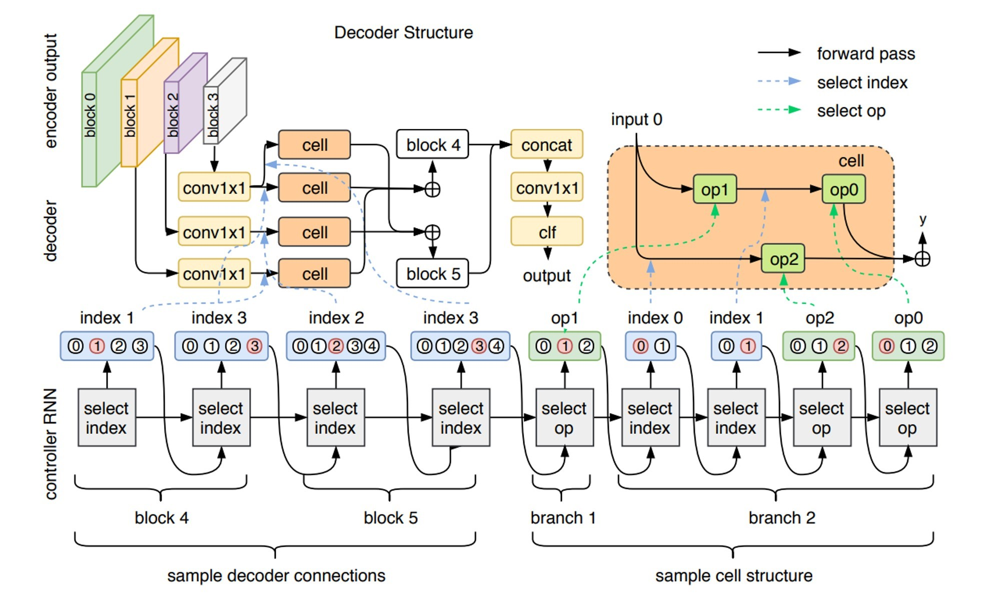
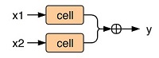
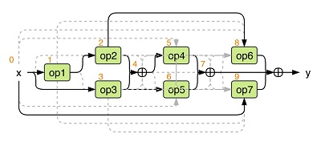
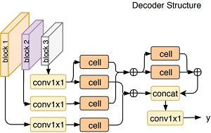

# Contents

- [Contents](#contents)
    - [Algorithm Introduction](#algorithm-introduction)
    - [Algorithm Principles](#algorithm-principles)
        - [Search Space and Strategy](#search-space-and-strategy)
            - [Searching for a cell](#searching-for-a-cell)
            - [Searching for a connection](#searching-for-a-connection)
        - [Configuring the search space](#configuring-the-search-space)
    - [Dataset](#dataset)
    - [Requirements](#requirements)
        - [Hardware (Ascend)](#hardware-ascend)
        - [Framework](#framework)
    - [For more information, please check the resources below](#for-more-information-please-check-the-resources-below)
        - [Script Description](#script-description)
        - [Scripts and Sample Code](#scripts-and-sample-code)
    - [Script Parameter](#script-parameter)
    - [Training Process](#training-process)
        - [For training](#for-training)
    - [Evaluation](#evaluation)
        - [Evaluation Process](#evaluation-process)
        - [Evaluation Result](#evaluation-result)
    - [Performance](#performance)
        - [Inference Performance](#inference-performance)
    - [ModeZoo Homepage](#modezoo-homepage)

## Algorithm Introduction

SEGMENTATION-Adelaide-EA-NAS is an network architecture search algorithm for semantic segmentation. The search algorithm is improved based on the Fast-NAS developed by Shen's team in Adelaide, and the search policy is changed from reinforcement learning (RL) to evolutionary search (EA). Therefore, the search algorithm is named SEGMENTATION-Adelaide-EA-NAS. For more details about Fast-NAS, see the article on arxiv at <https://arxiv.org/abs/1810.10804> .

## Algorithm Principles

A semantic segmentation model may be generally decoupled into an encoder part (which may also be referred to as a backbone) and a decoder part. Generally, the backbone generates feature maps with different scales, and the decoder implements pixel-level classification, by selecting feature maps of different scales for fusion and finally upsampling to the original input resolution. The SEGMENTATION-Adelaide-EA-NAS is used to search for decoders.



### Search Space and Strategy

The decoder for segmentation model is searched, which includes:

1. Connection between the decoder and the backbone;
2. Structure of the cell (including the operators and connection inside the cell);
3. Connections between cells.

The EA search policy is used. Each network is represented by 19 characters. The first 13 characters indicate the structure of the cell in the decoder (including the operator and connection mode in the cell), and the last 6 characters indicate the connection between the decoder and the backbone and the connection of the cell in the decoder. In each generation of search, a character in the previous generation is changed to obtain a new network. In addition, we need to pre-train the backbone part before the search.  The purpose of this is to speed up the convergence of the model, thereby speeding up the search.

The SEGMENTATION-Adelaide-EA-NAS search space is described as follows:

#### Searching for a cell

The search space of SEGMENTATION-Adelaide-EA-NAS includes the following operators::

`conv1x1, conv3x3, sep_conv_3x3, sep_conv_5x5, conv3x3_dil3, conv3x3_dil12, sep_conv_3x3_dil3, sep_conv_5x5_dil6`

As shown in the following figure, two cells are fused in two ways: concatenation or addition. The number of channels of each cell is fixed. When the two feature maps with different resolutions are fused, the feature map of the low resolution need to be upsampled to the size of the feature map of the high resolution. The fusion mode and the number of channels of a cell can be obtained from agg_size and agg_concat in the configuration.



Each model consists of 19 characters. The first 13 characters indicate the cell structure (including the operator and connection mode) of the decoder, which can be parsed as follows:

`[op1, [1, 0, op2, op3], [4, 3, op4, op5], [2, 0, op6, op7]]`

op1 to op7 indicate operators. For example, if op1 is 3, the third operator in op_names (the operator ID starts from 0) is used. The definition of op_names in the configuration is as follows:

`[conv1x1, conv3x3, sep_conv_3x3, sep_conv_5x5, conv3x3_dil3, conv3x3_dil12, sep_conv_3x3_dil3, sep_conv_5x5_dil6]`

, 3 indicates the sep_conv_5x5 operator. Besides op1 to op7, there are six digits, indicating the output from which the input of the corresponding operator comes. For example, in the above example, op2 corresponds to No.1 output, op3 corresponds to No.0 output, op4 corresponds to No.4 output, op5 corresponds to No.3 output, and op6 corresponds to No.2 output, op7 corresponds to output 0.  Output from 0 to 9 is the operator or symbol marked in orange in the following figure.



#### Searching for a connection

The search for connection includes the connection between the decoder and the backbone and the connection between the decoder cells. The connection can be encoded by six characters, which can be  parsed as follows:

`[[cell0,cell1], [cell2,cell3], [cell4,cell5]]`
The following figure shows the form of [[2, 3], [3, 1], [4, 4]]. [2,3] indicates that the No. 2 feature map and No. 3 feature map are fused. The fusion contains the following: a ) No. 2/3 feature map are fed into a cell; b)the method of MergeCell is invoked to fuse the two feature maps to obtain the No. 4 feature map. Correspondingly, [3, 1] and [4, 4] are fused in the same way. Finally, concat and conv 1x1 are performed on all fused feature maps to obtain the network output.



Particularly, all feature maps in the backbone are convolved by using a conv 1x1 to make the output channel to be agg_size in the configuration.

### Configuring the search space

Parameters are set in the configuration file (src/adelaide_ea.yml).

```yaml

pipeline: [random, mutate]

random:
    search_space:
        type: SearchSpace
        modules: ['custom']
        custom:
            type: AdelaideFastNAS
            backbone_out_sizes: [24, 32, 96, 320]
            op_names: [conv1x1, conv3x3, sep_conv_3x3, sep_conv_5x5, conv3x3_dil3, sep_conv_3x3_dil3, sep_conv_5x5_dil6]
            agg_size: 64
            sep_repeats: 1      # Number of times for repeated convolutional separation in the decoder cell
            agg_concat: true    # If the value is TRUE, the feature fusion mode in the decoder is concat. Otherwise, the feature fusion mode is +
            num_classes: 21
    search_algorithm:
        type: AdelaideRandom
        codec: AdelaideCodec
        max_sample: 100

mutate:
    search_space:
        ref: random.search_space
    search_algorithm:
        type: AdelaideMutate
        codec: AdelaideCodec
        max_sample: 100
        pareto_front_file: "{local_base_path}/output/random/pareto_front.csv"
        random_file: "{local_base_path}/output/random/random.csv"
```

## Dataset

The dataset for image semantic segmentation needs to include RGB images and corresponding mask tags. The RGB image value ranges from 0 to 255, and the mask label ranges from 0 to N-1 (N indicates the number of segmentation types. 255 indicates the ignored label, which can be set in the configuration file). The corresponding data list is a .txt file. Each line indicates the RGB image and the corresponding label file, a space character is used for separation. For example:

`VOC2012/JPEGImages/2007_000033.jpg VOC2012/SegmentationClassAug/2007_000033.png`

The benchmark datasets can be downloaded as follows:

[VOC2012](http://host.robots.ox.ac.uk/pascal/VOC/voc2012/VOCtrainval_11-May-2012.tar).

After downloaded the correspond dataset to the target place, You can configure and use the dataset separately for train and test.

Dataset configuration parameters in adelaide_ea/adelaide_ea.yml:

```yaml
    dataset:
        type: Cityscapes
        common:
            data_path: /cache/datasets/VOC2012 # Directory where the dataset is located
        train:
            list_file: train.txt
            batch_size: 16
            shuffle: true
            Rescale:
                size: 512
            RandomMirror: true
            RandomColor:
                color_factor: [0.95, 1.05]
                contrast_factor: [0.95, 1.05]
                brightness_factor: [0.95, 1.05]
            RandomGaussianBlur:
                kernel_size: 3
            RandomRotation:
                rotation_factor: [-10, 10]
                border_value: [0.485, 0.456, 0.406]
                fill_label: 255
            Normalization:
                mean: [0.485, 0.456, 0.406]
                std: [0.229, 0.224, 0.225]
        val:
            list_file: val.txt
            Rescale:
                size: 512
            Normalization:
                mean: [0.485, 0.456, 0.406]
                std: [0.229, 0.224, 0.225]
```

## Requirements

### Hardware (Ascend)

> Prepare hardware environment with Ascend.

### Framework

> [MindSpore](https://www.mindspore.cn/install/en)

### For more information, please check the resources below

[MindSpore Tutorials](https://www.mindspore.cn/tutorials/en/r1.3/index.html)
[MindSpore Python API](https://www.mindspore.cn/docs/api/en/r1.3/index.html)

## Script Description

### Scripts and Sample Code

```bash
adelaide_ea
├── eval.py # inference entry
├── train.py # pre-training entry
├── image
│   ├── Adelaide-EA-NAS1.jpg
│   ├── Adelaide-EA-NAS3.jpg
│   ├── Adelaide-EA-NAS4.jpg
│   └── Adelaide-EA-NAS5.jpg
├── README.md # Readme
├── scripts
│   ├── run_standalone.sh # shell script for standalone train on ascend
│   ├── run_distributed.sh # shell script for distributed train on ascend
└── src
    └── adelaide_ea.yml # options/hyper-parameters of adelaide_ea

```

### Script Parameter

> For details about hyperparameters, see src/adelaide_ea.yml.

## Training Process

### For training

- Standalone Ascend Training:

```bash
sh scripts/run_standalone.sh
```

- Distributed Ascend Training:

```bash
sh scripts/run_distributed.sh  [RANK_TABLE_FILE]
```

  For distributed training, a hccl configuration file with JSON format needs to be created in advance.

  Please follow the instructions in the link below:

  <https://gitee.com/mindspore/mindspore/tree/master/model_zoo/utils/hccl_tools>.
`$RANK_TABLE_FILE` is needed when you are running a distribute task on ascend.

> Or one can run following script for all tasks.

```bash
python3 train.py
```

## Evaluation

### Evaluation Process

> Inference example:

Modify src/eval.yml:

```bash
models_folder: [CHECKPOINT_PATH]
```

```bash
python3 eval.py
```

### Evaluation Result

The result are evaluated by the value of mIOU, and the format is as following.

```bash
INFO Best values: [{'worker_id': '4', 'performance': {'flops': 0.0, 'params': 44700.661, 'IoUMetric': 0.7602}}]
```

## Performance

### Inference Performance

The Results on super resolution tasks are listed as below.

| Parameters                 | Ascend                                                                                      |
| -------------------------- | ------------------------------------------------------------------------------------------- |
| Model Version              | V1                                                                                          |
| Resource                   | CentOs 8.2; Ascend 910; CPU 2.60GHz, 192cores; Memory 755G                                             |
| uploaded Date              | 08/26/2021 (month/day/year)                                                                 |
| MindSpore Version          | 1.2.0                                                                                       |
| Dataset                    | VOC2012 Dataset                                                                               |
| Training Parameters        | epoch=100,  batch_size = 24                                                                 |
| Optimizer                  | Adam                                                                                        |
| Loss Function              | CrossEntropyLoss                                                                                     |
| Output                     | mAP                                                                            |
| mIOU                       | 0.7602                                                               |
| Scripts                    | [adelaide_ea script](https://gitee.com/mindspore/mindspore/tree/master/model_zoo/research/cv/adelaide_ea) |

## ModeZoo Homepage

Please check the official [homepage](https://gitee.com/mindspore/mindspore/tree/master/model_zoo).
