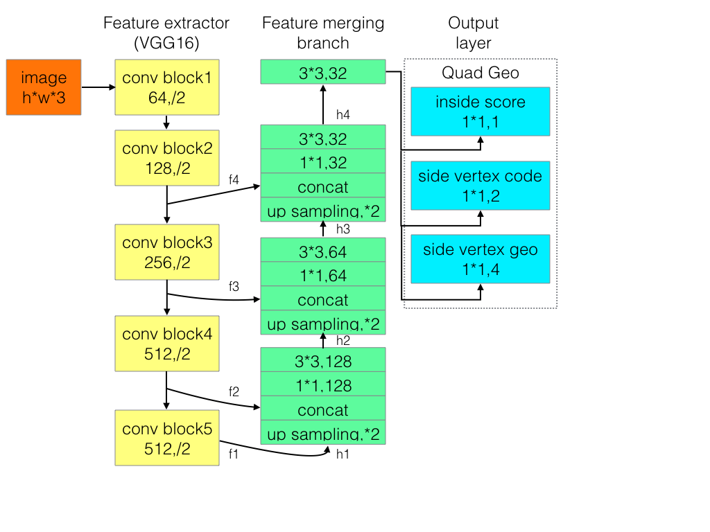

# AdvancedEAST

## introduction

AdvancedEAST is inspired by EAST [EAST:An Efficient and Accurate Scene Text Detector](https://arxiv.org/abs/1704.03155v2).
The architecture of AdvancedEAST is showed below.
This project is inherited by [huoyijie/AdvancedEAST](https://github.com/huoyijie/AdvancedEAST)(preprocess, network architecture, predict) and [BaoWentz/AdvancedEAST-PyTorch](https://github.com/BaoWentz/AdvancedEAST-PyTorch)(performance).

## Environment

* euleros v2r7 x86_64
* python 3.7.5

## Dependences

* mindspore==1.1
* shapely==1.7.1
* numpy==1.19.4
* tqdm==4.36.1

## Project files

* configuration of file
    cfg.py, control parameters
* pre-process data:
    preprocess.py, resize image
* label data:
    label.py,produce label info
* define network
    model.py and VGG.py
* define loss function
    losses.py
* execute training
    advanced_east.py and dataset.py
* predict
    predict.py and nms.py
* scoring
    score.py
* logging
    logger.py

```shell
.
└──advanced_east
  ├── README.md
  ├── scripts
    ├── run_distribute_train_gpu.sh        # launch ascend distributed training(8 pcs)
    ├── run_standalone_train_ascend.sh     # launch ascend standalone training(1 pcs)
    ├── run_distribute_train_gpu.sh        # launch gpu distributed training(8 pcs)
    └── run_standalone_train_gpu.sh        # launch gpu standalone training(1 pcs)
  ├── src
    ├── cfg.py                             # parameter configuration
    ├── dataset.py                         # data preprocessing
    ├── label.py                           # produce label info
    ├── logger.py                          # generate learning rate for each step
    ├── model.py                           # define network
    ├── nms.py                             # non-maximum suppression
    ├── predict.py                         # predict boxes
    ├── preprocess.py                      # pre-process data
    └── score.py                           # scoring
  ├── export.py                            # export model for inference
  ├── prepare_data.py                      # exec data preprocessing
  ├── eval.py                              # eval net
  ├── train.py                             # train net
  └── train_mindrecord.py                  # train net on user specified mindrecord
```

## dataset

ICPR MTWI 2018 challenge 2：Text detection of network image，[Link](https://tianchi.aliyun.com/competition/entrance/231651/introduction). It is not available to download dataset on the origin webpage,
the dataset is now provided by the author of the original project，[Baiduyun link](https://pan.baidu.com/s/1NSyc-cHKV3IwDo6qojIrKA)， password: ye9y. There are 10000 images and corresponding label
information in total in the dataset, which is divided into 2 directories with 9000 and 1000 samples respectively. In the origin training setting, training set and validation set are partitioned at the ratio
of 9:1. If you want to use your own dataset, please modify the configuration of dataset in /src/config.py. The organization of dataset file is listed as below：

  > ```bash
  > .
  > └─data_dir
  >   ├─images                # dataset
  >   └─txt                   # vertex of text boxes
  > ```
Some parameters in config.py：

```python
    'validation_split_ratio': 0.1,      # ratio of validation dataset
    'total_img': 10000,                  # total number of samples in dataset
    'data_dir': './icpr/',              # dir of dataset
    'train_fname': 'train.txt',         # the file which stores the images file name in training dataset
    'val_fname': 'val.txt',             # the file which stores the images file name in validation dataset
    'mindsrecord_train_file': 'advanced-east.mindrecord',               # mindsrecord of training dataset
    'mindsrecord_test_file': 'advanced-east-val.mindrecord',            # mindsrecord of validation dataset
    'origin_image_dir_name': 'images_9000/',    # dir which stores the original images.
    'train_image_dir_name': 'images_train/',    # dir which stores the preprocessed images.
    'origin_txt_dir_name': 'txt_9000/',         # dir which stores the original text verteices.
    'train_label_dir_name': 'labels_train/',    # dir which stores the preprocessed text verteices.
```

## Run the project

### Data preprocess

Resize all the images to fixed size, and convert the label information(the vertex of text box) into the format used in training and evaluation, then the Mindsrecord files are generated.

```bash
python preparedata.py
```

### Training

Prepare the VGG16 pre-training model. Due to copyright restrictions, please go to https://github.com/machrisaa/tensorflow-vgg to download the VGG16 pre-training model and place it in the src folder.

single 1p）

```bash
python train.py  --device_target="Ascend" --is_distributed=0 --device_id=0  > output.train.log 2>&1 &
```

single 1p）specific size

```bash
python train_mindrecord.py  --device_target="Ascend" --is_distributed=0 --device_id=2 --size=256  > output.train.log 2>&1 &
```

multi Ascends

```bash
# running on distributed environment（8p）
bash scripts/run_distribute_train.sh
```

The detailed training parameters are in /src/config.py。

multi GPUs

```bash
# running on distributed environment（8p）
bash scripts/run_distribute_train_gpu.sh
```

The detailed training parameters are in /src/config.py。

config.py：

```bash
    'initial_epoch': 0, # epoch to init
    'learning_rate': 1e-4, # learning rate when initialization
    'decay': 5e-4, # weightdecay parameter
    'epsilon': 1e-4, # the value of epsilon in loss computation
    'batch_size': 8, # batch size
    'lambda_inside_score_loss': 4.0, # coef of inside_score_loss
    'lambda_side_vertex_code_loss': 1.0, # coef of vertex_code_loss
    "lambda_side_vertex_coord_loss": 1.0, # coef of vertex_coord_loss
    'max_train_img_size': 448, # max size of training images
    'max_predict_img_size': 448, # max size of the images to predict
    'ckpt_save_max': 10, # maximum of ckpt in dir
    'saved_model_file_path': './saved_model/', # dir of saved model
```

## Evaluation

### Evaluate

The above python command will run in the background, you can view the results through the file output.eval.log. You will get the accuracy as following:

## performance

### Training performance

The performance listed below are acquired with the default configurations in /src/config.py
| Parameters           | single Ascend                            |
| -------------------------- | ---------------------------------------------- |
| Model Version               | AdvancedEAST                                          |
| Resources                   | Ascend 910 |
| MindSpore Version        | 1.1                                  |
| Dataset                | MTWI-2018                                        |
| Training Parameters  | epoch=18, batch_size = 8, lr=1e-3  |
| Optimizer                  | AdamWeightDecay                                                        |
| Loss Function | QuadLoss |
| Outputs              |  matrix with size of 3x64x64,3x96x96,3x112x112                  |
| Loss             | 0.1                                         |
| Total Time | 28mins, 60mins, 90mins |
| Checkpoints | 173MB（.ckpt file）                                           |

### Evaluation Performance

On the default
| Parameters  | single Ascend          |
| ------------------- | --------------------------- |
| Model Version      | AdvancedEAST                        |
| Resources        | Ascend 910         |
| MindSpore Version   | 1.1                 |
| Dataset | 1000 images |
| batch_size          |   8                        |
| Outputs | precision, recall, F score |
| performance | 94.35, 55.45, 66.31 |