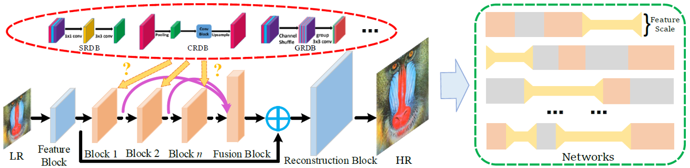
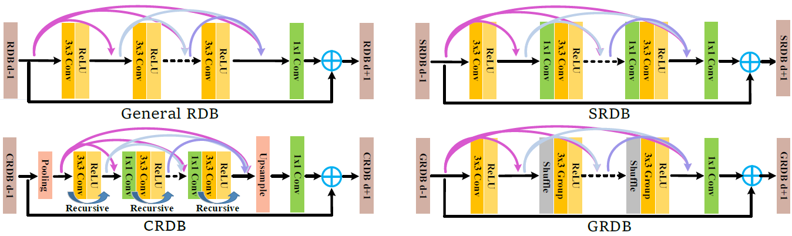

# Contents

- [Contents](#contents)
    - [Algorithm Introduction](#algorithm-introduction)
    - [Algorithm Description](#algorithm-description)
        - [Search Space and Searching Strategy](#search-space-and-searching-strategy)
        - [Configuring](#configuring)
    - [Application Scenarios](#application-scenarios)
    - [Dataset](#dataset)
    - [Requirements](#requirements)
        - [Hardware (Ascend)](#hardware-ascend)
        - [Framework](#framework)
        - [For more information, please check the resources below](#for-more-information-please-check-the-resources-below)
    - [Script Description](#script-description)
        - [Scripts and Sample Code](#scripts-and-sample-code)
        - [Script Parameter](#script-parameter)
    - [Training Process](#training-process)
        - [For training](#for-training)
    - [Evaluation](#evaluation)
        - [Evaluation Process](#evaluation-process)
        - [Evaluation Result](#evaluation-result)
    - [Performance](#performance)
        - [Inference Performance](#inference-performance)
    - [ModeZoo Homepage](#modezoo-homepage)

## Algorithm Introduction

 Taking the advantage of the rapid development of GPU and deep convolutional network (DCNN), the visual quality of super-resolution is greatly improved, which makes image super-resolution widely used in real life.

At the same time, the model size of the super resolution network is increasing from 57K to 43M, and the computing workload reaches 10192G FLOPs (RDN). Meanwhile, the computing and storage budgets of mobile devices are limited, which constrains the application of the huge super-resolution models on mobile devices (for example, mobile phones, cameras, and smart homes). A lightweight super-resolution model is appealed for mobile applications.

Common methods for compressing a super-resolution model can be classified into two categories: a) manually designed efficient structural units (such as group convolution and recuresive); b) automatically search a lightweight entwork architecture. The existing architecture search algorithms are mainly focus on using convolution units and connections to search lightweight networks. However, the obtained network structure is very irregular and is not hardware friendly. Moreover, the entire backbone is calculated on a single scale, which means a huge computation workload.

We propose a network architecture search algorithm , which constructs a modular search space, takes the parameters and computations as constraints, and the network accuracy (PSNR) as the objective to search for a lightweight and fast super-resolution model. In this way, the network structure is hardware friendly. In addition, we compress the super-resolution network from three aspects: channel, convolution, and feature scale. The proposed algorithm has been published at AAAI 2020.

```text
[1] Song, D.; Xu, C.; Jia, X.; Chen, Y.; Xu, C.; Wang, Y. Efficient Residual Dense Block Search for Image Super-Resolution[C]. AAAI 2020.
```

## Algorithm Description

Firstly, the algorithm constructs a search space based on modules, takes the parameters and computations as constraints, and the network accuracy (PSNR) as the objective to search for an efficient super-resolution network structure. In addition, a high efficiency super-resolution module based on RDB is designed to compress the redundant information of super network from channel, convolution and characteristic scale. Finally, genetic algorithm is used to search for the number of each type of module, the corresponding location and the specific internal parameters. The following figure shows the algorithm framework.



We take RDN as the basic network structure and Efficient Dense Block (RDB) as the basic module, and searches for the number, the types and the internal parameters of the modules. You can assign the compression ratio of each module and the location of each module in the whole network during the search. We design three kinds of efficient residual-intensive modules, which compress the redundancy of channel, convolution and feature scale respectively. The detailed network structure is as follows:



The proposed algorithm has two steps : network structure search and full training. In order to speed up the search, the model evaluation is usually achieved by means of fast training. Fully train on a large data set needs to be performed after we have the searched candidates.

The following is an example of the searched:

```text
['G_8_16_24', 'C_8_16_16', 'G_4_16_24', 'G_8_16_16', 'S_4_24_32', 'C_8_16_48', 'S_4_16_24', 'G_6_16_24', 'G_8_16_16', 'C_8_16_24', 'S_8_16_16', 'S_8_16_24', 'S_8_16_32', 'S_6_16_16', 'G_6_16_64', 'G_8_16_16', 'S_8_16_32']
```

### Search Space and Searching Strategy

The efficient RDB is used as the basic modules for search. Considering the hardware efficiency, the number of convolutional channels is also a multiple of 16, for example, 16, 24, 32, 48, or 64. The algorithm mainly searches for the number of modules, the type of each location module, and the specific parameters (such as the number of convolutions and channels) in the model, and allocates the compression ratio of each aspect.

The search strategy is mainly based on evolutionary algorithms. Firstly, RDN is used as the basic structure framework to encode the global network, and a next generation population is generated through crossover and mutation. There are two selection modes for parents selection , which are tourament and roulette modes. The final high performance network structure is obtained through iterative evolution.

### Configuring

For details, see the configuration file esr_ea/esr_ea.yml in the sample code.

```yaml
nas:
    search_space:                       # Set the network structure search parameters.
        type: SearchSpace
        modules: ['esrbody']
        esrbody:
            type: ESRN
            block_type: [S,G,C]         # module
            conv_num: [4,6,8]           # Number of convolutions in the module
            growth_rate: [8,16,24,32]   # Number of convolutional channels in the module
            type_prob: [1,1,1]          # Probability of module type selection
            conv_prob: [1,1,1]          # Probability of selecting the number of convolutions
            growth_prob: [1,1,1,1]      # Probability of selecting the number of convolution channel
            G0: 32                      # Number of initial convolution channels
            scale: 2                    # Scale of the super-distribution
    search_algorithm:
        type: ESRSearch
        codec: ESRCodec
        policy:
            num_generation: 20          # Number of iterations in evolution algorithm
            num_individual: 8           # Number of individuals in evolution algorithm
            num_elitism: 4              # Number of elites to be reserved
            mutation_rate: 0.05         # probability of mutation for each gene
        range:
            node_num: 20                # Upper limit of the modules
            min_active: 16              # Lower limit of the modules
            max_params: 325000          # Maximum parameters of network
            min_params: 315000          # Minimum parameters of network


```

If other blocks need to be used as the basic modular structure or multiple types of blocks need to be searched.

## Application Scenarios

This method is used to search for low-level vision tasks, such as super-resolution, denoising, and de-mosaic. Currently, the RGB data is used for training. We use the DIV2K dataset in this repo. Other similar datasets can be used by simply change the config.

## Dataset

The benchmark datasets can be downloaded as follows:

[DIV2K](https://cv.snu.ac.kr/research/EDSR/DIV2K.tar).

## Requirements

### Hardware (Ascend)

> Prepare hardware environment with Ascend.

### Framework

> [MindSpore](https://www.mindspore.cn/install/en)

### For more information, please check the resources below

[MindSpore Tutorials](https://www.mindspore.cn/tutorials/en/r1.3/index.html)
[MindSpore Python API](https://www.mindspore.cn/docs/api/en/r1.3/index.html)

## Script Description

### Scripts and Sample Code

```bash
esr_ea
├── eval.py # inference entry
├── train.py # pre-training entry
├── image
│   ├── esr_arch.png # the illustration of esr_ea network
│   └── esr_block.png #
├── readme.md # Readme
├── scripts
│   ├── run_distributed.sh # pre-training script for all tasks
└── src
    ├── esr_ea.yml # options/hyper-parameters of esr_ea
    └── esr_ea_distributed.yml # options/hyper-parameters of esr_ea

```

### Script Parameter

> For details about hyperparameters, see src/esr_ea.yml.

## Training Process

### For training

```bash
python3 train.py
```

> Or one can run following script for all tasks.

```bash
sh scripts/run_distributed.sh  [RANK_TABLE_FILE]
```

## Evaluation

### Evaluation Process

> Inference example:

Modify src/eval.yml:

```bash
models_folder: [CHECKPOINT_PATH]
```

```bash
python3 eval.py
```

### Evaluation Result

The result are evaluated by the value of PSNR, and the format is as following.

```bash
INFO Best values: [{'worker_id': 82, 'performance': {'flops': 0.0, 'params': 516.339, 'PSNR': 41.08037491480157}}]
```

## Performance

### Inference Performance

The Results on super resolution tasks are listed as below.

| Parameters                 | Ascend                                                                                      |
| -------------------------- | ------------------------------------------------------------------------------------------- |
| Model Version              | V1                                                                                          |
| Resource                   | CentOs 8.2; Ascend 910; CPU 2.60GHz, 192cores; Memory 755G                                             |
| uploaded Date              | 08/26/2021 (month/day/year)                                                                 |
| MindSpore Version          | 1.2.0                                                                                       |
| Dataset                    | DIV2K Dataset                                                                               |
| Training Parameters        | epoch=15000,  batch_size = 16                                                                 |
| Optimizer                  | Adam                                                                                        |
| Loss Function              | L1Loss                                                                                     |
| Output                     | super resolution image                                                                             |
| PSNR                       | 41.08                                                               |
| Scripts                    | [esr_ea script](https://gitee.com/mindspore/mindspore/tree/master/model_zoo/research/cv/esr_ea) |

## ModeZoo Homepage

Please check the official [homepage](https://gitee.com/mindspore/mindspore/tree/master/model_zoo).
