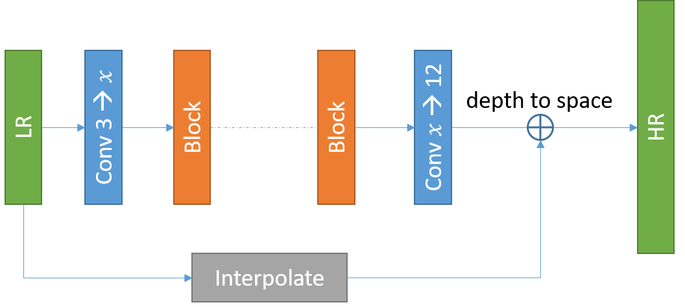

# Contents

- [Contents](#contents)
    - [Algorithm Introduction](#algorithm-introduction)
    - [Algorithm Principle](#algorithm-principle)
        - [Search Space and Search Policy](#search-space-and-search-policy)
        - [Configuring](#configuring)
    - [Dataset](#dataset)
    - [Requirements](#requirements)
        - [Hardware (Ascend)](#hardware-ascend)
        - [Framework](#framework)
        - [For more information, please check the resources below](#for-more-information-please-check-the-resources-below)
    - [Script Description](#script-description)
        - [Scripts and Sample Code](#scripts-and-sample-code)
        - [Script Parameter](#script-parameter)
    - [Training Process](#training-process)
        - [For training](#for-training)
    - [Evaluation](#evaluation)
        - [Evaluation Process](#evaluation-process)
        - [Evaluation Result](#evaluation-result)
    - [Performance](#performance)
        - [Inference Performance](#inference-performance)
    - [ModeZoo Homepage](#modezoo-homepage)

## Algorithm Introduction

SR-EA is a module that uses the evolutionary algorithm (EA) to search for the image super-resolution (SR) network architecture. EA is a common automatic network architecture search method (NAS). The search process is as follows：

1. Sampling a series of models (usually random), and perform incomplete training (for example, reduce the number of iterations or training samples) on each model.
2. Calculating a Pareto front (pareto front) of all currently generated models, generating an evolutionary model based on the Pareto front, and performing incomplete training on each model;
3. Repeat step 2 until the specified maximum iterations are reached or the specified performance is achieved.

## Algorithm Principle

SR-EA provides two series of network architectures: modified SRResNet (baseline) and CCRN-NAS (from Noah's Ark ). The following figure shows the structure of Modified SRResNet:



SR-EA provides two architecture search policies ( random search & brute force search ), which focus on searching for the number of blocks and channels in the architecture.
CCRN-NAS is a network architecture dedicated to lightweight networks. The CCRN-NAS consists of three types of blocks:

1. Residual block whose kernel size is 2;
2. Residual block whose kernel size is 3;
3. Channel Acquisition Block (CIB): consists of the two modules in sequence. Each module combines the above two outputs in the channel dimension. Therefore, the number of channels is doubled after the CIB.

Pipeline provides a sample for CCRN-NAS architecture search. It searches for the combination of the three modules to optimize the network architecture.

### Search Space and Search Policy

The search space of the modified SRResNet includes the number of blocks and channels. We provide two search methods: random search (RS) and brute force (BF). In the two search methods, users need to define the range of the block number and the channel number for each convolution layer. RS generates model randomly from these range until the number of models reaches max_count. On the other size, BF will train all selected models.

The search space of CCRN-NAS is a combination of three types of blocks:

1. Random search: The number of residual blocks and the number of CIBs are selected based on user-defined conditions. In the residual block, the ratio of convolution layer with kernel size 2 is randomly generated between [0,1]. The sampling process generates a common residual block and randomly inserts CIB into the residual block.

2. Evolution search: Models on Pareto front are selected for modification each time. Following operations are allowed:
  – Change the kernel size of a random residual block from 2 to 3 or from 3 to 2.
  – A residual block is added to the random number of layers, and the kernel size is randomly generated in 2 and 3.

### Configuring

For details, see the configuration file sr_ea/sr_ea.yml in the sample code.

```yaml
pipeline: [random, mutate]

random:
    pipe_step:
        type: SearchPipeStep

    search_space:                              # Set the network structure search parameters.
        type: SearchSpace
        modules: ['custom']
        custom:
            type: MtMSR
            in_channel: 3                      # number of input channels
            out_channel: 3                     # number of output channels
            upscale: 2                         # Up scale
            rgb_mean: [0.4040, 0.4371, 0.4488] # mean of rgb value
            candidates: [res2, res3]
            block_range: [10, 80]              # the range of block number
            cib_range: [3, 4]                  # the range of CIB number

    search_algorithm:
        type: SRRandom
        codec: SRCodec
        policy:
            mum_sample: 1000

mutate:
    search_space:
        ref: random.search_space

    search_algorithm:
        type: SRMutate
        codec: SRCodec
        policy:
            mum_sample: 1000                   # Set the number of samples
            num_mutate: 3                      # Set Genetic Algebra for Genetic Algorithm
```

## Dataset

The benchmark datasets can be downloaded as follows:

[DIV2K](https://cv.snu.ac.kr/research/EDSR/DIV2K.tar).

After downloaded the correspond dataset to the target place, You can configure and use the dataset separately for train and test.

Dataset configuration parameters in sr_ea/sr_ea.yml:

```yaml
random:
    dataset:
        type: DIV2K
        common:
            value_div: 255.0
        train:
            root_HR: /cache/datasets/DIV2K/div2k_train/hr # Directory where the HR image is located
            root_LR: /cache/datasets/DIV2K/div2k_train/lr # Directory where the LR image is located
            upscale: 2                                    # Up scale
            crop: 64                                      # crop size of lr image
            hflip: true                                   # flip image horizontally
            vflip: true                                   # flip image vertically
            rot90: true                                   # flip image diagonally
            shuffle: true                                 # shuffle
            num_workers: 2                                # Number of read threads
            batch_size: 16                                # batch size
            pin_memory: false                             # Pin memory
        test:
            root_HR: /cache/datasets/DIV2K/div2k_valid/hr
            root_LR: /cache/datasets/DIV2K/div2k_valid/lr
            upscale: 2
            crop: 64
            pin_memory: false

```

## Requirements

### Hardware (Ascend)

> Prepare hardware environment with Ascend.

### Framework

> [MindSpore](https://www.mindspore.cn/install/en)

### For more information, please check the resources below

[MindSpore Tutorials](https://www.mindspore.cn/tutorials/en/r1.3/index.html)
[MindSpore Python API](https://www.mindspore.cn/docs/api/en/r1.3/index.html)

## Script Description

### Scripts and Sample Code

```bash
sr_ea
├── eval.py # inference entry
├── train.py # pre-training entry
├── image
│   └── sr_ea_SRResNet.png # the illustration of sr_ea network
├── README.md # Readme
├── scripts
│   ├── run_standalone.sh # shell script for standalone train on ascend
│   ├── run_distributed.sh # shell script for distributed train on ascend
└── src
    └── sr_ea.yml # options/hyper-parameters of sr_ea

```

### Script Parameter

> For details about hyperparameters, see src/sr_ea.yml.

## Training Process

### For training

- Standalone Ascend Training:

```bash
sh scripts/run_standalone.sh
```

- Distributed Ascend Training:

```bash
sh scripts/run_distributed.sh  [RANK_TABLE_FILE]
```

  For distributed training, a hccl configuration file with JSON format needs to be created in advance.

  Please follow the instructions in the link below:

  <https://gitee.com/mindspore/mindspore/tree/master/model_zoo/utils/hccl_tools>.
`$RANK_TABLE_FILE` is needed when you are running a distribute task on ascend.

> Or one can run following script for all tasks.

```bash
python3 train.py
```

## Evaluation

### Evaluation Process

> Inference example:

Modify src/eval.yml:

```bash
models_folder: [CHECKPOINT_PATH]
```

```bash
python3 eval.py
```

### Evaluation Result

The result are evaluated by the value of PSNR, and the format is as following.

```bash
INFO finished host evaluation, id: 44, performance: {'PSNR': 43.35796722215399, 'latency': 0.5015704035758972}
```

## Performance

### Inference Performance

The Results on super resolution tasks are listed as below.

| Parameters                 | Ascend                                                                                      |
| -------------------------- | ------------------------------------------------------------------------------------------- |
| Model Version              | V1                                                                                          |
| Resource                   | CentOs 8.2; Ascend 910; CPU 2.60GHz, 192cores; Memory 755G                                             |
| uploaded Date              | 08/26/2021 (month/day/year)                                                                 |
| MindSpore Version          | 1.2.0                                                                                       |
| Dataset                    | DIV2K Dataset                                                                               |
| Training Parameters        | epoch=20000,  batch_size = 50                                                                 |
| Optimizer                  | Adam                                                                                        |
| Loss Function              | L1Loss                                                                                     |
| Output                     | super resolution image                                                                             |
| PSNR                       | 43.35                                                               |
| Scripts                    | [sr_ea script](https://gitee.com/mindspore/mindspore/tree/master/model_zoo/research/cv/sr_ea) |

## ModeZoo Homepage

Please check the official [homepage](https://gitee.com/mindspore/mindspore/tree/master/model_zoo).
