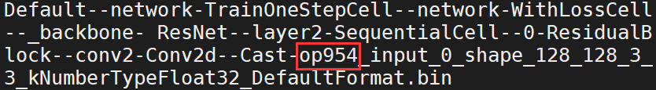
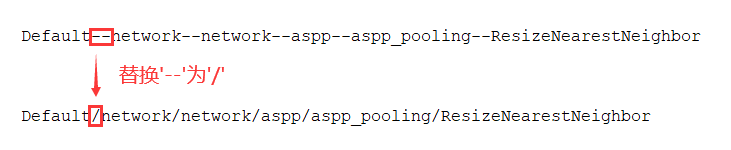

# 映射数据文件到对应的脚本源码

## 文档功能与适用场景

  在MindSpore进行计算调试，怀疑遇到精度问题时可以选择dump文件进行对比。此时用户希望知道dump文件夹下的每个数据文件对应的Python源码。
  本文的主要目的为指导用户使用该工具进行数据文件到python源码的映射。
  此指导文档适合运行在 **Ascend硬件** 环境下的计算。

## 辅助工具使用

 1. 使用脚本的3步操作：  
   - 用户在训练脚本里设置context.set_context(mode=context.GRAPH_MODE, save_graphs=True)，进行图文件的保存。  
   - 用户开启dump数据功能，参考<https://www.mindspore.cn/tutorial/training/zh-CN/r1.1/advanced_use/custom_debugging_info.html#dump>  
   - 获取dump数据文件的op_num，然后通过辅助脚本进行解析。如数据文件：`Default--network-TrainOneStepCell--network-WithLossCell--_backbone-
   ResNet--layer2-SequentialCell--0-ResidualBlock--conv2-Conv2d--Cast-op954_input_0_shape_128_128_3_3_kNumberTypeFloat32_DefaultFormat.bin`.  
   可观察到Cast-op954，说明该算子的op_num为op954, 如下图所示。
     
   脚本名： **[map_file_to_code.py](https://gitee.com/mindspore/mindspore/blob/master/scripts/map_dump_file_to_code/map_file_to_code.py)**; &nbsp; 执行方式:  

     ```ruby
     python3 map_file_to_code.py
             --graph_path(-p) [the graph path, default is the current path](option)
             --dump_op(-o) [Dump operator id, case insensitive, such as 'op954'.](required)  
     For example:  
     python3 map_file_to_code.py -p graph_path -o op954
     ```

 2. 解析效果
   解析文件时通常有2种情况：  
   ① 匹配时会显示出调用栈过程，需要用户在调用栈中查找自己的源码：

    ```ruby
    [INFO] Start to map the dump file to source code.
    [INFO] Find operation 'Cast'.
           In file /data1/jzg/mindspore/mindspore/nn/layer/conv.py(253)/
                   output = self.conv2d(x, self.weight)
           In file /data1/jzg/dump_to_code/resnet/scripts/train/src/resnet.py(166)/
                   out = self.conv2(out)
           In file /data1/jzg/mindspore/mindspore/nn/layer/container.py(173)/
                   for cell in self.cell_list:
           In file /data1/jzg/dump_to_code/resnet/scripts/train/src/resnet.py(323)/     # 用户代码行
                   c3 = self.layer2(c2)
           In file /data1/jzg/mindspore/mindspore/train/amp.py(101)/
                   out = self._backbone(data)
           In file /data1/jzg/mindspore/mindspore/nn/wrap/cell_wrapper.py(247)/
                   loss = self.network(*inputs)
           In file /data1/jzg/mindspore/mindspore/train/dataset_helper.py(87)/
                   return self.network(*outputs)
    ```

    ② 未匹配，在图中未找对应节点的调用栈:

    ```ruby
    [INFO] Start to map the dump file to source code.  
    [WARNING] Cannot find cast's source code in ir file.  # 未找到cast算子的信息
    ```

 3. 手动代码查找  
   这里还会存在些特殊情况，需要用户进行自行查找。通过将dump的数据文件名中的'--'替换为'/'可获取到算子的full_name, 如下图所示：
     
   input和output文件名shape后面的数据为对应算子的输入输出shape信息。然后利用算子的full_name和输入输出信息回到源码中进行对应代码的查找。  
   举个例子说明如何手动在代码中查找指定full_name和shape的算子，例如full_name为: `Default/network/network/aspp/aspp_pooling/ResizeNearestNeighbor`，输入的shape为[8, 256, 1, 1]， dtype为float32。
   可以观察到其scope为: `Default/network/network/aspp/aspp_pooling`，算子名为: `ResizeNearestNeighbor`。注意：scope中会存在Default、network自动填充，Default表示正向，network为网络名。  
   查看以下用户定义的代码，首先我们先分析scope: `Default/network/network/aspp/aspp_pooling`。由network/aspp可定位到算子的定义与调用处分别为26行与31行，继续由`network/aspp/aspp_pooling`，可以定位到定义与调用处分别为4行与8行，然后通过算子名`ResizeNearestNeighbor`可以定位至定义与调用处分别为16行与19行。最后若存在相同scope下存在相同的算子名时，需要通过输入的shape进行进一步判断。

    ```ruby
      1 class ASPP(nn.Cell):
      2     def __init__(self):
      3         super(ASPP, self).__init__()
      4         self.aspp_pooling = ASPPPooling()
      5         self.drop = nn.Dropout(0.3)
      6
      7     def construct(self, x):
      8         x = self.aspp_pooling(x)
      9         x = self.drop(x)
     10         return x
     11
     12 class ASPPPooling(nn.Cell):
     13     def __init__(self):
     14         super(ASPPPooling, self).__init__()
     15         self.shape = P.Shape()
     16         self.resizenearestneighbor = P.ResizeNearestNeighbor((size[2], size[3]), True)
     17     def construct(self, x):
     18         size = self.shape(x)
     19         out = self.resizenearestneighbor(x)
     20         return out
     21
     22 # 主结构
     23 class DeepLabV3(nn.Cell):
     24     def __init__(self, phase='train', num_classes=21, output_stride=16, freeze_bn=False):
     25         super(DeepLabV3, self).__init__()
     26         self.aspp = ASPP()
     27         self.shape = P.Shape()
     28
     29     def construct(self, x):
     30         size = self.shape(x)
     31         out = self.aspp(x)
     32         return out
    ```
